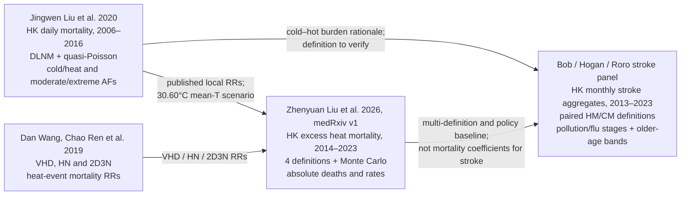

# Jasmine → Roro → monthly stroke: one complementary evidence family

## The three questions

- **Jasmine:** What daily mortality risk and attributable burden are associated with cold and hot temperature?
- **Roro:** How many model-based excess deaths correspond to alternative heatwave scenarios?
- **Our project:** How do pre-specified monthly hot and cold burdens associate with true-month stroke-event aggregates?

These are complementary estimands, not competing claims. Daily mortality AFs, modeled excess deaths and monthly stroke associations must remain separate.

## Credit line

**Jasmine paper:** Jingwen Liu, Alana Hansen, Blesson Varghese, Zhidong Liu, Michael Tong, Hong Qiu, Linwei Tian, Kevin Ka-Lun Lau, Edward Ng, Chao Ren and Peng Bi.

**Roro paper:** Zhenyuan Liu, Chao Ren, Jingwen Liu, Kawasaki Yurika and David Makram Bishai. Reported roles: concept/design—David Bishai; data—Jingwen Liu and Chao Ren; analysis/interpretation—Zhenyuan Liu; drafting—Zhenyuan Liu and Kawasaki Yurika; critical revision—Chao Ren, Jingwen Liu and David Bishai.

**Monthly stroke project:** Hogan leads weather framing and definition lock; Roro leads governed stroke aggregates and event timing; David Bishai leads the extension question; Bob leads reproducible analysis, pollution assembly and writing. Jingwen Liu and Chao Ren provide the scientific continuity across the mortality papers.

## Family rule

Build forward with explicit credit: use Jasmine to motivate cold–hot symmetry, Roro to motivate definition sensitivity and absolute-policy framing, and the stroke panel to add morbidity and later-period age detail. Do not imply that one layer replaces another.
