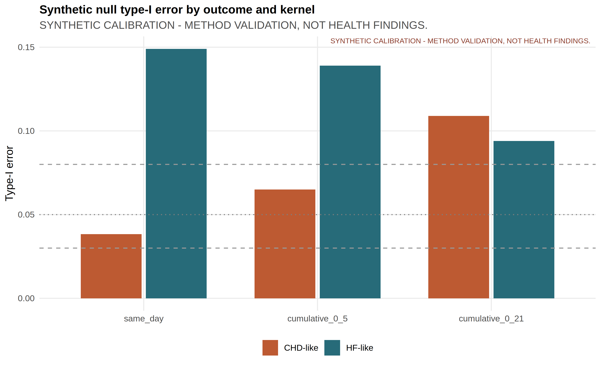
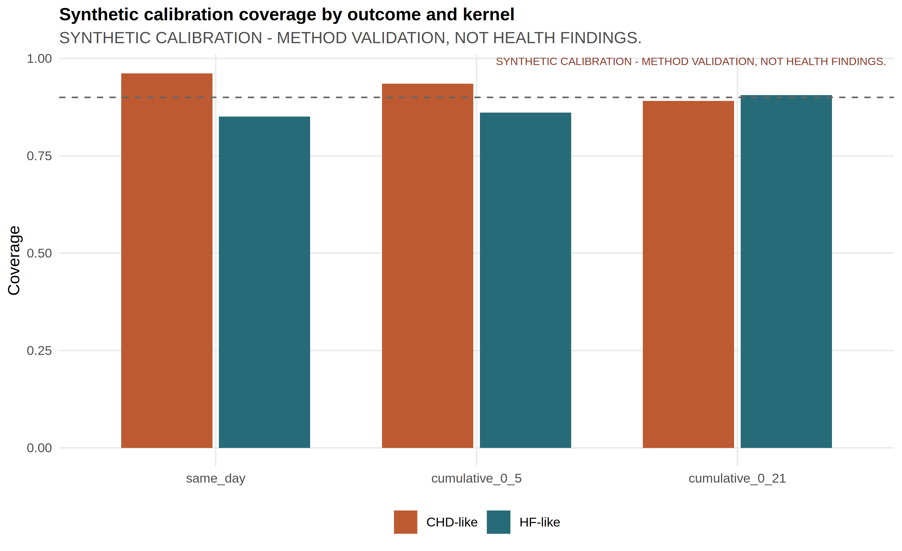
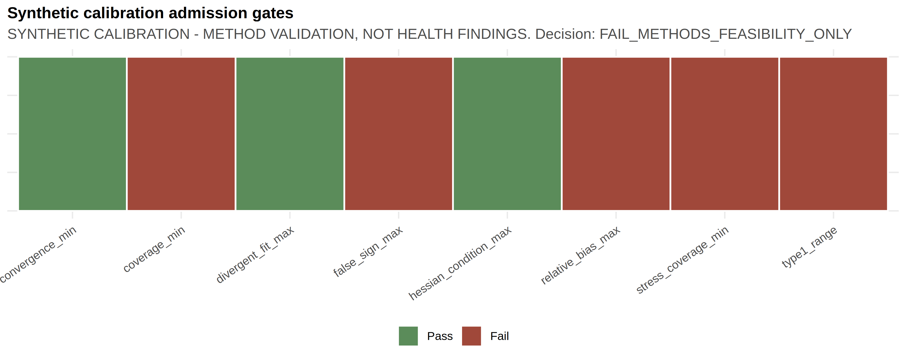

Companion to [`chd_hf_thermal_associations_2013_2023.md`](chd_hf_thermal_associations_2013_2023.md).
All health-effect numbers below are drawn from `outputs/release_chd_hf/` unless labelled `SYNTHETIC_CALIBRATION` or `REAL_PUBLIC_HKO`.
Provenance for CHD/HF association rows is `HA_APPROVED_AGGREGATE`.

## S0. Reporting checklist

| Item | Location |
|---|---|
| Estimand (monthly count ratio; days offset) | Main Methods; S2 |
| Outcome construction (first recorded hospitalisation after diagnosis; column-label semantics open) | Main Methods; S1 |
| Complete 12-contrast core table | `outputs/release_chd_hf/tables/table2_core_models.csv` |
| Claim ledger identity CVD-01 to CVD-12 | `outputs/release_chd_hf/tables/claim_ledger_v2.csv` |
| SE ladder Model/HC1/NW3/NW6 | `outputs/release_chd_hf/tables/table4_uncertainty_ladder.csv`; Figure 5 |
| Multiplicity (BH q across 12) | Table 2 `q_value_core_bh` |
| Residual ACF / Ljung–Box | S6; `outputs/release_chd_hf/supplement/chd_pathway_core_diagnostics.csv`; `outputs/release_chd_hf/supplement/hf_pathway_core_diagnostics.csv` |
| Joint vs separate / VIF | S3 |
| Trend, depletion, lag, influence, unoffset INGARCH | S5 |
| Weather source lock + five reproduction checks | S4 |
| M\|D calibration F1.0 / F1.1 / F1.2 | S7 |
| Provenance firewall | S8 |
| Reproducibility commands | S9 |
| Scope exclusions | S10 |
| Authorship / ICD / stroke governance items | [`authorship_and_governance_decisions.md`](authorship_and_governance_decisions.md) |

## S1. Outcome and exposure definitions

### S1.1 Cohort and event

- Cohort universe: people diagnosed with type 2 diabetes and/or hypertension during 2013–2023.
- Event: first recorded hospitalisation after the patient’s first diagnosis record for CHD or HF.
- Admission cause: not recorded.
- Grain: territory × calendar month, January 2013–December 2023 (132 months).
- Observed columns (gitignored source): CHD `chd_inpatient`; HF `hf_inpatient`.
- Care-setting label: inpatient semantics are inferred from column names; confirmation remains human-owned.
- Stroke: named in covering correspondence; file not attached; no stroke estimates.

### S1.2 Outcome totals

From `outputs/release_chd_hf/tables/table1_outcome_summary.csv`:

| Outcome | Months | Total events | Monthly mean |
|---|---:|---:|---:|
| CHD | 132 | 156,156 | 1,183.0 |
| HF | 132 | 29,681 | 224.9 |

### S1.3 Thermal exposures used in the core panel

Internal pathway IDs are retained here for archive mapping only; they do not appear in the journal scientific body.

| Pathway ID | Exposure | Contrast |
|---|---|---|
| P01A | Monthly mean temperature | per 1 °C |
| P02A | Monthly mean of daily maximum temperature | per 1 °C |
| P02B | Monthly mean of daily minimum temperature | per 1 °C |
| P04A | Official hot nights (`Tmin ≥ 28 °C`) | per 5 days |
| P04B | Official cold days (`Tmin ≤ 12 °C`) | per 5 days |
| P04C | Official very hot days (`Tmax ≥ 33 °C`) | per 5 days |

### S1.4 Denominator

Analysis-of-record offset: `log(days in month)`.
Population aged 35+ × days is an ecological sensitivity only. It is not person-time among members of the diabetes or hypertension cohort still at risk of a first CHD or HF hospitalisation.

## S2. Complete model table index

| Table / figure | Path | Role |
|---|---|---|
| Table 1 | `outputs/release_chd_hf/tables/table1_outcome_summary.csv` | Outcome summary |
| Table 2 | `outputs/release_chd_hf/tables/table2_core_models.csv` | Twelve core NW6 contrasts |
| Table 3 | `outputs/release_chd_hf/tables/table3_robustness_summary.csv` | Robustness ranges |
| Table 4 | `outputs/release_chd_hf/tables/table4_uncertainty_ladder.csv` | 12 × 4 SE ladder |
| Claim ledger v2 | `outputs/release_chd_hf/tables/claim_ledger_v2.csv` | CVD-01 to CVD-12 with tiers |
| Analysis availability | `outputs/release_chd_hf/tables/analysis_availability.csv` | Scope / blocker inventory |
| Figure 1 | `outputs/release_chd_hf/figures/figure1_indexed_outcome_series.png` | Indexed series |
| Figure 2 | `outputs/release_chd_hf/figures/figure2_seasonal_pattern.png` | Seasonality |
| Figure 3 | `outputs/release_chd_hf/figures/figure3_core_forest.png` | Core forest |
| Figure 4 | `outputs/release_chd_hf/figures/figure4_trend_depletion_sensitivity.png` | Trend/depletion |
| Figure 5 | `outputs/release_chd_hf/figures/figure5_se_method_ladder.png` | SE ladder forest |

### S2.1 Pathway panel archives

- `outputs/release_chd_hf/supplement/combined_pathway_panel_estimates.csv`
- `outputs/release_chd_hf/supplement/chd_pathway_panel_forest.png`
- `outputs/release_chd_hf/supplement/hf_pathway_panel_forest.png`
- Core diagnostics: `outputs/release_chd_hf/supplement/chd_pathway_core_diagnostics.csv`, `outputs/release_chd_hf/supplement/hf_pathway_core_diagnostics.csv`
- Core fit summary: `outputs/release_chd_hf/supplement/cvd_core_model_fit.csv`
- Robust SE/offset/family ladder: `outputs/release_chd_hf/supplement/cvd_core_robust_estimates.csv`

Joint extreme-day and nested heat-month structures remain exploratory. Separate core IDs P01A, P02A/B, and P04A–C map to the manuscript core panel.

Legacy pollution, humidity, and influenza pathway fits in the broader archive are not adjusted versions of these separate core models.

### S2.2 Supplementary Table S1 — complete standard-error ladder

**Supplementary Table S1.** Negative-binomial count ratios under the
days-in-month offset. The point estimate is fixed within each outcome-exposure
model; only the covariance estimator changes.

| Outcome | Exposure | SE method | Count ratio (95% CI) | p |
|---|---|---|---:|---:|
| CHD | Mean temperature / 1 °C | Model | 0.993 (0.977–1.009) | 0.397 |
| CHD | Mean temperature / 1 °C | HC1 | 0.993 (0.974–1.012) | 0.470 |
| CHD | Mean temperature / 1 °C | NW3 | 0.993 (0.976–1.011) | 0.433 |
| CHD | Mean temperature / 1 °C | NW6 | 0.993 (0.976–1.010) | 0.424 |
| CHD | Mean maximum temperature / 1 °C | Model | 0.993 (0.979–1.007) | 0.334 |
| CHD | Mean maximum temperature / 1 °C | HC1 | 0.993 (0.976–1.010) | 0.408 |
| CHD | Mean maximum temperature / 1 °C | NW3 | 0.993 (0.978–1.008) | 0.345 |
| CHD | Mean maximum temperature / 1 °C | NW6 | 0.993 (0.979–1.007) | 0.321 |
| CHD | Mean minimum temperature / 1 °C | Model | 0.994 (0.979–1.010) | 0.463 |
| CHD | Mean minimum temperature / 1 °C | HC1 | 0.994 (0.976–1.012) | 0.528 |
| CHD | Mean minimum temperature / 1 °C | NW3 | 0.994 (0.977–1.012) | 0.517 |
| CHD | Mean minimum temperature / 1 °C | NW6 | 0.994 (0.977–1.012) | 0.509 |
| CHD | Hot nights / 5 days | Model | 1.022 (0.995–1.049) | 0.112 |
| CHD | Hot nights / 5 days | HC1 | 1.022 (0.997–1.047) | 0.081 |
| CHD | Hot nights / 5 days | NW3 | 1.022 (1.0003–1.0439) | 0.047 |
| CHD | Hot nights / 5 days | NW6 | 1.022 (1.002–1.042) | 0.032 |
| CHD | Cold days / 5 days | Model | 0.995 (0.954–1.037) | 0.801 |
| CHD | Cold days / 5 days | HC1 | 0.995 (0.956–1.035) | 0.792 |
| CHD | Cold days / 5 days | NW3 | 0.995 (0.949–1.042) | 0.820 |
| CHD | Cold days / 5 days | NW6 | 0.995 (0.949–1.043) | 0.823 |
| CHD | Very hot days / 5 days | Model | 0.999 (0.974–1.025) | 0.963 |
| CHD | Very hot days / 5 days | HC1 | 0.999 (0.975–1.025) | 0.962 |
| CHD | Very hot days / 5 days | NW3 | 0.999 (0.973–1.026) | 0.964 |
| CHD | Very hot days / 5 days | NW6 | 0.999 (0.974–1.025) | 0.962 |
| HF | Mean temperature / 1 °C | Model | 0.974 (0.956–0.993) | 0.007 |
| HF | Mean temperature / 1 °C | HC1 | 0.974 (0.949–1.000) | 0.049 |
| HF | Mean temperature / 1 °C | NW3 | 0.974 (0.949–1.001) | 0.055 |
| HF | Mean temperature / 1 °C | NW6 | 0.974 (0.947–1.002) | 0.069 |
| HF | Mean maximum temperature / 1 °C | Model | 0.981 (0.964–0.998) | 0.029 |
| HF | Mean maximum temperature / 1 °C | HC1 | 0.981 (0.958–1.004) | 0.111 |
| HF | Mean maximum temperature / 1 °C | NW3 | 0.981 (0.959–1.004) | 0.098 |
| HF | Mean maximum temperature / 1 °C | NW6 | 0.981 (0.958–1.005) | 0.113 |
| HF | Mean minimum temperature / 1 °C | Model | 0.973 (0.956–0.991) | 0.003 |
| HF | Mean minimum temperature / 1 °C | HC1 | 0.973 (0.950–0.997) | 0.026 |
| HF | Mean minimum temperature / 1 °C | NW3 | 0.973 (0.948–0.999) | 0.038 |
| HF | Mean minimum temperature / 1 °C | NW6 | 0.973 (0.947–1.000) | 0.050 |
| HF | Hot nights / 5 days | Model | 1.003 (0.970–1.037) | 0.855 |
| HF | Hot nights / 5 days | HC1 | 1.003 (0.971–1.037) | 0.853 |
| HF | Hot nights / 5 days | NW3 | 1.003 (0.974–1.033) | 0.837 |
| HF | Hot nights / 5 days | NW6 | 1.003 (0.976–1.031) | 0.825 |
| HF | Cold days / 5 days | Model | 1.073 (1.023–1.125) | 0.004 |
| HF | Cold days / 5 days | HC1 | 1.073 (1.011–1.138) | 0.020 |
| HF | Cold days / 5 days | NW3 | 1.073 (1.007–1.143) | 0.031 |
| HF | Cold days / 5 days | NW6 | 1.073 (1.006–1.144) | 0.031 |
| HF | Very hot days / 5 days | Model | 0.995 (0.964–1.027) | 0.759 |
| HF | Very hot days / 5 days | HC1 | 0.995 (0.963–1.028) | 0.765 |
| HF | Very hot days / 5 days | NW3 | 0.995 (0.964–1.027) | 0.759 |
| HF | Very hot days / 5 days | NW6 | 0.995 (0.963–1.028) | 0.764 |

## S3. Joint versus separate exposures and collinearity

File: `outputs/release_chd_hf/supplement/cvd_single_vs_joint_estimates.csv`
VIF: `outputs/release_chd_hf/supplement/cvd_exposure_vif.csv`
Exposure correlations: `outputs/release_chd_hf/supplement/cvd_exposure_correlations.csv`; Figure S1 `outputs/release_chd_hf/supplement/figureS1_exposure_correlation.png`

After month and trend residualisation:

- VIF for mean maximum and minimum temperature (joint temperature model) = 4.66.
- VIF for hot nights and very hot days (joint extreme-day model) ≈ 1.96.
- VIF for cold days in the joint extreme-day set ≈ 1.00.

Under days-only offset and Newey–West lag-6 intervals, the CHD hot-night count ratio was 1.022 in the separate hot-night model and 1.045 (1.015–1.075) in the joint extreme-day model. The HF cold-day coefficient was about 1.073 in both structures. Joint inflation of the CHD hot-night coefficient is retained as a collinearity warning.

## S4. Source-validation audit (weather)

Provenance: `REAL_PUBLIC_HKO`.
Files:

- `outputs/release_chd_hf/supplement/methods_feasibility/weather_definition_source_lock.csv`
- `outputs/release_chd_hf/supplement/methods_feasibility/weather_definition_source_validation.csv`
- `outputs/release_chd_hf/supplement/methods_feasibility/weather_event_morphology_audit.csv`
- `outputs/release_chd_hf/supplement/methods_feasibility/weather_spillover_exposure_build.md`
- Spillover figure: `outputs/release_chd_hf/supplement/methods_feasibility/figure_spillover_event_counts.png`

### S4.1 Five source reproduction checks (all pass)

| validation_id | expected | observed | source DOI |
|---|---:|---:|---|
| `li_events_1980_2023` | 57 | 57 | 10.1016/j.atmosres.2024.107845 |
| `wang_vhd_days_2006_2015` | 204 | 204 | 10.1016/j.scitotenv.2019.07.039 |
| `wang_hn_days_2006_2015` | 230 | 230 | 10.1016/j.scitotenv.2019.07.039 |
| `wang_vhd_ge5_event_days_2006_2015` | 48 | 48 | 10.1016/j.scitotenv.2019.07.039 |
| `wang_hn_ge5_event_days_2006_2015` | 56 | 56 | 10.1016/j.scitotenv.2019.07.039 |

Release validation recorded `weather_source_validation_all_pass = TRUE` (`outputs/reports/cvd_real_release_validation.md`).

### S4.2 Provisional hot-month / cold-month calendar

Provisional HM/CM flags remain unlocked. Calendar figure: `outputs/release_chd_hf/supplement/figureS2_provisional_hm_cm_calendar.png`. Estimates in `outputs/release_chd_hf/supplement/chd_hm_cm_panel_estimates.csv` and `outputs/release_chd_hf/supplement/hf_hm_cm_panel_estimates.csv` are not eligible for primary claims until weather reference rules are locked by the weather co-investigator.

## S5. Sensitivity ladders

### S5.1 Offset and family

File: `outputs/release_chd_hf/supplement/cvd_core_robust_estimates.csv`.
For each core-panel exposure: offsets (days only, population × days, none); families (negative binomial, quasi-Poisson); SE methods (model, HC1, NW3, NW6). Manuscript Table 2 freezes the days-only / negative-binomial / NW6 core slice; Table 4 shows the SE ladder without selecting an interval by null exclusion.

### S5.2 Trend and first-event depletion

File: `outputs/release_chd_hf/supplement/cvd_trend_depletion_sensitivity.csv`; summary ranges in `outputs/release_chd_hf/tables/table3_robustness_summary.csv`; Figure 4.

CHD hot nights: baseline 1.022; scenario range approximately 1.011–1.025.
HF cold days: baseline 1.073; scenario range approximately 1.043–1.113; pre-2020 1.113 (1.053–1.176).

### S5.3 Lag

File: `outputs/release_chd_hf/supplement/cvd_lag_sensitivity.csv`.

| Outcome | Exposure | Lag 0 | Lag 1 | Lag 2 |
|---|---|---|---|---|
| CHD | Hot nights /5 | 1.022 (1.002–1.042) | 1.010 (0.979–1.042) | 1.016 (0.987–1.045) |
| HF | Cold days /5 | 1.073 (1.006–1.144) | 1.073 (1.014–1.135) | 1.053 (0.985–1.127) |

Lag-one-month temperature is a labelled sensitivity. It is not a recovered daily lag curve.

### S5.4 Influence

File: `outputs/release_chd_hf/supplement/cvd_influence_sensitivity.csv`.

| Outcome | Pathway ID | Excluded month | RR after exclusion | Max Cook’s D |
|---|---|---|---|---:|
| CHD | P04A | 2020-02 | 1.021 (1.001–1.040) | 0.110 |
| HF | P04B | 2022-02 | 1.088 (1.034–1.144) | 0.085 |

### S5.5 Count-series dependence (unoffset INGARCH)

File: `outputs/release_chd_hf/supplement/cvd_count_timeseries_sensitivity.csv`.

Negative-binomial INGARCH(1,1) models were fitted **without an offset**. They reduced residual ACF1 (CHD hot-night residual ACF1 ≈ 0.25; HF cold-day residual ACF1 ≈ −0.04) while retaining positive CHD hot-night and HF cold-day associations. These fits are unoffset residual-dependence diagnostics. They are not directly comparable with the days-offset core estimates and are not a second primary estimand.

## S6. Residual diagnostics

| Outcome | Core residual ACF1 (approx.) | Range across six core exposures | Ljung–Box lag 6 |
|---|---|---|---|
| CHD | 0.51 | 0.508–0.534 | Rejects white noise |
| HF | 0.15 | 0.131–0.179 | Does not reject |

Plots: `outputs/release_chd_hf/supplement/chd_core_residual_acf_pacf.png`, `outputs/release_chd_hf/supplement/hf_core_residual_acf_pacf.png`.
Tables: `outputs/release_chd_hf/supplement/chd_pathway_residual_acf.csv`, `outputs/release_chd_hf/supplement/hf_pathway_residual_acf.csv`.

## S7. M|D calibration scenarios and gates

**Provenance:** `SYNTHETIC_CALIBRATION` only.
Quarantine folder: `outputs/release_chd_hf/supplement/methods_feasibility/`.
These materials validate methods. They are not CHD/HF health findings.

### S7.1 Rationale

Monthly sums erase within-month timing. The Basagaña–Ballester aggregated likelihood provides a constrained route from daily exposure to monthly counts [@basagana2024md; @basagana2026md]. Admission of real daily coefficients requires synthetic calibration gates to pass under the frozen protocol (`analysis_plan/final_reanalysis_protocol_2026-08-10.md`, Section 8).

### S7.2 F1.0 pilot failure

Artifact: `outputs/release_chd_hf/supplement/methods_feasibility/md_pilot_f1_0_failure_note.md`.
Design: 100 replicates; daily nuisance seasonality = one annual sine/cosine pair.
CHD-like null cells were acceptable (Type I ≈ 0.00–0.06; coverage ≈ 0.94–1.00).
HF-like null cells failed under every kernel (Type I ≈ 0.62–0.75; coverage ≈ 0.25–0.38).
Interpretation: model-design failure from inadequate nuisance seasonality, not evidence of a real HF cold effect.

### S7.3 F1.1 correction

Amendment: replace the harmonic with calendar-month indicators, matching the analysis-of-record seasonality, while remaining inside the 20-parameter cap. The failed F1.0 pilot remains auditable. No new real health model was fitted to choose the correction.

### S7.4 F1.2 worst-cell decision (500 replicates)

Artifact: `outputs/release_chd_hf/supplement/methods_feasibility/md_calibration_f1_2_decision_report.md`.
Decision: `FAIL_METHODS_FEASIBILITY_ONLY`.
All gates passed: FALSE.

| Gate | Passed | Value | Requirement |
|---|---|---:|---|
| Convergence min | Yes | 1.000 | ≥0.95 |
| Null Type I range | No | 0.048–0.150 | within 0.03–0.08 |
| Coverage min | No | 0.840 | ≥0.90 |
| Relative bias max | No | 32.77 | ≤0.20 |
| False-sign max | No | 0.808 | ≤0.10 |
| Hessian condition | Yes | 1.82×10³ | <1×10⁸ |
| Divergent fits | Yes | 0 | <0.05 |
| Stress coverage min | No | 0.842 | ≥0.85 |

Method-validation figures (not health findings):

{width=100%}

{width=100%}

{width=100%}

Paths:

- `outputs/release_chd_hf/supplement/methods_feasibility/figure_calibration_type1_by_outcome_kernel.png`
- `outputs/release_chd_hf/supplement/methods_feasibility/figure_calibration_coverage_by_outcome_kernel.png`
- `outputs/release_chd_hf/supplement/methods_feasibility/figure_calibration_gate_passfail.png`

### S7.5 Real M|D admission rule

Because F1.2 calibration failed, no real daily-exposure coefficient is eligible for manuscript Results. Real constrained M|D fitting additionally requires governed analysis panels that are not redistributed in the public repository.

## S8. Provenance firewall

| Class | Label | May appear on main claim surfaces? |
|---|---|---|
| Governed CHD/HF aggregates and model summaries | `HA_APPROVED_AGGREGATE` | Yes |
| Public HKO weather validation | `REAL_PUBLIC_HKO` | Yes, as exposure methods |
| Synthetic calibration | `SYNTHETIC_CALIBRATION` | Supplement methods-feasibility only |
| Daily mortality AF (Jingwen Liu 2020) | Literature | Introduction/Discussion only; not morbidity coefficients |
| Modelled excess deaths (Zhenyuan Liu 2026 medRxiv) | Literature / preprint | Companion baseline only |
| Source HA xlsx / merged panels | Governed; gitignored | Never committed |
| Private correspondence PDF | Internal provenance | Not cited; no raw addresses or private quotations |

Forbidden promotions (from `analysis_plan/final_claim_tiers.yml`):

- calibration → real finding;
- exploratory → primary without human headline freeze;
- mortality AF → monthly morbidity effect;
- modelled excess death → observed hospitalisation burden;
- general-population offset → cohort incidence rate.

## S9. Reproducibility

Identity checks already recorded:

1. Every Table 2 row matches `outputs/release_chd_hf/tables/claim_ledger_v2.csv` for RR, CI, p, q, SE method, and provenance.
2. BH q-values recomputed with `p.adjust(..., method="BH")` across the twelve NW6 p-values.
3. Release validation: `outputs/reports/cvd_real_release_validation.md` — 29/29 checks passed on 10 August 2026.
4. Manifest hashes: `outputs/release_chd_hf/release_manifest.csv`.
5. Index: `outputs/release_chd_hf/RELEASE_INDEX.md`.

### S9.1 Commands for completed public / release / calibration checks

From the repository root:

```bash
# Public HKO spillover morphology + five source reproduction checks
Rscript scripts/35_build_spillover_exposures.R

# Rebuild disclosure-minimised release package from existing analysis tables
Rscript scripts/38_cns_final_release_artifacts.R

# Recompute F1.2 worst-cell gates from existing synthetic raw metrics
# (does not refit real health models; requires outputs/calibration_md/md_calibration_raw_metrics.csv)
Rscript scripts/45_recompute_md_calibration_gates.R

# Release identity / provenance checks (tables, claim ledger, SE ladder, quarantine policy)
Rscript scripts/34_cvd_real_release_checks.R
```

### S9.2 Governed full rerun (local files required)

A complete real-data pathway rerun requires governed monthly CHD/HF aggregates and merged analysis panels that are gitignored and not present in the public checkout:

```bash
# Requires local governed inputs under data_raw/ha_secure_placeholder/ (or equivalent)
# and a constructed analysis panel. Do not commit HA microdata.
PATHWAY_MODE=real OUTCOMES=chd,hf Rscript scripts/run_cvd_full_analysis.R
```

Without those local governed files, treat release tables under `outputs/release_chd_hf/` as the analysis-of-record artifact set for manuscript drafting.

## S10. Scope exclusions

Excluded from the journal scientific claims by design or delivery:

- Stroke results (file not delivered);
- Age/sex or medication effect modification (strata not delivered);
- Principal-diagnosis CHD/HF or AMI claims (admission cause absent);
- Locked hot-month / cold-month primary estimates (weather reference rules unlocked);
- Cohort incidence with the true still-at-risk denominator (denominator unavailable);
- Real daily-exposure M|D coefficients (calibration failed);
- Confounding-adjusted core estimates for pollution, humidity, or influenza (legacy/joint archive paths only).

### S7 note — archive influenza (not core-adjusted)

On the 121 months with influenza data, archive pathway P14 associated influenza activity with CHD counts 1.673 (1.249–2.243). That numeral is **not** an adjusted version of Table 2 and does not appear in the live collaborative manuscript body. Source: `outputs/release_chd_hf/supplement/combined_pathway_panel_estimates.csv`.

Cloud-runtime availability of governed panels is an internal operations fact and is documented in the supervisor integrated report, not as a journal result.

## S11. What this supplement does not contain

- Source monthly HA count files
- Merged health–environment panels with event counts
- Synthetic coefficients presented as health findings
- Private email text or raw addresses
- Final author order or unrecorded headline approval
