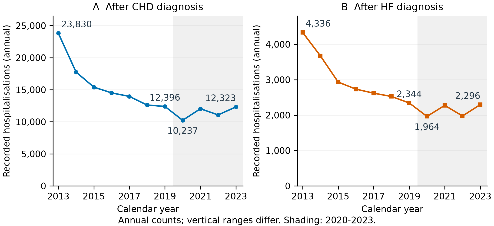
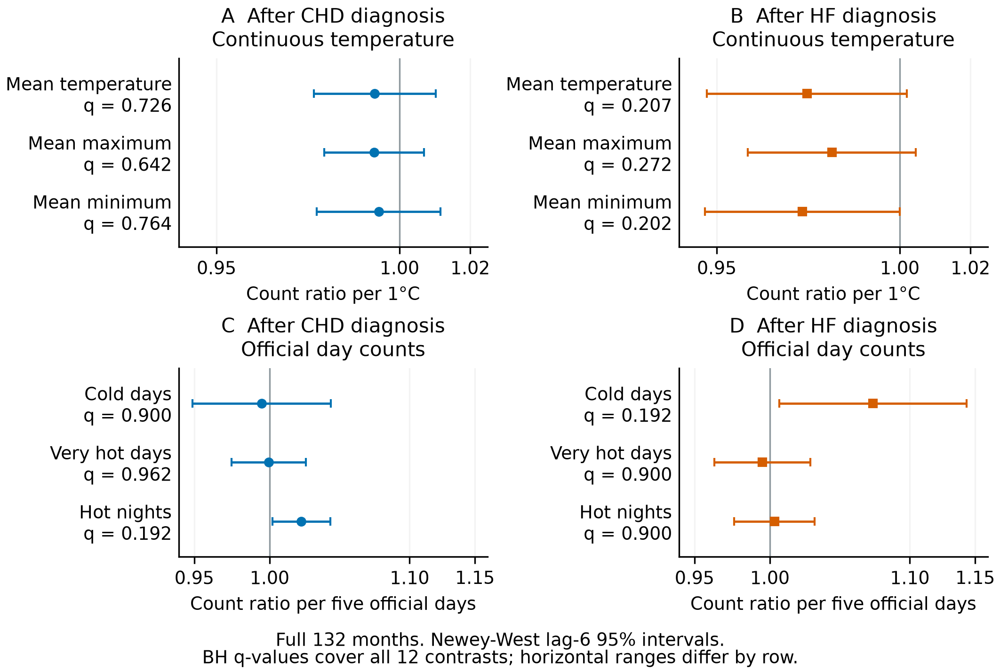
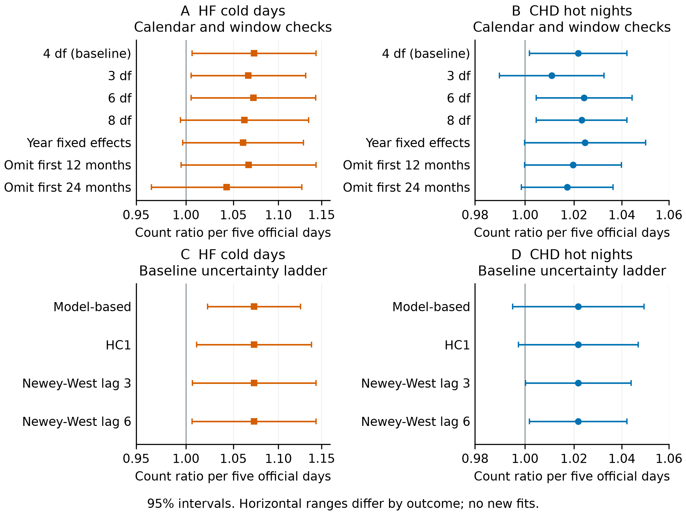

# Recorded first hospitalisations after cardiovascular diagnosis before and during COVID in Hong Kong

*Running title:* Recorded hospitalisations in the COVID era

## Abstract

Fewer recorded hospitalisations during a health-system disruption may reflect changes in disease, care use or ascertainment. We examined first recorded hospitalisations after coronary heart disease (CHD) or heart failure (HF) diagnosis in Hong Kong among people diagnosed with type 2 diabetes and/or hypertension during 2013–2023. Two monthly series comprised 156,156 CHD-associated and 29,681 HF-associated stays. Admission cause and eligible person-time were unavailable. Annual counts declined before 2020, fell further in 2020 and recovered towards 2019 levels by 2023. Compared with 2019, CHD and HF counts were respectively 17.4% and 16.2% lower in 2020, and 0.6% and 2.0% lower in 2023. Twelve exploratory negative-binomial weather models used calendar-month, time-trend and month-length controls. All full-window lag-six false-discovery-adjusted q-values exceeded 0.19. Selected associations depended on calendar specification and uncertainty construction. Nested pre-2020 and full-series fits did not provide independent period comparisons. The recorded trajectory therefore places the 2020 fall within a preceding decline and subsequent recovery. These observations cannot distinguish physiological improvement from altered care or recording, and the weather models do not exclude a weather contribution. Interpretation of falling first-hospitalisation counts requires explicit event definitions and the eligible population contributing to them.

**Keywords:** COVID-19; recorded hospitalisation; coronary heart disease; heart failure; diabetes; hypertension; Hong Kong

## Introduction

Hospitalisation counts are often used to describe population health during a public health emergency. Their interpretation depends on whether disease occurrence, access to care and event recording remain comparable. Hong Kong studies reported fewer hospitalisations and emergency-department visits during COVID-19 alongside higher mortality [1,2]. A reduction in recorded hospital use can therefore coexist with worse outcomes. For first hospitalisations, the number of people eligible to contribute an event also matters: entry, prior diagnoses, earlier events and departures from observation can change the count without an equivalent change in individual risk.

Closely related studies have examined cardiovascular outcomes, mortality and healthcare use among people with diabetes in Hong Kong and Korea [3] and among Hong Kong patients with hypertension [4]. The hypertension study also assessed blood-pressure control. A subsequent Hong Kong cohort related reduced continuity of diabetes care to later cardiovascular and other outcomes [5]. These studies supply clinical or service information that a monthly count series does not contain. A longer series or a different recorded endpoint is not sufficient grounds for claiming a new explanation of the pandemic's cardiovascular effects.

We examined two territory-wide monthly series of first recorded hospitalisations after CHD or HF diagnosis among people diagnosed with type 2 diabetes and/or hypertension during 2013–2023. The descriptive objective was to locate the pandemic-era trajectory within the earlier pattern of recorded counts. An existing weather analysis suggested smaller cold-day coefficients when later years were included. We assessed that observation through the complete weather panel and its calendar and uncertainty sensitivities. The count trajectory is the empirical focus; the weather analyses establish how dependent the associated interpretations are on the fitted specification.

## Results

### A preceding decline and a pandemic-era trough

The series contained 156,156 first recorded hospitalisations after CHD diagnosis and 29,681 after HF diagnosis. These outcome-specific totals were not combined into a unique patient count. Annual CHD counts fell from 23,830 in 2013 to 12,396 in 2019, while HF counts fell from 4,336 to 2,344 (Fig. 1; Supplementary Table S1). Both series therefore showed a substantial decline before the first pandemic year.

Counts fell further in 2020, to 10,237 for CHD and 1,964 for HF: respectively 17.4% and 16.2% below 2019. Both series rose in 2021, fell in 2022 and rose again in 2023. In 2023, the totals were 12,323 for CHD and 2,296 for HF, 0.6% and 2.0% below 2019. Recovery refers to recorded counts approaching the late pre-pandemic level, rather than returning to the much higher 2013 totals. These arithmetic comparisons do not adjust for the pre-existing trend.

Monthly means were 1,315.3 CHD events and 252.0 HF events in 2013–2019, 926.3 and 172.6 in 2020–2022, and 1,026.9 and 191.3 in 2023 (Supplementary Table S2). These periods do not overlap, but their averages include the preceding decline. An average over the whole pre-2020 period is consequently not a counterfactual for what would have occurred in 2020 without the pandemic.

**Figure 1. Annual recorded first hospitalisations after cardiovascular diagnosis, 2013–2023.** Stays after coronary heart disease (CHD) and heart failure (HF) diagnosis are shown separately on zero-origin count axes with different vertical scales. Each point is an observed annual total, without adjustment for eligible population or secular trend. Shading identifies 2020–2023 calendar years and does not denote an estimated treatment effect. Counts fell before 2020, reached a further trough in 2020 and approached 2019 totals by 2023. The endpoint is the first recorded hospitalisation after a relevant diagnosis, with admission cause unavailable. All 22 totals are retained in Supplementary Table S1.

### The complete weather panel does not resolve the trajectory

Full-window models gave small inverse point estimates for continuous temperature in both outcomes (Fig. 2; Supplementary Table S3). For example, the count ratio per 1°C higher monthly mean temperature was 0.993 (95% CI 0.976–1.010) for CHD and 0.974 (0.947–1.002) for HF. Official-day exposures gave a different pattern. Per five additional cold days, the CHD ratio was 0.995 (0.949–1.043) and the HF ratio was 1.073 (1.006–1.144). CHD hot nights gave a ratio of 1.022 (1.002–1.042). These are conditional ecological count associations, rather than changes in eligible-population incidence.

The smallest Benjamini–Hochberg-adjusted q-value in the twelve-fit lag-six family was 0.192; all twelve exceeded 0.19. The complete family therefore supplies no multiplicity-protected thermal finding. This result does not establish equivalence to no association or exclude a weather contribution to the count trajectory. The continuous-temperature and official-day models also represent different exposure contrasts, so their numerical magnitudes cannot be compared as interchangeable measures of thermal response.

The pre-2020 fits were different again. Cold-day ratios were 1.036 (1.007–1.067) for CHD and 1.113 (1.053–1.176) for HF, compared with 0.995 and 1.073 in the full window. Nested monthly-mean-temperature ratios were 0.980 (0.970–0.990) and 0.945 (0.927–0.963), respectively. Complete official-day results appear in Supplementary Table S4 and Fig. S2. The 84 pre-2020 months are contained within the full 132 months, and the spline basis was reconstructed for each fit. Their difference is not an estimated pre/post effect. The smaller full-window cold-day coefficients are not evidence that cold became protective.

**Figure 2. Complete full-window exploratory weather associations.** All twelve coronary heart disease (CHD) and heart failure (HF) negative-binomial models for January 2013–December 2023 are displayed with Newey–West lag-six 95% confidence intervals. Continuous exposures are scaled per 1°C; official-day exposures are scaled per five additional days, without a consecutive-day requirement. Separate panels distinguish outcomes and reporting units. Every model uses calendar-month indicators, a four-degree-of-freedom natural time spline and a days-in-month offset. The reference line denotes a count ratio of one. BH q-values apply jointly to the twelve lag-six Wald tests; all exceed 0.19. Reported estimates, p-values and q-values are in Supplementary Table S3; full-precision values are retained in the source CSV. These are recorded-count associations, not cohort incidence ratios.

### Calendar control and covariance alter the interpretation

The full-window HF cold-day interval included one under an eight-degree-of-freedom spline, year indicators, or omission of the first twelve or twenty-four months (Fig. 3; Supplementary Table S5). Calendar adjustments therefore affected whether the interval excluded one. Omitting the first months also changed the observations contributing to the fit. COVID-phase intercepts gave a CHD hot-night ratio of 1.013 (0.994–1.033) and an HF cold-day ratio of 1.074 (1.006–1.145). Those intercepts were adjustments within the full series, rather than an independently estimated later period.

Uncertainty construction changed the interpretation of CHD hot nights while leaving the fitted coefficient unchanged. Its model-based interval was 0.995–1.049 and its HC1 interval 0.997–1.047, whereas the lag-six interval was 1.002–1.042. Pearson residual autocorrelation at lag one was 0.508 for this model. A narrower HAC interval is not itself evidence of an invalid covariance estimate: the sandwich covariance depends on regression-score autocovariances, not residual autocorrelation alone. Residual dependence nevertheless limits confidence in nominal finite-sample uncertainty. Complete intervals and released diagnostics are retained in Supplementary Tables S6 and S7.

**Figure 3. Calendar and uncertainty criticism of two historically discussed associations.** Heart failure (HF) cold-day and coronary heart disease (CHD) hot-night ratios are displayed per five official days. Baseline fits cover January 2013–December 2023. Upper panels retain the baseline and six fixed calendar/start-window checks with Newey–West lag-six 95% intervals. Lower panels retain the same baseline coefficient under model-based, HC1, lag-three and lag-six uncertainty constructions. These selected examples reveal specification dependence; they are not a new confirmatory family. Panel ranges differ, and interval overlap or crossing one is not a test of a difference between specifications. The complete calendar panel, including phase-intercept adjustment, and all 48 baseline intervals remain in Supplementary Tables S5 and S6.

## Discussion

The observed first-hospitalisation trajectory comprises a decline before 2020, a further fall in 2020 and recovery towards 2019 counts by 2023. Placing these features in one series changes the descriptive comparison: the pandemic-era trough followed a substantial earlier reduction, and the subsequent increase approached the late pre-pandemic level. A comparison against the average of all preceding years would mix those changes with the earlier trend. The annual summaries locate the change in recorded burden, but do not estimate the additional effect of the pandemic.

The endpoint makes clinical interpretation particularly difficult. A first counted stay follows a diagnosis record, but its admission cause is unavailable. Its frequency depends on diagnosis recording, hospital contact and the people still eligible to contribute a first stay. The schematic in Supplementary Fig. S1 distinguishes those processes. It expresses plausible pathways, not effects estimated here. The early maximum does not prove a first-in-window recording artefact, and the later rebound does not rule out a changing eligible population. A changing count alone cannot determine which observation process changed.

Care disruption provides a plausible explanation for part of the 2020 fall. Local studies found reduced hospitalisation or emergency attendance alongside higher mortality [1,2]. Closely matched diabetes and hypertension studies examined cardiovascular outcomes together with healthcare use and mortality [3,4]; Hu and colleagues also reported blood-pressure control below pre-pandemic levels among measured patients [4]. These observations challenge a general interpretation of fewer recorded events as improved cardiovascular health. Their estimates cannot be transferred to this series because the endpoint and population contributing events differ.

Clinical measurements in other settings likewise provide no consistent physiological explanation. Retained diabetes outpatients in Taiwan showed lower HbA1c and fasting glucose after restrictions [6], whereas a Tokyo diabetes cohort showed small adverse changes in glycaemia and lipids [7]. A Hong Kong primary-care study found no evidence of an overall adjusted improvement in HbA1c or blood pressure [8]. Its sampling windows were February–March 2020 and February–March 2021, despite group labels referring to 2019 and 2020; it was neither a clean pre-pandemic comparison nor an individual longitudinal assessment. A small Hong Kong follow-up of COVID-19 survivors with acute dysglycaemia found worsening glycaemic status [9]. These studies preserve both favourable and adverse findings, but attendance, treatment and measurement timing restrict their interpretation.

Respiratory infection and prevention remain contextual explanations. Hong Kong interventions coincided with reduced influenza transmission in early 2020 [10]. Influenza has been associated with acute myocardial infarction [11], and community influenza-like illness activity with HF hospitalisation [12]. Reduced winter respiratory triggers could therefore affect a cold-day association without changing the direct response to cold. Infection was not measured in this population, and the cited outcomes differ from the supplied first post-diagnosis stay. Vaccinated people with recorded SARS-CoV-2 infection in Hong Kong subsequently had lower observed cardiovascular event risk than unvaccinated infected people [13]. That observational comparison does not establish population-wide baseline improvement, and vaccination cannot account for the 2020 dip that preceded it.

The continuity-of-care study by Yau and colleagues illustrates both the value and the limits of linked clinical evidence [5]. Patients attended repeatedly and remained alive and free of the study outcomes at a June 2022 landmark. Reduced continuity was associated with later CHD, HF and kidney failure; results for stroke and all-cause mortality were less conclusive. Those findings concern a selected population and a different endpoint. Conditioning on continued attendance, survival or infection status can change who contributes to an analysis. Better measurements among retained patients do not establish better health in everyone originally eligible.

The weather findings have a similarly bounded role. Adding later years changed coefficients, but also changed exposure support and calendar control. A utilisation or recording change correlated with weather after adjustment could alter a fitted slope without changing physiological susceptibility. Conversely, a stable slope would not establish stable susceptibility. The full-window family, calendar checks and covariance comparisons show how sensitive the associated interpretations are. None supplies a formal period-difference test or a decomposition of the annual burden. Non-rejection after multiplicity adjustment is therefore not evidence that weather was irrelevant.

Several limitations determine what this analysis can support. Cause-coded events, validated first-event rules, eligible person-time and linked deaths were unavailable; counts cannot be interpreted as disease-specific incidence. Clinical and treatment measurements were absent. Monthly aggregation obscures daily timing, while calendar modelling cannot separate all secular changes in diagnosis, care and recording. The thermal analyses were exploratory, the sensitivity models had no joint multiplicity adjustment, and the nominal uncertainty constructions were not certified by finite-sample calibration. These limitations constrain the contribution to description and model criticism of this particular recorded series.

The data show a pandemic-era trough within a longer history of changing first-hospitalisation counts. They leave physiological change, care disruption, respiratory co-exposure and altered ascertainment unresolved, with several explanations able to coexist. The distinction between recorded stays and clinical incidence remains essential when interpreting lower hospital use during a health-system disruption.

## Methods

### Design and recorded endpoint

This ecological time-series study covered January 2013–December 2023. The Hospital Authority transfer supplied one territory-month series for CHD and one for HF, each containing 132 months. The supplied population comprised people diagnosed with type 2 diabetes and/or hypertension during 2013–2023. For each cardiovascular diagnosis, the counted event was the first recorded hospitalisation after the person's first relevant diagnosis record. CHD and HF were analysed separately; no composite outcome or unique cross-outcome patient total was constructed.

The transfer did not record admission cause. The events were therefore not defined as stays principally for CHD, HF, acute myocardial infarction or acute coronary syndrome. The receipt did not establish whether the diagnosis admission itself qualified or a later stay was required. It also did not supply diagnostic code lists, diagnosis setting, look-back/washout, deduplication, inpatient versus day-procedure or emergency classification, or cohort entry and exit rules. The source extraction query was unavailable for verification. We retained the supplied first-hospitalisation definition and did not infer first-ever disease, a closed cohort or a necessarily declining risk set from the diagnosis interval.

Eligible person-time, linked death/exit information, age and sex strata, laboratory measurements, medication records and infection/vaccination histories were unavailable. The analytical unit was a monthly count, not an individual patient. The event totals describe recorded burden in the supplied construction; the same person could contribute to the separate CHD and HF series, with cross-outcome overlap unknown.

### Environmental measurements

Meteorological data was obtained from the HKO. The monthly variables included: temperature (mean, minimum, maximum), relative humidity, total rainfall, the number of hot nights (T~min~ ≥ 28°C), the number of very hot days (T~max~ ≥ 33°C), the number of extremely hot days (T~max~ ≥ 35°C), and the number of cold days (T~min~ ≤ 12°C). Monthly mean pollutant levels for nitrogen dioxide (NO~2~), sulfur dioxide (SO~2~), and ozone (O~3~) were obtained from the Hong Kong Environmental Protection Department (EPD). All monthly data were derived by taking the average of daily data in each calendar month.

For modelled official-day variables, each monthly exposure was the sum of daily threshold indicators. The five-day reporting scale did not require consecutive days. Continuous temperature measures were monthly means and rainfall, where assembled, was a monthly total. Averaging therefore applies to continuous mean variables, rather than threshold-day counts or rainfall totals. The reported baseline panel comprised mean temperature, mean daily maximum temperature, mean daily minimum temperature, hot nights, very hot days and cold days. The wider project's pollutant and influenza series were not included in these baseline models. Environmental data were not used as a substitute for clinical measurements.

Daily Hong Kong HF admissions and unplanned emergency admissions have been studied in relation to meteorological exposures [14,15]. Those studies provided thermal context, but their temporal resolution and cause-coded or care-setting definitions differed from this monthly first-hospitalisation construction. We did not interpret the monthly coefficients as daily triggering effects, duration thresholds or heatwave excess mortality.

### Descriptive comparisons

We summarised the annual counts and monthly means for three disjoint periods: 2013–2019, 2020–2022 and 2023. The final year was presented separately to show the end-of-series trajectory; it was not an unexposed control period. Annual percentage differences were calculated relative to 2019 from the recorded totals. No eligible-population standardisation, trend-adjusted counterfactual or uncertainty interval was assigned to those descriptive arithmetic comparisons. General-population denominators in older project summaries were omitted because they do not define the eligible first-event population.

### Weather models and reporting units

For each outcome, a separate negative-binomial model was fitted for each of the six exposures. The log mean monthly count included the log number of days in the month as an offset, calendar-month indicators and a natural cubic spline of calendar time with four degrees of freedom. January was the reference calendar month. Each model contained one exposure, rather than a joint temperature/extreme-day panel.

\[
log E(Y_t) = log(d_t) + alpha + beta X_t + calendar month indicators + s(t; 4 df).
\]

Here Yₜ is the monthly first-hospitalisation count, dₜ is days in that month, Xₜ is one exposure, and s(t; 4 df) represents the time spline. Exponentiated exposure coefficients were reported per 1°C for continuous measures and per five additional official days. The days offset controls calendar duration; it does not supply the eligible person-time denominator needed for incidence rates. Coefficients are conditional count ratios for the supplied ecological series.

The same specification was refitted on January 2013–December 2019. The natural spline's knots and boundary basis were reconstructed on those 84 months. The nested and full fits consequently differ in observations, exposure support and temporal basis. Their coefficients were retained as analysis-window sensitivities, not subtracted to estimate a period effect. No 2020–2023-only model or exposure-by-period interaction was available. Interval overlap and a change in whether an interval contains one were not tests of a window difference.

### Uncertainty and model criticism

Confidence intervals were reported from the model covariance, HC1 covariance and Newey–West covariance with three- and six-month lags [16]. The Newey–West calculations used no prewhitening and applied the finite-sample adjustment. Lag-six intervals were the common display convention. Benjamini–Hochberg adjustment covered the twelve full-window lag-six Wald p-values [17]. That family included both outcomes and all six exposures. Other covariance constructions, nested fits and calendar sensitivities remained exploratory and outside that adjusted family.

Existing calendar checks replaced the four-degree-of-freedom time spline with three, six or eight degrees of freedom or year indicators; omitted the first twelve or twenty-four months; or added COVID-phase intercepts in the full series. The five intercept periods ended in January 2020, December 2021, April 2022 and December 2022, with the last beginning in January 2023. These intercepts did not form a separately fitted later-era series. Calendar and omission alternatives were reported together rather than selected according to interval exclusion.

The displayed model-criticism examples were HF cold days and CHD hot nights, which had been discussed in the preceding exploratory analysis. Their selection for display did not establish a new inferential family. All official-day calendar results and all baseline uncertainty constructions were retained in the supplement. Released diagnostics comprised convergence, negative-binomial dispersion parameter, Pearson dispersion, residual autocorrelation and Ljung–Box statistics. Residual statistics were not treated as a substitute for score-based covariance assessment or simulation calibration. Analyses used R, MASS negative-binomial regression, natural splines and sandwich covariance estimators.

## Data availability

The aggregate descriptive and model summaries supporting the figures and tables are available in the Laidlaw Heat Project repository. Individual records and the underlying governed monthly hospitalisation files are not reproduced. Access to underlying health data is controlled by the data custodian. Environmental sources are the Hong Kong Observatory, Environmental Protection Department and Centre for Health Protection.

## Code availability

The analysis and figure code is available at https://github.com/bobshenruililin/Laidlaw-Heat-Project. The completed analysis summaries are distinguished from prospective scripts that have not generated results for this article. Figure source tables retain the reported quantities and provenance needed to reproduce the displays from released summaries.

## References

1. Xin H, Wu P, Wong JY, et al. Hospitalizations and mortality during the first year of the COVID-19 pandemic in Hong Kong, China: An observational study. Lancet Reg Health West Pac. 2023;30:100645. doi:10.1016/j.lanwpc.2022.100645

2. Wai AKC, Wong CKH, Wong JYH, et al. Changes in emergency department visits, diagnostic groups, and 28-day mortality associated with the COVID-19 pandemic. Ann Emerg Med. 2022;79:148–157. doi:10.1016/j.annemergmed.2021.09.424

3. Youn HM, Hu Z, Park YS, et al. Indirect Impact of the COVID-19 Pandemic on All-Cause Mortality and Cardiovascular Disease Among People With Diabetes Mellitus From Korea and Hong Kong: An Interrupted Time Series Analysis. Health Sci Rep. 2025;8:e71291. doi:10.1002/hsr2.71291

4. Hu Z, Yau YK, Quan J, et al. Indirect effect of the COVID-19 pandemic on cardiovascular diseases incidence, mortality, and healthcare use among patients with hypertension but without SARS-CoV-2 infection in Hong Kong: an interrupted time series analysis. Hypertens Res. 2025;48:2197–2208. doi:10.1038/s41440-025-02230-y

5. Yau YK, Li M, Quan J, et al. Association of Reduction in Continuity of Care During COVID-19 Pandemic With Cardiovascular Diseases, Kidney Failure and All-Cause Mortality for People With Diabetes: A Cohort Study in Hong Kong. Diabetes Obes Metab. 2026;28:8016–8024. doi:10.1111/dom.70984

6. Huang H, Su HL, Huang CH, Lin YH. Retrospective Study on the Impact of COVID-19 Lockdown on Patients with Type 2 Diabetes in Northern Taiwan. Diabetes Metab Syndr Obes. 2023;16:2539–2547. doi:10.2147/DMSO.S422617

7. Ohkuma K, Sawada M, Aihara M, et al. Impact of the COVID-19 pandemic on the glycemic control in people with diabetes mellitus: A retrospective cohort study. J Diabetes Investig. 2023;14:985–993. doi:10.1111/jdi.14021

8. Wong CM, Lai KPL, Luk MHM, et al. Impact of COVID-19 pandemic on glycaemic and blood pressure control among patients with type 2 diabetes in primary care in Hong Kong. BMC Prim Care. 2025;26:182. doi:10.1186/s12875-025-02893-z

9. Lui DTW, Lee CH, Wong Y, et al. A Prospective 1-Year Follow-up of Glycemic Status and C-Peptide Levels of COVID-19 Survivors with Dysglycemia in Acute COVID-19 Infection. Diabetes Metab J. 2024;48:763–770. doi:10.4093/dmj.2023.0175

10. Cowling BJ, Ali ST, Ng TWY, et al. Impact assessment of non-pharmaceutical interventions against coronavirus disease 2019 and influenza in Hong Kong: an observational study. Lancet Public Health. 2020;5:e279–e288. doi:10.1016/S2468-2667(20)30090-6

11. Kwong JC, Schwartz KL, Campitelli MA, et al. Acute Myocardial Infarction after Laboratory-Confirmed Influenza Infection. N Engl J Med. 2018;378:345–353. doi:10.1056/NEJMoa1702090

12. Kytömaa S, Hegde S, Claggett B, et al. Association of Influenza-like Illness Activity With Hospitalizations for Heart Failure: The Atherosclerosis Risk in Communities Study. JAMA Cardiol. 2019;4:363–369. doi:10.1001/jamacardio.2019.0549

13. Wan EYF, Mok AHY, Yan VKC, et al. Association between BNT162b2 and CoronaVac vaccination and risk of CVD and mortality after COVID-19 infection: A population-based cohort study. Cell Rep Med. 2023;4:101195. doi:10.1016/j.xcrm.2023.101195

14. Goggins WB, Chan EYY. A study of the short-term associations between hospital admissions and mortality from heart failure and meteorological variables in Hong Kong. Int J Cardiol. 2017;228:537–542. doi:10.1016/j.ijcard.2016.11.106

15. Guo YT, Chan KH, Qiu H, Wong ELY, Ho KF. The risk of hospitalization associated with hot nights and excess nighttime heat in a subtropical metropolis: a time-series study in Hong Kong, 2000–2019. Lancet Reg Health West Pac. 2024;51:101168. doi:10.1016/j.lanwpc.2024.101168

16. Newey WK, West KD. A simple, positive semi-definite, heteroskedasticity and autocorrelation consistent covariance matrix. Econometrica. 1987;55:703–708. doi:10.2307/1913610

17. Benjamini Y, Hochberg Y. Controlling the false discovery rate: a practical and powerful approach to multiple testing. J R Stat Soc Series B. 1995;57:289–300. doi:10.1111/j.2517-6161.1995.tb02031.x
