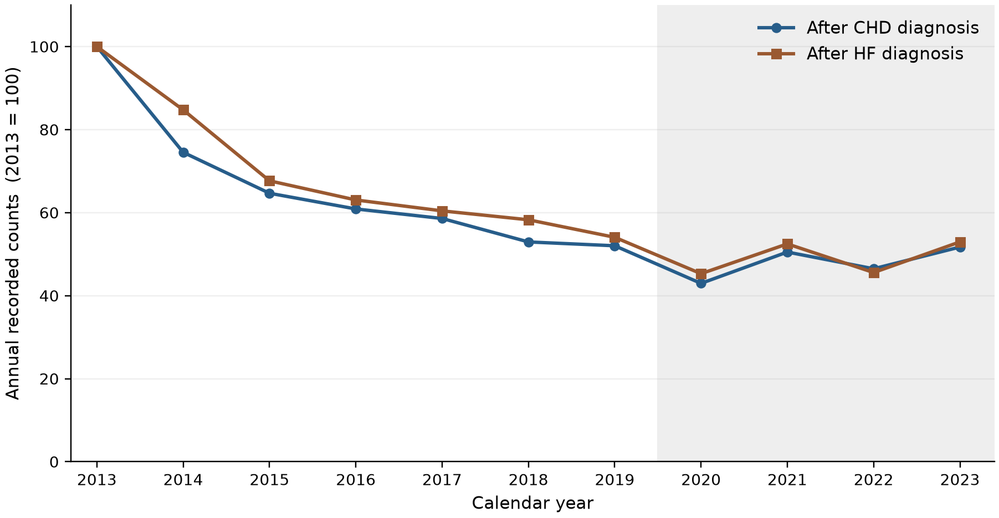

# First recorded hospitalisations after coronary heart disease or heart failure diagnosis before and during the COVID pandemic in Hong Kong from 2013 to 2023

*Running title:* Pandemic era first hospitalisation counts

## Abstract

**Background.** Fewer recorded hospitalisations during the COVID-19 pandemic can reflect changes in disease burden, care use or event ascertainment. We examined first-hospitalisation counts among people with type 2 diabetes and/or hypertension in Hong Kong, placing the pandemic years within the preceding trend and assessing the sensitivity of weather associations to the analysis window.

**Methods.** We analysed two territory-wide monthly series from January 2013 to December 2023. The event was the first recorded hospitalisation after a first coronary heart disease (CHD) or heart failure (HF) diagnosis; admission cause was unavailable. We described annual counts and three non-overlapping calendar periods. Twelve separate negative-binomial weather models included calendar-month indicators, a four-degree-of-freedom time spline and a days-in-month offset. We compared the full 132-month fit with a nested 84-month fit ending in 2019. These overlapping fits were sensitivity analyses, not a pre/post interaction test.

**Results.** There were 156,156 first recorded hospitalisations after CHD diagnosis and 29,681 after HF diagnosis. Counts declined before 2020. Compared with 2019, annual counts were 17.4% lower for CHD and 16.2% lower for HF in 2020, but only 0.6% and 2.0% lower in 2023. The cold-day count ratio per five additional days was 1.036 (Newey–West lag-six 95% CI 1.007–1.067) for CHD in the pre-2020 fit and 0.995 (0.949–1.043) in the full fit; corresponding HF ratios were 1.113 (1.053–1.176) and 1.073 (1.006–1.144). All twelve full-window multiplicity-adjusted q-values exceeded 0.19. No laboratory measurements or cohort person-time were available.

**Conclusions.** Recorded first-hospitalisation counts dipped in 2020 after a substantial earlier decline and recovered towards 2019 levels by 2023. Thermal estimates depended on the window and calendar specification. Neither the count trajectory nor these sensitivity fits identify physiological improvement or exclude a contribution from weather.

**Keywords:** COVID-19; first hospitalisation; coronary heart disease; heart failure; diabetes; hypertension; Hong Kong

## Introduction

A fall in hospitalisations during a public health emergency is difficult to interpret. It may indicate fewer events requiring care, reduced access or willingness to attend, or a change in which events are recorded. In Hong Kong, Xin and colleagues reported fewer hospitalisations alongside higher mortality in 2020, including more deaths outside public hospitals [1]. Wai and colleagues likewise found fewer emergency-department visits and higher subsequent mortality among attenders [2]. These findings make it unsafe to equate a lower recorded hospital count with better cardiovascular health.

The distinction is particularly important for first events. A monthly count of first hospitalisations depends on how people enter the eligible population, which previous diagnoses and admissions are recognised, and how many people remain able to contribute an event. These processes can change without a change in individual susceptibility. They also differ from the repeated, cause-coded admissions generally used to study short-term temperature effects. Hong Kong studies of daily HF admissions and unplanned emergency hospitalisations provide relevant thermal context [3,4], but their outcomes and temporal resolution differ from a monthly first-hospitalisation series without recorded admission cause.

We examined first recorded hospitalisations after CHD or HF diagnosis among people with type 2 diabetes and/or hypertension during 2013–2023. An initial weather analysis suggested that cold-day count ratios were lower when pandemic years were included. That observation raised two distinct questions: how did recorded counts change around 2020, and did the association between weather and counts change between eras? The available results address the first descriptively and the second through analysis-window sensitivity. They do not provide an independent estimate for the later era or a formal interaction test.

Our primary descriptive objective was to locate the pandemic-era count trajectory within the preceding decline. Our secondary objective was to assess thermal associations across the full and nested pre-2020 windows and across calendar specifications. We considered evidence on physiological change, care use and respiratory infection to identify plausible explanations and the measurements needed to distinguish them.

## Methods

### Design and outcome definition

This ecological time-series study covered January 2013 to December 2023. The Hospital Authority transfer comprised one territory-month series for CHD and one for HF, each with 132 months. The supplied definition was the first recorded hospitalisation after a person's first diagnosis record for the relevant cardiovascular disease among patients diagnosed with type 2 diabetes and/or hypertension during 2013–2023. CHD and HF were analysed separately; their counts were not combined into a composite outcome.

Admission cause was not recorded. The events therefore cannot be interpreted as admissions principally for CHD, HF, acute myocardial infarction or acute coronary syndrome. The transfer did not establish whether the diagnosis episode itself counted as the first hospitalisation or whether a later stay was required. It also did not provide the diagnostic code list, look-back period, washout, entry and exit dates, or separate inpatient, emergency and day-procedure classifications. We retained the supplied first-hospitalisation label without assuming these details. The diagnosis interval does not establish a closed cohort or a monotonically declining population at risk.

Age and sex strata, laboratory measurements, medication records, infection and vaccination histories, and person-time at risk were unavailable. This study therefore estimated recorded burden and ecological count associations, rather than individual disease incidence or physiological change.

### Weather data

Meteorological data was obtained from the HKO. The monthly variables included: temperature (mean, minimum, maximum), relative humidity, total rainfall, the number of hot nights (T~min~ ≥ 28°C), the number of very hot days (T~max~ ≥ 33°C), the number of extremely hot days (T~max~ ≥ 35°C), and the number of cold days (T~min~ ≤ 12°C). Monthly mean pollutant levels for nitrogen dioxide (NO~2~), sulfur dioxide (SO~2~), and ozone (O~3~) were obtained from the Hong Kong Environmental Protection Department (EPD). All monthly data were derived by taking the average of daily data in each calendar month.

For the modelled official-day variables, each monthly exposure was the sum of daily threshold indicators. The five-day reporting scale did not require consecutive days. Continuous temperature measures were monthly means; rainfall, where assembled, was a monthly total. Thus averaging applies to continuous mean variables, not to threshold-day counts or rainfall totals. Pollutant and influenza series were available in the wider project but were not included in the baseline models reported here. No physiological measurements were inferred from environmental series.

### Descriptive comparisons

We summarised annual first-hospitalisation totals and monthly means for three disjoint periods: 2013–2019, 2020–2022 and 2023. The latter was described separately to show the end-of-series trajectory; it was not treated as an unexposed control period. Annual percentage differences relative to 2019 were arithmetic comparisons, without trend adjustment or a causal interpretation. We did not use the average of all pre-2020 years as a counterfactual for 2020 because counts were already declining over that interval.

### Thermal models and estimands

For each outcome, we fitted a separate negative-binomial regression for monthly mean temperature, mean daily maximum temperature, mean daily minimum temperature, hot nights, very hot days and cold days. The model was:

\[
log E(Y_t) = log(d_t) + alpha + beta X_t + calendar month indicators + s(t; 4 df).
\]

Here Y_t is the monthly first-hospitalisation count, d_t is the number of days in that month, X_t is one weather exposure, and s(t; 4 df) is a natural cubic spline of calendar time with four degrees of freedom. January was the reference calendar month. We reported exp(beta) per 1°C for continuous temperature or per five additional official days. The offset accounts for month length. It does not supply the eligible person-time denominator needed for incidence rates. General-population counts are not a substitute for that denominator.

We refitted the specification on January 2013–December 2019. These 84 months are contained within the full 132 months. The natural spline basis, including its knots and boundaries, was recalculated on the subset. Consequently, the two fitted coefficients differ in both sample and calendar control. Their difference is not an estimated pre/post effect. Neither overlap of confidence intervals nor a change in whether an interval contains one constitutes a test of such a difference. No 2020–2023-only model or exposure-by-period interaction was available.

### Uncertainty and model criticism

We reported model-based, HC1 and Newey–West confidence intervals with lags of three and six months [5]. Newey–West calculations used no prewhitening and included the finite-sample adjustment. Lag-six intervals were the common display convention across the panel. Benjamini–Hochberg adjustment covered the twelve full-window lag-six Wald p-values [6]. Nested fits and other sensitivity models were outside that multiplicity family and remained exploratory.

Calendar sensitivity replaced the four-degree-of-freedom spline with three, six or eight degrees of freedom or year indicators, omitted the first twelve or twenty-four months, or added full-sample COVID-phase intercepts. The five intercept periods ended in January 2020, December 2021, April 2022 and December 2022, with the last beginning in January 2023. These adjustments were not independent period estimates. Pearson residual autocorrelation and Ljung–Box statistics were examined as model diagnostics. We did not select a calendar or uncertainty specification because its interval excluded one. Analyses used R, MASS negative-binomial regression, natural splines and sandwich covariance estimators.

## Results

### Recorded counts before and during the pandemic

The series contained 156,156 first recorded hospitalisations after CHD diagnosis and 29,681 after HF diagnosis. Annual counts fell from 23,830 to 12,396 for CHD and from 4,336 to 2,344 for HF between 2013 and 2019 (Table 1). A substantial decline therefore preceded the pandemic.

Counts fell further in 2020, to 10,237 for CHD and 1,964 for HF. These totals were 17.4% and 16.2% below 2019. Both series rose in 2021, fell in 2022 and rose again in 2023. By 2023, CHD and HF totals were 12,323 and 2,296, respectively: 0.6% and 2.0% below 2019. Counts returned towards the late pre-pandemic level rather than the much higher 2013 level (Figure 1).

**Table 1. Annual recorded first hospitalisation counts.** Each event is a first recorded hospitalisation after the relevant diagnosis in the supplied type 2 diabetes and/or hypertension population. Admission cause was unavailable. These are counts, not incidence rates.

| Year | CHD first hospitalisations | HF first hospitalisations |
|:--|:--|:--|
| 2013 | 23,830 | 4,336 |
| 2014 | 17,760 | 3,675 |
| 2015 | 15,411 | 2,934 |
| 2016 | 14,510 | 2,734 |
| 2017 | 13,962 | 2,620 |
| 2018 | 12,616 | 2,527 |
| 2019 | 12,396 | 2,344 |
| 2020 | 10,237 | 1,964 |
| 2021 | 12,035 | 2,275 |
| 2022 | 11,076 | 1,976 |
| 2023 | 12,323 | 2,296 |

**Figure 1. Annual first hospitalisation counts indexed to 2013.** Each series uses its own 2013 total as 100. The shaded interval begins in 2020 and marks calendar years, not an estimated treatment effect. Source: Hospital Authority aggregate annual summaries.

Monthly means were 1,315.3 CHD events and 252.0 HF events in 2013–2019, 926.3 and 172.6 in 2020–2022, and 1,026.9 and 191.3 in 2023 (Supplementary Table S1). These are disjoint descriptive periods. Differences in their averages include the strong pre-existing decline and cannot be attributed to the pandemic.

### Weather associations and analysis window

Cold-day point estimates were lower in the full window than in the nested pre-2020 window (Table 2). For CHD, the count ratio per five additional cold days changed from 1.036 (95% CI 1.007–1.067) to 0.995 (0.949–1.043). For HF, it changed from 1.113 (1.053–1.176) to 1.073 (1.006–1.144). The full-window HF point estimate remained above one. Neither comparison establishes a protective cold effect or a reduction in susceptibility after 2019.

**Table 2. Official day count associations in nested and full windows.** Count ratios per five additional days, with Newey–West lag-six 95% confidence intervals. The pre-2020 window is contained within the full window; these columns are not independent pre/post estimates.

| Outcome | Exposure | Pre 2020 84 months | Full 132 months |
|:--|:--|:--|:--|
| CHD | Hot nights / 5 days | 1.011 (0.991–1.032) | 1.022 (1.002–1.042) |
| CHD | Very hot days / 5 days | 0.997 (0.982–1.012) | 0.999 (0.974–1.025) |
| CHD | Cold days / 5 days | 1.036 (1.007–1.067) | 0.995 (0.949–1.043) |
| HF | Hot nights / 5 days | 0.965 (0.937–0.994) | 1.003 (0.976–1.031) |
| HF | Very hot days / 5 days | 0.990 (0.960–1.021) | 0.995 (0.963–1.028) |
| HF | Cold days / 5 days | 1.113 (1.053–1.176) | 1.073 (1.006–1.144) |

Hot-night estimates increased in both outcomes when later years were included: from 1.011 to 1.022 for CHD and from 0.965 to 1.003 for HF. Very-hot-day estimates were close to one in both windows. The different exposure encodings also gave different associations. Monthly mean temperature was inversely associated with counts in the nested window for CHD, 0.980 (0.970–0.990), and HF, 0.945 (0.927–0.963), while cold-day counts were positively associated with both. Monthly mean temperature and threshold-day frequency do not estimate the same thermal contrast.

The complete twelve-fit full-window panel is reported in Supplementary Table S2. The smallest adjusted q-value was 0.192; all twelve exceeded 0.19. The panel therefore does not support a multiplicity-protected thermal claim. It also does not establish the absence of a weather contribution to the count trajectory.

### Dependence on calendar control and uncertainty

The exploratory associations varied across calendar specifications (Supplementary Table S3). The full-window HF cold-day lag-six interval included one with an eight-degree-of-freedom spline, year indicators, or omission of the first twelve or twenty-four months. Adding COVID-phase intercepts gave a CHD hot-night ratio of 1.013 (0.994–1.033) and an HF cold-day ratio of 1.074 (1.006–1.145). This adjustment changed the calendar comparison but did not identify a pandemic effect or separate its mechanisms.

Uncertainty construction also affected interpretation (Supplementary Table S4). For full-window CHD hot nights, the model-based interval was 0.995–1.049 and the HC1 interval was 0.997–1.047, whereas the lag-six interval was 1.002–1.042. Pearson residual autocorrelation at lag one was 0.508 for that model. The lag-six interval being narrower does not itself show that the covariance estimate is invalid: a sandwich covariance depends on regression score autocovariances, not solely on residual autocorrelation. Residual dependence nevertheless warrants caution about finite-sample inference. Agreement among baseline HF cold-day uncertainty methods did not overcome its calendar sensitivity or multiplicity adjustment.

## Discussion

The count trajectory has three features: a substantial decline before 2020, a further fall in 2020, and recovery towards 2019 levels by 2023. The thermal analysis has a different result: estimated associations depended on the analysis window, exposure encoding and calendar control. Together, these observations motivate investigation of the pandemic-era change in recorded first events. They do not identify improved cardiovascular physiology.

### Care use and first event ascertainment

Care disruption is a plausible explanation for part of the 2020 dip. Hong Kong studies reported fewer hospitalisations or emergency visits alongside higher mortality [1,2]. They caution against interpreting fewer recorded events as a health benefit, but they involve different outcomes and populations. They cannot explain this series by direct transfer of their effect estimates. Nor can evidence confined to 2020 explain the preceding decline or the 2022 dip.

First-event ascertainment offers another explanation. Entry into the eligible population, diagnosis look-back, removal after a first recorded event, competing deaths and changes in service coding may all alter counts. The available metadata do not show which of these processes occurred. In particular, the early maximum does not prove an artefact of first-in-window recording, and the later rebound does not disprove a changing risk set. These possibilities require the extraction rules and eligible population by month, rather than another temperature specification.

### Physiological change and competing explanations

Evidence of metabolic improvement during pandemic restrictions is heterogeneous. Huang and colleagues observed lower HbA1c and fasting glucose after restrictions among retained diabetes outpatients in Taiwan [7]. A Tokyo diabetes cohort instead showed small adverse changes in glycaemia and lipids [8]. Both studies concerned patients who remained under observation, with potential changes in treatment, attendance and seasonal timing. Neither establishes a population-wide cardiovascular benefit in Hong Kong.

The most directly relevant local study, by Wong and colleagues, found no evidence of an overall adjusted improvement in HbA1c or blood pressure among regular primary-care attenders with type 2 diabetes [9]. Its group labels referred to 2019 and 2020, but the actual sampling windows were February–March 2020 and February–March 2021. Its first window was already after the initial Hong Kong outbreak. It is therefore neither a clean pre-pandemic comparison nor an individual longitudinal assessment. A separate small Hong Kong follow-up of COVID-19 survivors with acute dysglycaemia found worsening rather than improved glycaemic status [10]. These findings weaken a broad metabolic-improvement explanation without excluding benefits in particular patient groups.

Reduced respiratory infection is another candidate. Hong Kong non-pharmaceutical interventions coincided with reduced influenza transmission in early 2020 [11]. Laboratory-confirmed influenza has been associated with acute myocardial infarction in a self-controlled study [12], and community influenza-like illness activity with HF hospitalisation in the ARIC study [13]. A reduction in winter respiratory triggers could change observed cold-day associations without any reduction in the direct physiological effect of cold. This remains an untested explanation here: infection was not measured in the study population, and these external outcomes differ from the first recorded post-diagnosis stay.

Vaccination and changes in prevention may have affected later years. Wan and colleagues reported lower acute and post-acute cardiovascular event risk among vaccinated than unvaccinated people with SARS-CoV-2 infection in Hong Kong [14]. That comparison concerns vaccination among infected people, with observational confounding and a different cardiovascular endpoint. It does not establish better baseline health in the whole eligible population, and it cannot explain a dip that preceded vaccination. Treatment, behaviour, infection, care use and recording may have operated simultaneously.

### What the thermal models establish

The nested fits show sensitivity to adding later years, not a change in a causal weather effect. Their samples overlap and their spline bases differ. A pandemic-era utilisation shock can change a fitted weather coefficient if its timing is associated with weather after calendar adjustment; a lower overall count does not predict attenuation in every model. Conversely, similar coefficients would not rule out changing susceptibility. The direction of coefficient movement alone cannot discriminate between these explanations.

The thermal panel also cannot exclude weather as an explanation for the count trajectory. Such a claim would require an explicit decomposition or standardisation with a defined counterfactual, adequate exposure support and controlled confounding. Non-rejection after multiplicity adjustment supplies no such decomposition. Sparse official cold days and monthly aggregation further limit discrimination between cold itself, seasonal infection and care-use patterns.

### Limitations and implications

The main limitation is the event construction. Without recorded admission cause, eligible person-time or validated first-event rules, these counts cannot measure disease-specific incidence. Laboratory and medication data were absent, preventing direct assessment of physiological change. Monthly aggregation obscures daily timing, and secular trends may reflect changing diagnosis, treatment, eligibility and recording. The available thermal models did not include a separate later-era coefficient or an interaction, and exploratory sensitivity analyses did not receive joint multiplicity adjustment. Annual comparisons did not estimate a counterfactual pandemic effect.

The next discriminating analysis should separate change in recorded burden from change in weather association. A common full-series model with exposure-by-period terms could estimate the latter, provided calendar structure and exposure support are handled consistently. Testing physiological explanations would additionally require repeated clinical measurements, treatment and attendance information, and explicit attention to who was tested. Lower values among tested attenders could reflect selection rather than improved health. Confirmation of event rules and denominators has priority over adding further speculative mechanisms.

## Conclusion

First recorded hospitalisation counts after CHD or HF diagnosis declined before 2020, dipped further in 2020 and recovered towards 2019 levels by 2023. Lower cold-day coefficients in a full-window fit were an exploratory sensitivity finding, not evidence that cold became protective or of physiological improvement after COVID-19. The data support a study of recorded burden and its ascertainment. They leave physiological change, care disruption and respiratory co-exposure as competing explanations requiring different evidence.

## Data and code availability

Individual records and the underlying monthly hospitalisation files are not reproduced. Analysis code and aggregate descriptive and model summaries are available in the Laidlaw Heat Project repository at https://github.com/bobshenruililin/Laidlaw-Heat-Project. Environmental sources are the Hong Kong Observatory, Environmental Protection Department and Centre for Health Protection. The aggregate summaries permit verification of the reported tables; the underlying health data are governed by the data custodian.

## References

1. Xin H, Wu P, Wong JY, et al. Hospitalizations and mortality during the first year of the COVID-19 pandemic in Hong Kong, China: An observational study. Lancet Reg Health West Pac. 2023;30:100645. doi:10.1016/j.lanwpc.2022.100645

2. Wai AKC, Wong CKH, Wong JYH, et al. Changes in emergency department visits, diagnostic groups, and 28-day mortality associated with the COVID-19 pandemic. Ann Emerg Med. 2022;79:148–157. doi:10.1016/j.annemergmed.2021.09.424

3. Goggins WB, Chan EYY. A study of the short-term associations between hospital admissions and mortality from heart failure and meteorological variables in Hong Kong. Int J Cardiol. 2017;228:537–542. doi:10.1016/j.ijcard.2016.11.106

4. Guo YT, Chan KH, Qiu H, Wong ELY, Ho KF. The risk of hospitalization associated with hot nights and excess nighttime heat in a subtropical metropolis: a time-series study in Hong Kong, 2000–2019. Lancet Reg Health West Pac. 2024;51:101168. doi:10.1016/j.lanwpc.2024.101168

5. Newey WK, West KD. A simple, positive semi-definite, heteroskedasticity and autocorrelation consistent covariance matrix. Econometrica. 1987;55:703–708. doi:10.2307/1913610

6. Benjamini Y, Hochberg Y. Controlling the false discovery rate: a practical and powerful approach to multiple testing. J R Stat Soc Series B. 1995;57:289–300. doi:10.1111/j.2517-6161.1995.tb02031.x

7. Huang H, Su HL, Huang CH, Lin YH. Retrospective Study on the Impact of COVID-19 Lockdown on Patients with Type 2 Diabetes in Northern Taiwan. Diabetes Metab Syndr Obes. 2023;16:2539–2547. doi:10.2147/DMSO.S422617

8. Ohkuma K, Sawada M, Aihara M, et al. Impact of the COVID-19 pandemic on the glycemic control in people with diabetes mellitus: A retrospective cohort study. J Diabetes Investig. 2023;14:985–993. doi:10.1111/jdi.14021

9. Wong CM, Lai KPL, Luk MHM, et al. Impact of COVID-19 pandemic on glycaemic and blood pressure control among patients with type 2 diabetes in primary care in Hong Kong. BMC Prim Care. 2025;26:182. doi:10.1186/s12875-025-02893-z

10. Lui DTW, Lee CH, Wong Y, et al. A Prospective 1-Year Follow-up of Glycemic Status and C-Peptide Levels of COVID-19 Survivors with Dysglycemia in Acute COVID-19 Infection. Diabetes Metab J. 2024;48:763–770. doi:10.4093/dmj.2023.0175

11. Cowling BJ, Ali ST, Ng TWY, et al. Impact assessment of non-pharmaceutical interventions against coronavirus disease 2019 and influenza in Hong Kong: an observational study. Lancet Public Health. 2020;5:e279–e288. doi:10.1016/S2468-2667(20)30090-6

12. Kwong JC, Schwartz KL, Campitelli MA, et al. Acute Myocardial Infarction after Laboratory-Confirmed Influenza Infection. N Engl J Med. 2018;378:345–353. doi:10.1056/NEJMoa1702090

13. Kytömaa S, Hegde S, Claggett B, et al. Association of Influenza-like Illness Activity With Hospitalizations for Heart Failure: The Atherosclerosis Risk in Communities Study. JAMA Cardiol. 2019;4:363–369. doi:10.1001/jamacardio.2019.0549

14. Wan EYF, Mok AHY, Yan VKC, et al. Association between BNT162b2 and CoronaVac vaccination and risk of CVD and mortality after COVID-19 infection: A population-based cohort study. Cell Rep Med. 2023;4:101195. doi:10.1016/j.xcrm.2023.101195
