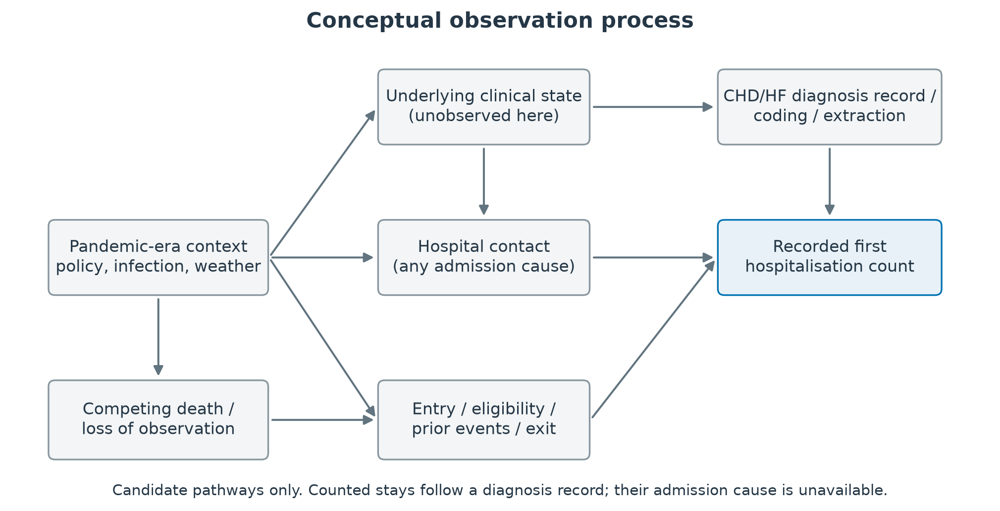
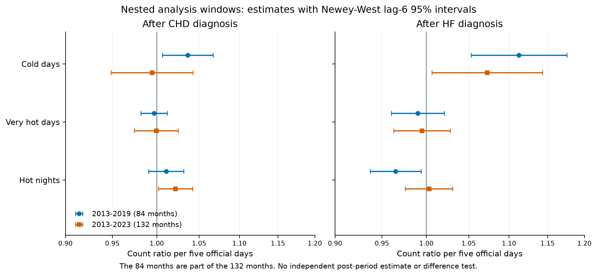

# Supplementary results for first hospitalisation counts before and during the COVID pandemic

The tables distinguish disjoint descriptive periods from overlapping model fits. Confidence intervals are nominal pointwise 95% normal-reference Wald intervals for exploratory associations; no later-era effect is inferred by subtracting nested coefficients.

## Annual recorded counts

**Supplementary Table S1. Annual recorded first hospitalisations after coronary heart disease (CHD) or heart failure (HF) diagnosis, 2013–2023.** Each total is the sum of twelve supplied monthly counts. Admission cause and eligible person-time were unavailable; no incidence rate or unique combined patient count is implied.

| Year | CHD first hospitalisations | HF first hospitalisations |
|:--|:--|:--|
| 2013 | 23,830 | 4,336 |
| 2014 | 17,760 | 3,675 |
| 2015 | 15,411 | 2,934 |
| 2016 | 14,510 | 2,734 |
| 2017 | 13,962 | 2,620 |
| 2018 | 12,616 | 2,527 |
| 2019 | 12,396 | 2,344 |
| 2020 | 10,237 | 1,964 |
| 2021 | 12,035 | 2,275 |
| 2022 | 11,076 | 1,976 |
| 2023 | 12,323 | 2,296 |

## Descriptive periods

**Supplementary Table S2. Monthly mean recorded counts in non overlapping calendar periods.** Coronary heart disease (CHD) and heart failure (HF) arithmetic means from aggregate period summaries.

| Period | Months | CHD monthly mean | HF monthly mean |
|:--|:--|:--|:--|
| 2013–2019 | 84 | 1315.3 | 252.0 |
| 2020–2022 | 36 | 926.3 | 172.6 |
| 2023 | 12 | 1026.9 | 191.3 |

## Complete baseline panel

**Supplementary Table S3. All twelve baseline weather models, January 2013–December 2023.** CHD denotes coronary heart disease; HF denotes heart failure. Days-in-month offset, calendar-month indicators, four-degree-of-freedom natural time spline; Newey–West lag-six intervals. BH q-values cover these twelve two-sided Wald tests of zero exposure coefficient only; interval endpoints are not multiplicity-adjusted. The window spans 132 calendar months, not 132 independent replicates.

| Outcome | Exposure | Count ratio and 95% CI | p | BH q |
|:--|:--|:--|:--|:--|
| CHD | Mean temperature / 1°C | 0.993 (0.976–1.010) | 0.424 | 0.726 |
| CHD | Mean maximum / 1°C | 0.993 (0.979–1.007) | 0.321 | 0.642 |
| CHD | Mean minimum / 1°C | 0.994 (0.977–1.012) | 0.509 | 0.764 |
| CHD | Hot nights / 5 days | 1.022 (1.002–1.042) | 0.032 | 0.192 |
| CHD | Very hot days / 5 days | 0.999 (0.974–1.025) | 0.962 | 0.962 |
| CHD | Cold days / 5 days | 0.995 (0.949–1.043) | 0.823 | 0.900 |
| HF | Mean temperature / 1°C | 0.974 (0.947–1.002) | 0.069 | 0.207 |
| HF | Mean maximum / 1°C | 0.981 (0.958–1.005) | 0.113 | 0.272 |
| HF | Mean minimum / 1°C | 0.973 (0.947–1.000) | 0.050 | 0.202 |
| HF | Hot nights / 5 days | 1.003 (0.976–1.031) | 0.825 | 0.900 |
| HF | Very hot days / 5 days | 0.995 (0.963–1.028) | 0.764 | 0.900 |
| HF | Cold days / 5 days | 1.073 (1.006–1.144) | 0.031 | 0.192 |

The HF mean-minimum-temperature lag-six interval includes one on the unrounded scale; its upper bound is 1.0000496637 (Wald p = 0.0504). Rounding to 1.000 in Table S3 or 1.0000 in Table S6 does not change that interpretation.

The nested pre-2020 continuous-temperature fits were CHD mean temperature 0.980 (0.970–0.990), mean maximum 0.982 (0.974–0.991), and mean minimum 0.982 (0.972–0.992); HF corresponding fits were 0.945 (0.927–0.963), 0.958 (0.939–0.977), 0.944 (0.927–0.961). These estimates are not multiplicity-adjusted or a later-era contrast.

## Overlapping analysis windows

**Supplementary Table S4. Official-day associations in nested (2013–2019) and full (2013–2023) windows.** CHD denotes coronary heart disease; HF denotes heart failure. Ratios per five additional days with Newey–West lag-six 95% intervals. The pre-2020 window is contained within the full series, with a separately reconstructed spline basis. These are dependent sensitivity fits, not independent pre/post estimates.

| Outcome | Exposure | Pre 2020 84 months | Full 132 months |
|:--|:--|:--|:--|
| CHD | Hot nights / 5 days | 1.011 (0.991–1.032) | 1.022 (1.002–1.042) |
| CHD | Very hot days / 5 days | 0.997 (0.982–1.012) | 0.999 (0.974–1.025) |
| CHD | Cold days / 5 days | 1.036 (1.007–1.067) | 0.995 (0.949–1.043) |
| HF | Hot nights / 5 days | 0.965 (0.937–0.994) | 1.003 (0.976–1.031) |
| HF | Very hot days / 5 days | 0.990 (0.960–1.021) | 0.995 (0.963–1.028) |
| HF | Cold days / 5 days | 1.113 (1.053–1.176) | 1.073 (1.006–1.144) |

## Calendar specification sensitivity

**Supplementary Table S5. Complete official day panel under alternative calendar specifications.** Coronary heart disease (CHD) and heart failure (HF) ratios per five days with Newey–West lag-six intervals. The full series is January 2013–December 2023. Baseline and nested values are in Supplementary Table S4. Year indicators replace the spline. COVID-phase intercepts supplement the baseline in the full series; they are not a third window. Omission checks shorten the 132-calendar-month window to 120 or 108 months. These window lengths are not independently verified fitted-observation counts. These sensitivity estimates have no multiplicity adjustment.

### CHD

| Specification | Hot nights | Very hot days | Cold days |
|:--|:--|:--|:--|
| Time spline 3 df | 1.011 (0.990–1.032) | 0.993 (0.967–1.020) | 0.989 (0.934–1.046) |
| Time spline 6 df | 1.024 (1.005–1.044) | 0.999 (0.975–1.023) | 0.999 (0.952–1.047) |
| Time spline 8 df | 1.023 (1.005–1.042) | 0.997 (0.974–1.021) | 0.997 (0.950–1.047) |
| Year indicators | 1.025 (1.000–1.050) | 1.006 (0.983–1.029) | 0.994 (0.939–1.052) |
| Omit first 12 months | 1.020 (1.000–1.040) | 0.995 (0.969–1.022) | 1.008 (0.954–1.065) |
| Omit first 24 months | 1.017 (0.999–1.036) | 0.993 (0.966–1.020) | 0.989 (0.930–1.053) |
| COVID phase intercepts | 1.013 (0.994–1.033) | 0.993 (0.973–1.013) | 0.991 (0.943–1.041) |

### HF

| Specification | Hot nights | Very hot days | Cold days |
|:--|:--|:--|:--|
| Time spline 3 df | 0.993 (0.963–1.025) | 0.989 (0.956–1.024) | 1.066 (1.005–1.131) |
| Time spline 6 df | 1.004 (0.977–1.032) | 0.995 (0.963–1.028) | 1.072 (1.005–1.143) |
| Time spline 8 df | 1.002 (0.978–1.028) | 0.993 (0.963–1.024) | 1.062 (0.994–1.135) |
| Year indicators | 1.004 (0.982–1.026) | 0.997 (0.971–1.024) | 1.061 (0.997–1.129) |
| Omit first 12 months | 1.007 (0.977–1.038) | 0.995 (0.963–1.029) | 1.067 (0.995–1.143) |
| Omit first 24 months | 1.003 (0.974–1.034) | 0.988 (0.957–1.021) | 1.043 (0.965–1.127) |
| COVID phase intercepts | 0.994 (0.972–1.016) | 0.990 (0.963–1.017) | 1.074 (1.006–1.145) |

## Uncertainty constructions

**Supplementary Table S6. Uncertainty intervals for all twelve baseline models, January 2013–December 2023.** CHD denotes coronary heart disease; HF denotes heart failure. All four constructions use the same fitted coefficient. Lag-six q-values appear in Table S3 and do not apply to the other interval constructions. Four decimal places are retained for the near-null CHD hot-night lag-three bounds.

### CHD

| Exposure | Model CI | HC1 CI | NW3 CI | NW6 CI |
|:--|:--|:--|:--|:--|
| Mean temperature / 1°C | 0.9772–1.0092 | 0.9745–1.0120 | 0.9759–1.0105 | 0.9762–1.0102 |
| Mean maximum / 1°C | 0.9788–1.0073 | 0.9764–1.0098 | 0.9784–1.0077 | 0.9791–1.0069 |
| Mean minimum / 1°C | 0.9788–1.0098 | 0.9763–1.0124 | 0.9768–1.0119 | 0.9771–1.0116 |
| Hot nights / 5 days | 0.9950–1.0494 | 0.9973–1.0469 | 1.0003–1.0439 | 1.0019–1.0422 |
| Very hot days / 5 days | 0.9741–1.0254 | 0.9747–1.0247 | 0.9735–1.0260 | 0.9744–1.0251 |
| Cold days / 5 days | 0.9539–1.0371 | 0.9555–1.0353 | 0.9495–1.0419 | 0.9488–1.0427 |

### HF

| Exposure | Model CI | HC1 CI | NW3 CI | NW6 CI |
|:--|:--|:--|:--|:--|
| Mean temperature / 1°C | 0.9561–0.9929 | 0.9494–0.9999 | 0.9487–1.0006 | 0.9474–1.0020 |
| Mean maximum / 1°C | 0.9645–0.9981 | 0.9584–1.0044 | 0.9593–1.0035 | 0.9583–1.0046 |
| Mean minimum / 1°C | 0.9556–0.9909 | 0.9500–0.9967 | 0.9483–0.9986 | 0.9469–1.0000 |
| Hot nights / 5 days | 0.9702–1.0372 | 0.9706–1.0367 | 0.9739–1.0332 | 0.9759–1.0311 |
| Very hot days / 5 days | 0.9637–1.0274 | 0.9629–1.0282 | 0.9637–1.0273 | 0.9630–1.0281 |
| Cold days / 5 days | 1.0227–1.1253 | 1.0113–1.1381 | 1.0066–1.1434 | 1.0065–1.1435 |

## Released baseline diagnostics

**Supplementary Table S7. Diagnostics from all twelve baseline models, January 2013–December 2023.** CHD denotes coronary heart disease; HF denotes heart failure. Theta is the negative-binomial dispersion parameter. Pearson dispersion, lag-one Pearson residual autocorrelation and lag-six Ljung–Box p-values describe the released fits; no new diagnostic test was performed. Small Ljung–Box p-values indicate residual dependence; they do not establish interval calibration. Sandwich covariance depends on regression-score autocovariances, so positive residual autocorrelation alone does not require HAC intervals to widen. All released baseline convergence flags were true.

| Outcome | Exposure | Theta | Pearson dispersion | Residual ACF1 | Ljung–Box p lag6 |
|:--|:--|:--|:--|:--|:--|
| CHD | Mean temperature | 160.456 | 1.114 | 0.534 | 1.24e-09 |
| CHD | Mean maximum | 160.760 | 1.114 | 0.533 | 1.36e-09 |
| CHD | Mean minimum | 160.190 | 1.114 | 0.532 | 1.48e-09 |
| CHD | Hot nights | 163.009 | 1.116 | 0.508 | 1.17e-08 |
| CHD | Cold days | 159.450 | 1.114 | 0.528 | 2.24e-09 |
| CHD | Very hot days | 159.359 | 1.114 | 0.529 | 2.05e-09 |
| HF | Mean temperature | 186.459 | 1.149 | 0.139 | 0.469 |
| HF | Mean maximum | 178.627 | 1.147 | 0.150 | 0.397 |
| HF | Mean minimum | 190.800 | 1.151 | 0.131 | 0.514 |
| HF | Hot nights | 164.480 | 1.139 | 0.174 | 0.364 |
| HF | Cold days | 188.039 | 1.149 | 0.146 | 0.356 |
| HF | Very hot days | 164.636 | 1.140 | 0.179 | 0.319 |

## Interpretation and source binding

The pre-2020 window contains 84 of the 132 full-window calendar months, with a recalculated spline basis. Released metadata record window length rather than the number of observations used by each fitted model. Complete-case handling was not independently documented; this does not establish that any observations were missing. No independent 2020–2023 coefficient, interaction test or weather standardisation is reported. General-population rates in older aggregate files are omitted because the population is not the eligible first-event risk set.

Tables draw from the repository files outputs/tables/cvd_descriptive_annual_totals.csv, cvd_descriptive_covid_era_means.csv, cvd_core_robust_estimates.csv and cvd_trend_depletion_sensitivity.csv. Baseline diagnostics are in cvd_core_model_fit.csv. All health values have HA_APPROVED_AGGREGATE provenance; no monthly governed files were read to produce this revision.

## Conceptual observation process

**Supplementary Figure S1. Observation processes underlying a recorded first stay.** CHD denotes coronary heart disease; HF denotes heart failure. Conceptual diagram of how underlying clinical state, diagnosis recording, care contact, eligibility and competing death can affect the supplied count. Arrows specify plausible relationships with unknown signs; they are not identified effects or a complete causal adjustment graph. Admission cause, eligible person-time and linked clinical measurements were unavailable. No numerical cohort flow is inferred.

## Visual comparison of nested and full windows

**Supplementary Figure S2. Official day associations in overlapping analysis windows.** CHD denotes coronary heart disease; HF denotes heart failure. Points and Newey–West lag-six 95% confidence intervals for 2013–2019 and 2013–2023 reproduce Supplementary Table S4. The pre-2020 84 months are contained within the full 132 months, and the spline basis is recalculated in each fit. The paired display is a sensitivity comparison, not independent pre/post estimates or a test of a change. Ratios are per five additional official days, without a consecutive-day requirement.

