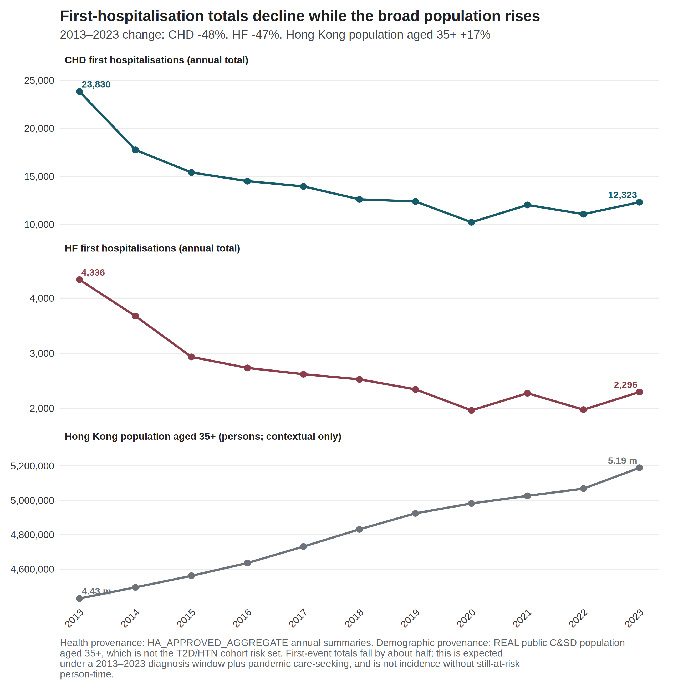
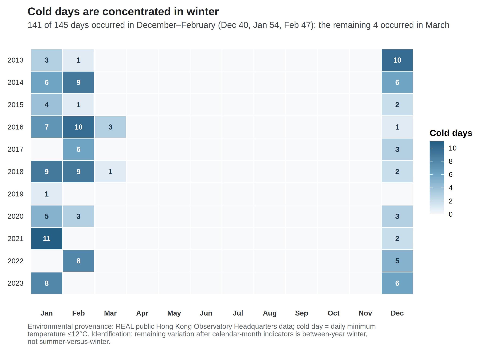
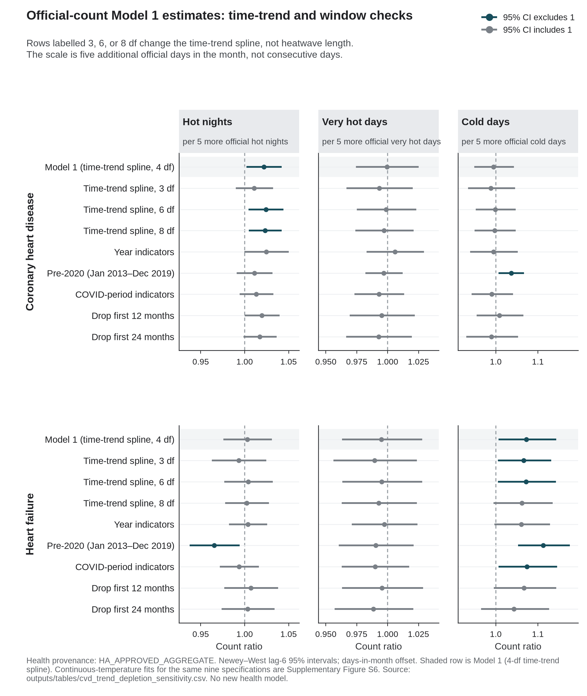

# Thermal extremes and first hospitalisation after coronary heart disease or heart failure diagnosis in Hong Kong, 2013–2023

*Running title:* Thermal extremes and first CHD/HF hospitalisation

Bob Ruililin Shen^1^, Author 2^1^, Author 3^1^, Author 4^1^, David Makram Bishai^1^

^1^ School of Public Health, Li Ka Shing Faculty of Medicine, The University of Hong Kong, Hong Kong SAR, China

## Abstract

**Background.** Hong Kong records more hot nights than a decade ago, while cold days persist. Whether the cold-dominant pattern of earlier daily cardiac-admission studies extends to monthly first-hospitalisation counts is untested.

**Methods.** We analysed 132 territory-months (2013–2023) of monthly counts of first hospitalisation after a first diagnosis of coronary heart disease (CHD; 156,156 events) or heart failure (HF; 29,681 events) among people with type 2 diabetes and/or hypertension. Admission cause was not recorded. Model 1 is a separate negative-binomial model for each of three continuous temperature measures and the official counts of hot nights, very hot days, and cold days, with calendar-month indicators, a 4-df time spline, and an offset for the number of days in the month. Model 2 adds monthly mean relative humidity and monthly total rainfall. Model 3 replaces official extreme-day counts with counts of days warmer or cooler than the historical same-calendar-day mean. Reported estimates are from Model 1. Intervals used model-based, HC1, and Newey–West lag-3 and lag-6 constructions. Benjamini–Hochberg *q*-values covered the twelve Model 1 fits.

**Results.** Under Newey–West lag-6 reporting, the count ratio was 1.022 (1.002–1.042) per five hot nights for CHD and 1.073 (1.006–1.144) per five cold days for HF, both with *q* = 0.192; all twelve *q*-values exceeded 0.19. For CHD hot nights, model-based and HC1 intervals included 1, as did the pre-2020 estimate (1.011, 0.991–1.032). For HF cold days, all four constructions excluded 1, and the pre-2020 estimate was stronger (1.113, 1.053–1.176). Official cold days fell almost entirely in December–February (141 of 145), identifying that contrast between winters.

**Conclusions.** The data do not support a multiplicity-protected differential thermal claim. The HF cold-day association is concordant across standard-error methods; the CHD hot-night association depends on the construction and on including 2020–2023. Estimates are ecological monthly count ratios for a first-event outcome without recorded admission cause.

**Keywords:** hot nights; cold days; coronary heart disease; heart failure; Hong Kong; monthly time series

## Introduction

Temperature-related cardiovascular morbidity remains a concern in subtropical cities, where intense humid heat coexists with episodic cold [9]. Hong Kong is a dense, ageing city whose thermal profile shifted within a single decade. At the Hong Kong Observatory (HKO), hot nights increased from 10 in 2013 to 61 in 2021, and very hot days from 17 to 54 in the same comparison [2,4]. Cold days persisted across the period: 14 in 2013, 13 in 2021, and 14 in 2023 [2,4,6]. A contemporary local analysis therefore has to hold heat and cold in one design.

Local evidence on cardiac admissions is daily, diagnosis-specific, and drawn from earlier decades. Using data from 2000–2009, Goggins et al. reported that a 1 °C decrease below an estimated 24 °C threshold was associated with a 3.7% increase in acute myocardial infarction admissions, and found no statistically significant heat association in Hong Kong, Taipei, or Kaohsiung [1]. Same-day nitrogen dioxide was the strongest pollutant predictor in that study [1]. An analysis of public-hospital stroke admissions during 1999–2006 found an inverse association of haemorrhagic stroke with temperature, and a weaker ischaemic-stroke association below about 22 °C [11]. Closest to the present outcomes, Goggins and Chan analysed daily public-hospital heart-failure admissions and deaths during 2002–2011 [21]. They reported a cumulative relative risk of 2.63 (2.43–2.84) for admissions comparing 11 °C with 25 °C, over lags extending to 23 days [21]. These studies fix the local historical pattern. They estimate daily risk for cause-coded admissions, so their coefficients do not transfer to monthly counts of first hospitalisation.

Nighttime heat can be encoded in more than one way. Guo et al. analysed daily unplanned emergency hospitalisations in Hong Kong during the hot seasons of 2000–2019 [17]. After adjustment for multi-day mean temperature, the official hot-night indicator (minimum temperature ≥ 28 °C) showed no overall association with non-cancer, non-external hospitalisation over lags 0–4 days (excess relative risk −0.2%, 95% CI −1.2% to 0.7%) [17]. An hourly excess-heat metric for 20:00–07:59 was associated with higher hospitalisation, including a 3.1% (1.5–4.8%) increase at its extreme value [17]. Official monthly counts of hot nights are, by construction, a coarser encoding than nighttime intensity. They remain an interpretable public climatological series, and they are not a test of the hourly metric. Guo et al. did not study first CHD or HF hospitalisation in a diabetes or hypertension cohort [17].

Air pollution also changed during the present study window. At general monitoring stations, mean nitrogen dioxide declined from 53.7 µg m^−3^ in 2013 to 32.1 µg m^−3^ in 2023, and fine particulate matter (PM2.5) from 30.8 to 14.6 µg m^−3^ [7]. Ozone rose over the same years, from 42.6 to 58.3 µg m^−3^ [7]. These concentrations describe 2013–2023 and are not a reconstruction of the 2000–2009 window analysed by Goggins et al. [1]. Temperature and pollutants are not interchangeable covariates. Ozone is coupled with hot, sunny conditions, and may confound the thermal association or lie on its pathway.

Daily mortality studies in Hong Kong answer a further, distinct question. Liu et al. (2020) reported a cold-dominant attributable fraction for cause-specific mortality during 2006–2016 (4.72% for cold versus 0.16% for heat), and a larger fraction for moderate non-optimum temperatures than for extremes (4.25% versus 0.63%) [12]. Liu et al. (2026) estimated 1,455 to 3,238 model-based excess heat deaths for 2014–2023, the range reflecting which local heatwave definition was applied [13]. Attributable fractions and modelled excess deaths are mortality burden quantities. They cannot be rescaled into monthly morbidity count ratios.

This study estimates associations between specified monthly thermal-exposure contrasts and monthly counts of first hospitalisation after first CHD or HF diagnosis among people with type 2 diabetes and/or hypertension in Hong Kong from January 2013 through December 2023, carrying heat and cold in parallel and reporting all twelve Model 1 fits in place of a single protected claim.

## Methods

The study is an ecological territory-month time series for January 2013 through December 2023 (132 months). It cannot show effects for individual people, the cause of any admission, or day-level triggering [14]. In line with ethical requirements, the study was approved by the Institutional Review Board (IRB) of the HKU/Hospital Authority HK West Cluster (IRB reference number: UW XX-XXX).

### Data sources

#### Health data

The dependent variable is the monthly count of first hospitalisations after a first diagnosis of coronary heart disease (CHD), and separately of heart failure (HF), among people with type 2 diabetes and/or hypertension in Hong Kong. The cohort is people diagnosed with type 2 diabetes and/or hypertension during 2013–2023. For each person, the event is the first recorded hospitalisation after that person’s first CHD diagnosis or first HF diagnosis. Admission cause was not recorded. Monthly counts were supplied from Hospital Authority records. Age and sex strata were not included.

Monthly influenza activity from November 2013 through December 2023 was obtained from Centre for Health Protection Flu Express summaries. January–October 2013 had no influenza values. Those months were left missing and were not coded as zero. Influenza was therefore not entered in Model 1; it is a sensitivity on the 121 months with data.

#### Weather and pollutants data

Meteorological data was obtained from the HKO. The monthly variables included: temperature (mean, minimum, maximum), relative humidity, total rainfall, the number of hot nights (T~min~ ≥ 28°C), the number of very hot days (T~max~ ≥ 33°C), the number of extremely hot days (T~max~ ≥ 35°C), and the number of cold days (T~min~ ≤ 12°C). Monthly mean pollutant levels for nitrogen dioxide (NO~2~), sulfur dioxide (SO~2~), and ozone (O~3~) were obtained from the Hong Kong Environmental Protection Department (EPD). All monthly data were derived by taking the average of daily data in each calendar month.

A station-month entered a pollutant mean only when at least 75% of expected observations were present. Missing measurements were not coded as zero. Territory-wide monthly pollutant concentrations are unweighted means of general EPD stations. Roadside monitors were not used for those means. Fine particulate matter (PM~2.5~) from the same general stations was assembled for sensitivity analysis only.

#### Population

Mid-year age- and sex-specific population estimates from the Census and Statistics Department (Table 110-01001) were interpolated to month mid-points [8]. Those figures describe the general population, not the diabetes or hypertension group still at risk of a first CHD or HF hospitalisation. Model 1 therefore uses the number of days in the month as the offset and is read as a monthly count ratio, not as a cohort incidence rate [14]. A population × days offset is a sensitivity only. It does not turn the estimate into cohort incidence.

### Statistical analysis

Let \(Y_t\) be the hospital count in month \(t\). Model 1 is a negative-binomial regression [10]:

\[
\log \mathrm{E}(Y_t) = \log(d_t) + \alpha + \beta X_t + \sum_{m=2}^{12} \gamma_m I(\mathrm{month}_t = m) + s(t; 4~\mathrm{df}). \tag{1}
\]

Here \(d_t\) is the number of days in month \(t\); \(\alpha\) is the intercept; \(X_t\) is one weather variable; \(\beta\) is the coefficient for that weather variable; \(I(\mathrm{month}_t = m)\) is 1 if month \(t\) is calendar month \(m\) and 0 otherwise (January is the reference month); \(\gamma_m\) is how much higher or lower month \(m\) is than January; and \(s(t; 4~\mathrm{df})\) is a smooth curve of time with four degrees of freedom, used to capture slow change over the eleven years. In words, the left side is the log of the expected hospital count. The estimate we report is \(\mathrm{e}^{\beta}\), the ratio of expected monthly counts for a 1 °C change in a temperature variable or a five-day change in an official day count.

We fitted Model 1 twelve times: six weather variables × two diagnoses. The six weather variables are monthly mean temperature, monthly mean daily maximum temperature, monthly mean daily minimum temperature, hot nights, very hot days, and cold days. Extreme-day counts were divided by 5 so that each estimate is the change associated with five extra such days in that month, rather than with one extra day. Five days is a convenient scale, not a new weather threshold and not a consecutive-duration rule. The official count of extremely hot days (T~max~ ≥ 35°C) was obtained with the other monthly weather variables and was not used as a temperature variable in Model 1. Each Model 1 fit contains one temperature variable. Temperature terms are not entered together in Model 1. We used a negative-binomial model because monthly counts can vary more than a Poisson model permits. A quasi-Poisson model is a sensitivity.

We report 95% confidence intervals in four ways: the model’s own standard errors, HC1, Newey–West with a lag of 3 months, and Newey–West with a lag of 6 months [19]. The main reported interval is Newey–West with lag 6. Monthly hospital counts can be correlated from one month to the next; Newey–West intervals allow for that. A *q*-value is a *p*-value adjusted for testing the twelve Model 1 fits together [20]. Table 2 reports Model 1.

Model 2 additionally adds monthly mean relative humidity [21] and monthly total rainfall [22] to Model 1. Goggins and Chan entered daily mean temperature, humidity, and wind speed as predictors of daily heart-failure admissions in Hong Kong, and reported that both high and low relative humidity were modestly associated with more admissions [21]. Chan et al. entered same-day rainfall on the hypothesis that heavy rain deters hospital attendance [22]. Both papers used daily terms; a monthly mean and a monthly total are coarser. Table 2 reports Model 1.

Model 3 counts, for each month, the days whose daily mean temperature was above or below the historical average for that day of the year. For 15 July 2018, that historical average is the leave-one-year-out mean of other 15 July daily mean temperatures in Hong Kong Observatory records for 2012–2023. Equal values are counted as neither. The same counts based on daily maximum and minimum temperature are sensitivities; they do not replace the daily-mean counts. Model 3 is specified and is not reported in Table 2. No Model 3 health coefficients are reported.

### Sensitivity analysis

Official day-count estimates from Model 1 can also be read per 3 days or per 1 day without fitting a new model. If the count ratio per five days is *R*, the count ratio per three days is *R*^(3/5) and the count ratio per one day is *R*^(1/5). Those are the same coefficient on a different scale, not a new model. The maximum- and minimum-temperature versions of the Model 3 day counts are sensitivities; they do not replace the daily-mean counts in Model 3.

Other checks were the time-trend spline (3, 6, or 8 degrees of freedom in place of the Model 1 4-df spline, or year indicators in place of that spline). Those checks change the control for slow calendar time, not the length of a heatwave. Further checks were the study window (dropping the first 12 or 24 months, or stopping at December 2019); COVID-period indicators; weather one or two months earlier; and dropping the most influential month. COVID periods were: through January 2020; February 2020–December 2021; January–April 2022; May–December 2022; and from January 2023. Cold-day models restricted to November–March are a labelled sensitivity.

Further checks used general-population × days as the offset (this is still a count ratio, not cohort incidence); maximum and minimum temperature in one model, or the three official extreme-day counts in one model; influenza on the 121 months with data; and nitrogen dioxide or PM2.5. Models that added pollution or influenza are extra checks. They are not replacements for Model 1.

Residual correlation was inspected with Pearson autocorrelation and Ljung–Box tests at lags 6 and 12.

Separately, we tested a published method for estimating daily temperature effects from monthly outcomes using simulated Hong Kong weather [15,16]. We did not apply that method to the hospital counts.

### Software

Analyses were conducted in R 4.3.3 (2024-02-29). Negative-binomial models used `MASS::glm.nb` (MASS 7.3-60.0.1). Newey–West and HC1 standard errors used `sandwich` 3.1.3. Natural cubic splines used `splines::ns`.

## Results

### Outcome series

CHD contributed 156,156 first recorded hospitalisations over 132 months, a mean of 1,183.0 per month. HF contributed 29,681, a mean of 224.9 per month (Table 1). Annual totals fell by about half from 2013 to 2023 (CHD 23,830 to 12,323; HF 4,336 to 2,296), with a further dip in 2020 (CHD 10,237; HF 1,964). Over the same years, the interpolated Census and Statistics Department population aged 35 years or older rose by 17%. Figure 1 indexes both series to 2013. The decline in first-event counts is compatible with depletion of the at-risk set in a 2013–2023 diagnosis window, together with pandemic changes in care-seeking. It is not a measure of falling incidence in the territory, and it does not quantify the share attributable to depletion without monthly still-at-risk person-time. Mean monthly HF counts were highest in January (287) and lowest in September (196). CHD showed a milder winter elevation (January 1,386; September 1,097). After calendar-month indicators, the thermal estimates ask whether a given January or July differs from a typical January or July, and not whether winter counts exceed summer counts.

**Table 1. Outcome summary.**

| Outcome | Period | Months | Total events | Mean per month | Event construction |
|:--|:--|---:|---:|---:|:--|
| Coronary heart disease | 2013–2023 | 132 | 156,156 | 1,183.0 | First recorded hospitalisation after first CHD diagnosis |
| Heart failure | 2013–2023 | 132 | 29,681 | 224.9 | First recorded hospitalisation after first HF diagnosis |

**Figure 1. First-event counts fell while the general population aged 35 years or older rose.** Index = 1 in 2013. CHD 23,830 → 12,323; HF 4,336 → 2,296. Source: governed Hospital Authority aggregate annual totals; Census and Statistics Department mid-year population aged 35 years or older.

### Exposure context

At HKO Headquarters, hot nights rose from 10 in 2013 to 61 in 2021 and 56 in 2023 [6]. The 2013 count was about seven days below the 1981–2010 normal [2]. The 2021 count was the highest annual number of hot nights in the Observatory record at that time [4]. Very hot days rose from 17 to 54 over the same 2013–2021 comparison, and were 54 in 2023 [6]. Cold days were 14 in 2013 and 14 in 2023, with 1 in 2019 and 13 in 2021 [6]. These are exposure counts, and not health effects. Figure 2 shows official cold days by year and month. Of 145 cold days in 2013–2023, 141 fell in December–February (December 40, January 54, February 47), and 4 fell in March. Twenty-nine of 132 months carried at least one official cold day. The year 2019 contributed a single cold day. After calendar-month indicators, the remaining cold-day variation is between-year winter variation, and not a summer-versus-winter contrast.

**Figure 2. Official cold days by year and month, Hong Kong Observatory Headquarters, 2013–2023.** Source: Hong Kong Observatory official daily cold-day flags (T~min~ ≤ 12 °C), aggregated to calendar months.

### Model 1

Table 2 reports the twelve separate-exposure count ratios under the offset for the number of days in the month and Newey–West lag-6 intervals.

**Table 2. Model 1: negative-binomial models with an offset for the number of days in the month and Newey–West lag-6 intervals.**

| Outcome | Exposure contrast | Count ratio (95% CI) | *p* | BH *q* |
|:--|:--|--:|--:|--:|
| CHD | Mean temperature / 1 °C | 0.993 (0.976–1.010) | 0.424 | 0.726 |
| CHD | Mean maximum temperature / 1 °C | 0.993 (0.979–1.007) | 0.321 | 0.642 |
| CHD | Mean minimum temperature / 1 °C | 0.994 (0.977–1.012) | 0.509 | 0.764 |
| CHD | Hot nights / 5 days | 1.022 (1.002–1.042) | 0.032 | 0.192 |
| CHD | Cold days / 5 days | 0.995 (0.949–1.043) | 0.823 | 0.900 |
| CHD | Very hot days / 5 days | 0.999 (0.974–1.025) | 0.962 | 0.962 |
| HF | Mean temperature / 1 °C | 0.974 (0.947–1.002) | 0.069 | 0.207 |
| HF | Mean maximum temperature / 1 °C | 0.981 (0.958–1.005) | 0.113 | 0.272 |
| HF | Mean minimum temperature / 1 °C | 0.973 (0.947–1.000) | 0.050 | 0.202 |
| HF | Hot nights / 5 days | 1.003 (0.976–1.031) | 0.825 | 0.900 |
| HF | Cold days / 5 days | 1.073 (1.006–1.144) | 0.031 | 0.192 |
| HF | Very hot days / 5 days | 0.995 (0.963–1.028) | 0.764 | 0.900 |

All twelve *q*-values exceeded 0.19, with a minimum of 0.192. No model meets a multiplicity-protected confirmatory threshold. The HF mean-minimum-temperature interval narrowly included 1, with an unrounded upper bound of 1.00005.

For CHD, the continuous monthly temperature estimates were near null, between 0.993 and 0.994, whereas the official hot-night count estimate was larger under Newey–West lag-6 reporting. These encodings describe different monthly thermal questions. The contrast does not imply that a hot-night effect was missed by the means, and it is not a test of hourly nighttime excess heat [17]. For HF, the continuous temperature estimates were weakly inverse, and the cold-day count estimate was positive.

### Uncertainty ladder

**Table 3. Uncertainty ladder for the two leading exploratory contrasts.**

| Outcome and exposure | Model | HC1 | NW3 | NW6 |
|:--|:--|:--|:--|:--|
| CHD hot nights / 5 days | 1.022 (0.995–1.049) | 1.022 (0.997–1.047) | 1.022 (1.0003–1.0439) | 1.022 (1.002–1.042) |
| HF cold days / 5 days | 1.073 (1.023–1.125) | 1.073 (1.011–1.138) | 1.073 (1.007–1.143) | 1.073 (1.006–1.144) |

For CHD hot nights, the model-based and HC1 intervals included 1, while both Newey–West intervals excluded 1 on the unrounded scale (lag 3: 1.000253 to 1.043860). The ladder narrowed from the model-based interval to the Newey–West intervals for that contrast. Robust intervals are not automatically wider, and the direction of that change is itself informative. For HF cold days, all four constructions excluded 1, and *q* remained 0.192. Concordance across standard-error methods does not create multiplicity protection.

### Joint models and residual diagnostics

After month and trend residualisation, maximum and minimum temperature retained a variance inflation factor of 4.66 when entered jointly. Hot nights and very hot days retained variance inflation factors near 1.96. In the joint extreme-day model, the CHD hot-night count ratio was 1.045 (1.015–1.075), compared with 1.022 in the separate model. The HF cold-day estimate was the same in the joint and separate models, at 1.073. Joint coefficients are diagnostics, and not preferred estimates.

Pearson residual autocorrelation at lag 1 was 0.508 in the CHD hot-night model and 0.146 in the HF cold-day model (Supplementary Figure S1). Ljung–Box tests at lag 6 gave *p* < 10^−7^ for every CHD Model 1 fit and *p* > 0.3 for every HF Model 1 fit. Serial dependence is part of the inferential problem for CHD, which is why the four-construction ladder is shown rather than a single interval.

### Sensitivity analyses

Offset choice changed the Model 1 count ratios only trivially. Across trend, window, and COVID-phase specifications, the CHD hot-night ratio ranged from 1.011 to 1.025, and the HF cold-day ratio from 1.043 to 1.113 (Figure 3). The HF cold-day association was strongest before 2020 (1.113, 1.053–1.176). The CHD hot-night association was weaker and compatible with 1 in the pre-2020 window (1.011, 0.991–1.032) and under COVID-phase adjustment (1.013, 0.994–1.033). Figure 3 shows the six official-count Model 1 fits. The 3-, 6-, and 8-df rows change the time-trend spline, not heatwave duration; the horizontal axis is five additional official days in the month. For CHD hot nights, the 3-df interval includes 1 (1.011, 0.990–1.032) and the year-indicator interval includes 1 (1.025, 0.9998–1.050); the 6-df interval excludes 1 (1.024, 1.005–1.044). For HF cold days, the 8-df interval includes 1 (1.062, 0.994–1.135). The pre-2020 window moved more than those two contrasts: nine of the twelve Newey–West lag-6 intervals excluded 1 in that 84-month window, including inverse associations for all six continuous temperature contrasts (Supplementary Figure S6; Supplementary Table S2). No multiplicity control was computed within that window, and no pre-2020 estimate is promoted beyond a sensitivity. The decline in first events and the rise in hot nights are both strong trends across this window, and the same 4-df spline absorbs both. Lag-1 month models attenuated the CHD hot-night association toward 1 (1.010, 0.979–1.042). The HF cold-day association remained elevated at lag 1 (1.073, 1.014–1.135) and was weaker at lag 2 (1.053, 0.985–1.127). Lag-one month is a labelled sensitivity, and it is not a daily lag curve. The months with largest Cook’s distance were February 2020 for CHD and February 2022 for HF cold days. Excluding the most influential month left both exploratory directions unchanged (CHD hot nights 1.021, 1.001–1.040; HF cold days 1.088, 1.034–1.144).

**Figure 3. Model 1 count ratios for official day counts across time-trend, window, and COVID-period specifications (Newey–West lag-6 intervals).** The exposure is the monthly official day count divided by five, so each estimate is the count ratio per five additional such days in that month. Rows labelled 3, 6, or 8 df replace the 4-df time-trend spline of Model 1. Neither the five-day scale nor the spline degrees of freedom refers to consecutive days. Pre-2020 is January 2013–December 2019 (84 months). Continuous-temperature fits for the same specifications are shown in Supplementary Figure S6.

The simulated daily-recovery method failed its worst-cell criteria: null Type I error ranged from 0.048 to 0.150, minimum coverage was 0.840, maximum non-null relative bias was 32.8, and the maximum moderate false-sign rate was 0.808 (Supplementary Table S8). No real daily coefficient is reported. That refusal is specific to this monthly series and this implementation.

## Discussion

These data do not support a multiplicity-protected differential thermal claim for CHD relative to HF. Under Newey–West lag-6 reporting for Model 1, CHD first-hospitalisation counts were more closely associated with official hot-night burden than with mean temperature or cold days. HF counts were more closely associated with cold-day burden than with hot nights. Both patterns sit inside twelve Model 1 fits in which every *q*-value exceeds 0.19. The complete set is therefore reported, and no model is promoted to a primary result.

The HF cold-day association is the more coherent of the two residual signals. It is concordant across all four standard-error constructions. It survives exclusion of the most influential pandemic month. It is not produced by entering correlated heat metrics jointly. It is strongest in the pre-2020 window, before pandemic disruption of care-seeking. It nevertheless remains unprotected by its *q*-value. Because official cold days fall almost entirely in December–February, and because only 29 of 132 months carry any official cold day, the association is identified from differences between winters rather than from a summer-versus-winter contrast. That is a limit of matching monthly hospital counts to monthly weather, not a reason to drop the cold-day series.

The CHD hot-night association is smaller, depends on the uncertainty method, and was not evident in the pre-2020 window. Model-based and HC1 intervals include 1, whereas the Newey–West intervals exclude 1 on the unrounded scale (lag 3: 1.000253 to 1.043860). Pearson residual autocorrelation at lag 1 is 0.508 in that model, so inference for the CHD series depends on how serial dependence is handled. For this contrast the Newey–West intervals were narrower than the model-based interval, which is atypical under positive residual autocorrelation; the exclusion of 1 therefore rests on the smaller robust variance estimate, and is a reason for caution rather than confirmation. No interval construction was chosen because it excluded 1. The estimate is also confined to specifications that include 2020–2023, which are the years in which hot nights peaked and in which care-seeking changed. Hot-night burden and the decline in first events both trend strongly across the window, and both are controlled by the same trend spline, so the hot-night contrast carries the harder identification problem of the two.

The two residual signals are sensitive to the time trend in opposite directions. The CHD hot-night interval includes 1 under a stiffer 3-df spline (1.011, 0.990–1.032) and excludes 1 under a more flexible 6-df spline (1.024, 1.005–1.044). The HF cold-day interval includes 1 under the most flexible 8-df spline (1.062, 0.994–1.135). That pattern concerns how the first-event decline and monthly thermal burden share one time smooth. The spline degrees of freedom are a model setting, and they do not describe a physiological duration.

The direction of the HF cold-day residual is consistent with earlier daily evidence that lower temperature was associated with higher heart-failure admissions in Hong Kong [21]. The comparison is between questions, and not between magnitudes. A cumulative daily relative risk comparing 11 °C with 25 °C is not a monthly count ratio per five official cold days, and the present event is a first hospitalisation after a first HF diagnosis without recorded admission cause. The CHD hot-night residual should likewise be read against Guo et al. rather than as a replication of it [17]. That study reported no overall association for the official hot-night flag after adjustment for mean temperature, and a positive association for hourly nighttime excess heat [17]. The present analysis uses monthly official counts, a first-event CHD series, and a later decade. A difference between monthly mean temperature and monthly official hot-night counts does not identify an intensity mechanism.

A monthly official-day total does not distinguish consecutive days from days scattered through the month. Interrupted overnight recovery is one hypothesis for why a hot-night count could differ from monthly mean temperature. The present monthly design cannot test that hypothesis. Five additional official days in a month is a reporting scale rather than a consecutive-day trigger. Hong Kong issues official heat and cold warnings. These estimates do not evaluate those warnings.

Liu et al. (2020, 2026) remain complementary mortality baselines [12,13]. Their attributable fractions and excess-death totals cannot be rescaled into the present count ratios. The failed daily-recovery calibration is the corresponding methods limit: monthly sums do not automatically yield daily trigger estimates [15,16]. That refusal is specific to this series, this implementation, and this calibration standard. It is not evidence that recovery of daily effects from aggregated outcomes fails in general.

Pollution and influenza remain scientifically motivated in this setting [1,18]. Models that entered nitrogen dioxide or fine particulate matter are sensitivities, not replacements for Model 1. On a monthly grain they cannot separate confounding from mediation for ozone. On the 121 months with influenza data, an archive model associated higher influenza activity with higher CHD counts (Supplementary Table S7); that model is not an adjusted version of Model 1. Confounding by infection or ozone is therefore unresolved. Absent cohort person-time, even a stable count ratio remains a count ratio [14].

The contribution of this analysis is identification rather than estimation. A monthly aggregate series of first events can be reported in a way that shows where its information comes from. Four displays do that work here: which months carry the exposure contrast, whether the outcome decline is compatible with risk-set depletion, how far each interval moves across standard-error constructions, and which specifications each estimate depends on. A protected primary claim would have required a predeclared confirmatory contrast, multiplicity control that survives the twelve Model 1 fits, uncertainty constructions that are not chosen for null exclusion, and residual diagnostics that leave no substantial CHD serial correlation unaddressed. This analysis does not meet that bar. We report the twelve Model 1 fits and the refusals.

## Conclusion

Between 2013 and 2023, hot nights in Hong Kong increased while cold days persisted. In monthly Hospital Authority counts for people with type 2 diabetes and/or hypertension, CHD first hospitalisations were more closely associated with hot nights, and HF first hospitalisations with cold days, than with the other thermal encodings examined. Neither association survived correction across the twelve Model 1 fits. The CHD estimate additionally depended on the treatment of uncertainty and on the inclusion of 2020–2023. This analysis therefore contributes a set of hypotheses, and an explicit account of what monthly aggregate counts cannot settle. Better-denominated and more finely resolved data are required before a thermal effect on cardiac hospitalisation in this cohort can be estimated.

## Strengths and limitations

**Strengths.** All twelve Model 1 fits are reported in full, rather than filtered to the largest estimates. Uncertainty is shown as an explicit four-construction ladder rather than as a single interval. Extreme-day exposures use published official thresholds. Identification displays show the sources of cold-day variation, the first-event decline, and the dependence of each estimate on the analysis window. The daily-recovery analysis is reported as a refusal rather than as a coefficient.

**Limitations.** Admission cause was not recorded, so an event is a first hospitalisation after a first diagnosis and not a cardiac-caused admission. Monthly counts of people still at risk of a first event were unavailable, so the estimates are count ratios rather than incidence-rate ratios [14]. The design is ecological and monthly, so individual-level and daily-triggering interpretations are not identified [14]. Monthly official-day totals cannot identify consecutive duration. Age, sex, and disease-subtype strata were not delivered. Residual serial correlation remains material for CHD, with lag-1 Pearson autocorrelation of 0.508 in the hot-night model. Official cold days are concentrated in December–February, and only 29 of 132 months carry any official cold day, so the HF cold-day estimate rests on differences between winters. The CHD hot-night estimate is not stable across analysis windows, and is compatible with 1 before 2020. Official hot-night counts are not hourly nighttime excess heat [17]. All exposures were measured at a single Observatory station and applied territory-wide. Influenza is missing for January–October 2013. Confounding by pollution, humidity, rainfall, and influenza is unresolved in Model 1. A corresponding stroke series was not available for this analysis.

## Declaration on the use of AI

AI-assisted tools were used for code scaffolding, methodological brainstorming, and review of potential data and modelling issues. Scientific claims and numerical results were checked against Hospital Authority monthly counts and the live weather paragraph.

## Declaration of competing interest

The authors declare no competing interests.

## Acknowledgements

None.

## Data and code availability

Code is at https://github.com/bobshenruililin/Laidlaw-Heat-Project. Monthly hospital counts are not posted. What may be shared later depends on ethics approval.

## References

1. Goggins WB, Chan EYY, Yang CY. Weather, pollution, and acute myocardial infarction in Hong Kong and Taiwan. *Int J Cardiol*. 2013;168(1):243-249. doi:10.1016/j.ijcard.2012.09.087
2. Hong Kong Observatory. The Year's Weather — 2013. https://www.hko.gov.hk/en/wxinfo/pastwx/ywx2013.htm
3. Hong Kong Observatory. The Year's Weather — 2017. https://www.hko.gov.hk/en/wxinfo/pastwx/2017/ywx2017.htm
4. Hong Kong Observatory. The Year's Weather — 2021. https://www.hko.gov.hk/en/wxinfo/pastwx/2021/ywx2021.htm
5. Hong Kong Observatory. The Year's Weather — 2024. https://www.hko.gov.hk/en/wxinfo/pastwx/2024/ywx2024.htm
6. Hong Kong Observatory. Hong Kong Observatory Open Data. https://www.hko.gov.hk/en/abouthko/opendata_intro.htm
7. Environmental Protection Department. Environmental Protection Interactive Centre: Air Quality Data. https://cd.epic.epd.gov.hk/EPICDI/air/station/?lang=en
8. Census and Statistics Department. Population by Sex and Age Group (Table 110-01001). https://data.gov.hk/en-data/dataset/hk-censtatd-tablechart-110-01001
9. Ye X, Wolff R, Yu W, Vaneckova P, Pan X, Tong S. Ambient temperature and morbidity: a review of epidemiological evidence. *Environ Health Perspect*. 2012;120(1):19-28. doi:10.1289/ehp.1003198
10. Bhaskaran K, Gasparrini A, Hajat S, Smeeth L, Armstrong B. Time series regression studies in environmental epidemiology. *Int J Epidemiol*. 2013;42(4):1187-1195. doi:10.1093/ije/dyt092
11. Goggins WB, Woo J, Ho S, Chan EYY, Chau PH. Weather, season, and daily stroke admissions in Hong Kong. *Int J Biometeorol*. 2012;56(5):865-872. doi:10.1007/s00484-011-0491-9
12. Liu J, Hansen A, Varghese B, et al. Cause-specific mortality attributable to cold and hot ambient temperatures in Hong Kong: a time-series study, 2006–2016. *Sustain Cities Soc*. 2020;57:102131. doi:10.1016/j.scs.2020.102131
13. Liu Z, Ren C, Liu J, Kawasaki Y, Bishai DM. Modelling the excess mortality associated with heat waves in Hong Kong: 2014–2023. medRxiv. 2026. doi:10.64898/2026.03.05.26347683
14. Greenland S, Morgenstern H. Ecological bias, confounding, and effect modification. *Int J Epidemiol*. 1989;18(1):269-274. doi:10.1093/ije/18.1.269
15. Basagaña X, Ballester J. Unbiased temperature-related mortality estimates using weekly and monthly health data: a new method for environmental epidemiology and climate impact studies. *Lancet Planet Health*. 2024;8(10):e766-e777. doi:10.1016/S2542-5196(24)00212-2
16. Basagaña X, Ballester J. Unbiased estimates using temporally aggregated outcome data in time series analysis: generalization to different outcomes, exposures, and types of aggregation. *Epidemiology*. 2026;37(1):16-20. doi:10.1097/EDE.0000000000001923
17. Guo YT, Chan KH, Qiu H, Wong ELY, Ho KF. The risk of hospitalization associated with hot nights and excess nighttime heat in a subtropical metropolis: a time-series study in Hong Kong, 2000–2019. *Lancet Reg Health West Pac*. 2024;51:101168. doi:10.1016/j.lanwpc.2024.101168
18. Yang Z, Wei Y, Jiang X, et al. Association of cold weather and influenza infection with stroke: a 22-year time-series analysis. *Int J Biometeorol*. 2025;69(5):963-973. doi:10.1007/s00484-025-02870-2
19. Newey WK, West KD. A simple, positive semi-definite, heteroskedasticity and autocorrelation consistent covariance matrix. *Econometrica*. 1987;55(3):703-708. doi:10.2307/1913610
20. Benjamini Y, Hochberg Y. Controlling the false discovery rate: a practical and powerful approach to multiple testing. *J R Stat Soc Series B*. 1995;57(1):289-300. doi:10.1111/j.2517-6161.1995.tb02031.x
21. Goggins WB, Chan EYY. A study of the short-term associations between hospital admissions and mortality from heart failure and meteorological variables in Hong Kong. *Int J Cardiol*. 2017;228:537-542. doi:10.1016/j.ijcard.2016.11.106
22. Chan EYY, Goggins WB, Yue JSK, Lee P. Hospital admissions as a function of temperature, other weather phenomena and pollution levels in an urban setting in China. *Bull World Health Organ*. 2013;91(8):576-584. doi:10.2471/BLT.12.113035
