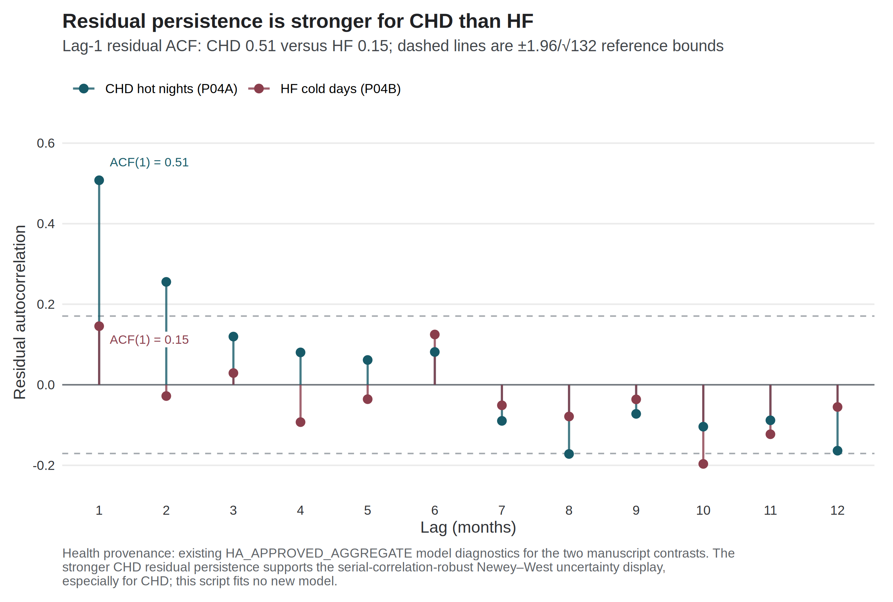
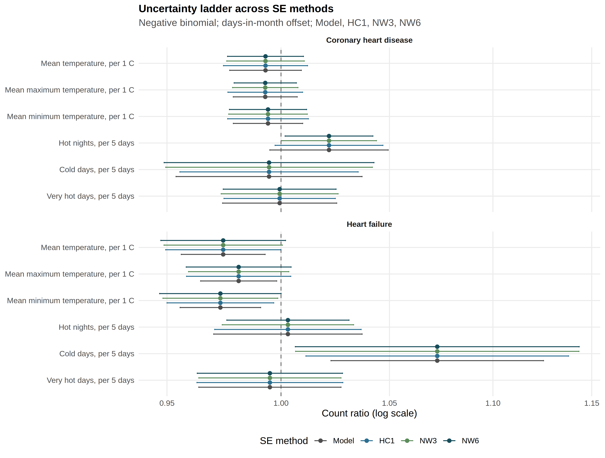
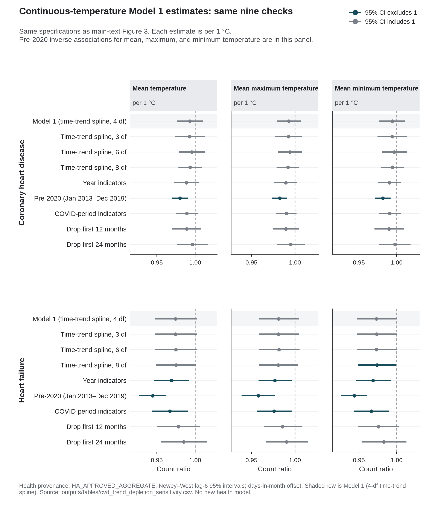
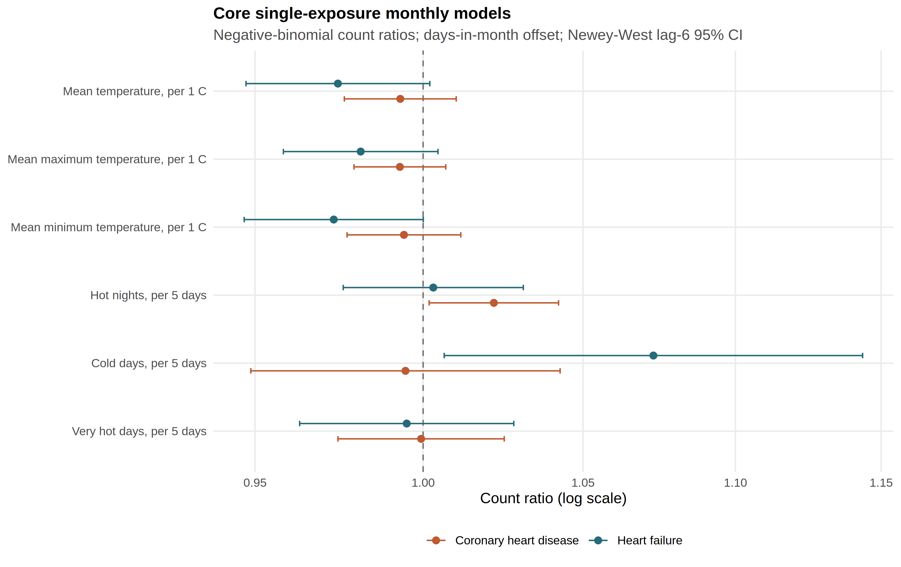
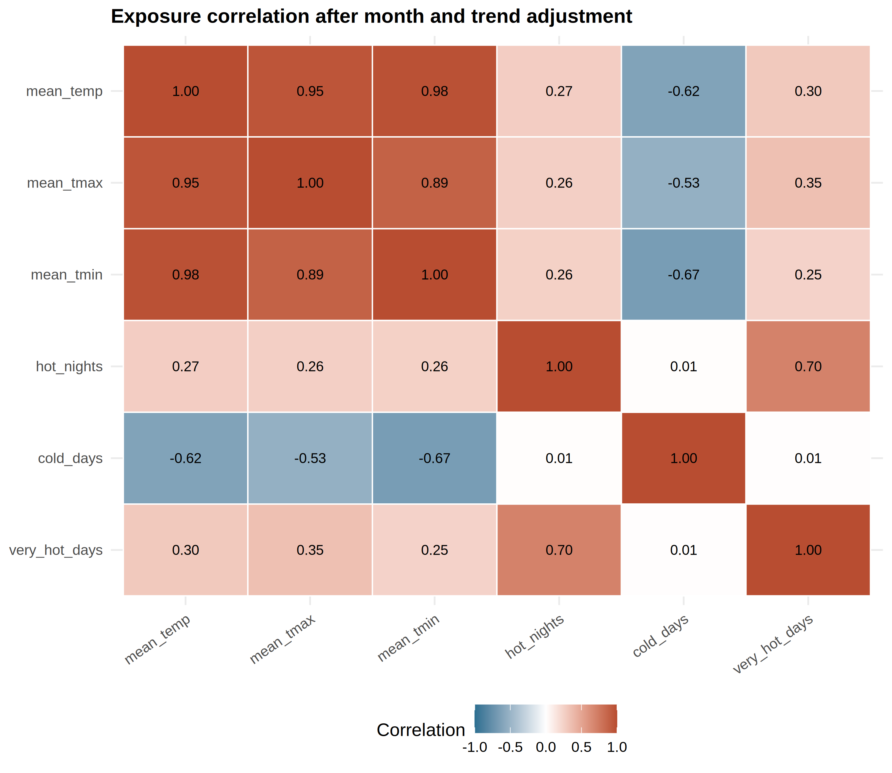

# Live-track supplementary information

**Authority:** live collaborative manuscript `Heat_CVD_Manuscript_live_update.md`.  
**Not** the 10 August `manuscript/chd_hf_supplement.pdf` (do not rebuild).  
**Not** Hogan’s shared Word/Google file (Bob pastes; agents do not).

This file is the journal-takeable supplement for the analysis-window sensitivity manuscript. Every numeral is transcribed from an existing `HA_APPROVED_AGGREGATE`, `REAL`, or `SYNTHETIC_CALIBRATION` table. No new health model was fitted. The twelve thermal fits are **Model 1**. Archive influenza and pollution models are **not** adjusted versions of Model 1. No confirmatory primary is declared.

Numbering matches the live body: Supplementary Figure S1 is residual ACF; Supplementary Tables S7 and S9 are archive influenza and archive pollution. The release heatmap filename `figureS1_exposure_correlation.png` is Supplementary Figure **S4** here.

## Supplementary Figure S1. Residual autocorrelation in two displayed exploratory models

Bars show the Pearson residual autocorrelation function for the separate-exposure negative-binomial CHD hot-night and HF cold-day models. Dashed lines mark ±1.96/√132. Lag-1 residual autocorrelation was 0.508 for CHD hot nights and 0.146 for HF cold days. These diagnostics motivate reporting more than one covariance estimator; they do not establish that a particular estimator is correct, protect either contrast from multiplicity, or identify a causal thermal effect. Source: residuals from the governed aggregate Model 1 fits.

## Supplementary Table S1. Complete Model 1 uncertainty ladder

Count ratios use the days-in-month offset. Intervals are model-based, HC1, Newey–West lag 3, and Newey–West lag 6. No interval was selected because it excluded 1. Display strings are those in `outputs/release_chd_hf/tables/table4_uncertainty_ladder.csv`.

| Outcome | Exposure contrast | Model | HC1 | NW3 | NW6 |
|:--|:--|--:|--:|--:|--:|
| CHD | Mean temperature / 1 °C | 0.993 (0.977–1.009) | 0.993 (0.974–1.012) | 0.993 (0.976–1.011) | 0.993 (0.976–1.010) |
| CHD | Mean maximum temperature / 1 °C | 0.993 (0.979–1.007) | 0.993 (0.976–1.010) | 0.993 (0.978–1.008) | 0.993 (0.979–1.007) |
| CHD | Mean minimum temperature / 1 °C | 0.994 (0.979–1.010) | 0.994 (0.976–1.012) | 0.994 (0.977–1.012) | 0.994 (0.977–1.012) |
| CHD | Hot nights / 5 days | 1.022 (0.995–1.049) | 1.022 (0.997–1.047) | 1.022 (1.000–1.044) | 1.022 (1.002–1.042) |
| CHD | Cold days / 5 days | 0.995 (0.954–1.037) | 0.995 (0.956–1.035) | 0.995 (0.949–1.042) | 0.995 (0.949–1.043) |
| CHD | Very hot days / 5 days | 0.999 (0.974–1.025) | 0.999 (0.975–1.025) | 0.999 (0.973–1.026) | 0.999 (0.974–1.025) |
| HF | Mean temperature / 1 °C | 0.974 (0.956–0.993) | 0.974 (0.949–1.000) | 0.974 (0.949–1.001) | 0.974 (0.947–1.002) |
| HF | Mean maximum temperature / 1 °C | 0.981 (0.964–0.998) | 0.981 (0.958–1.004) | 0.981 (0.959–1.004) | 0.981 (0.958–1.005) |
| HF | Mean minimum temperature / 1 °C | 0.973 (0.956–0.991) | 0.973 (0.950–0.997) | 0.973 (0.948–0.999) | 0.973 (0.947–1.000) |
| HF | Hot nights / 5 days | 1.003 (0.970–1.037) | 1.003 (0.971–1.037) | 1.003 (0.974–1.033) | 1.003 (0.976–1.031) |
| HF | Cold days / 5 days | 1.073 (1.023–1.125) | 1.073 (1.011–1.138) | 1.073 (1.007–1.143) | 1.073 (1.006–1.144) |
| HF | Very hot days / 5 days | 0.995 (0.964–1.027) | 0.995 (0.963–1.028) | 0.995 (0.964–1.027) | 0.995 (0.963–1.028) |

## Supplementary Figure S2. Standard-error method ladder for two displayed exploratory contrasts

The figure displays the same four constructions as Table 3 of the main paper. Concordance across constructions is not multiplicity protection. Source: `outputs/release_chd_hf/figures/figure5_se_method_ladder.png`.

## Supplementary Table S2. Model 1 contrasts in the pre-2020 window (Newey–West lag-6)

January 2013–December 2019; 84 months. Nine of twelve intervals exclude 1. All six continuous temperature contrasts are inverse. No multiplicity control was computed within this window, and no pre-2020 estimate is promoted beyond a sensitivity. Source: `pre_covid` rows of `outputs/release_chd_hf/supplement/cvd_trend_depletion_sensitivity.csv`. Main-text Figure 3 shows the six official-count fits. Continuous-temperature fits for the same nine specifications are Supplementary Figure S6.

| Outcome | Exposure contrast | Count ratio (NW6 95% CI) | Interval |
|:--|:--|--:|--:|
| CHD | Mean temperature / 1 °C | 0.980 (0.970–0.990) | excludes 1 |
| CHD | Mean maximum temperature / 1 °C | 0.982 (0.974–0.991) | excludes 1 |
| CHD | Mean minimum temperature / 1 °C | 0.982 (0.972–0.992) | excludes 1 |
| CHD | Hot nights / 5 days | 1.011 (0.991–1.032) | includes 1 |
| CHD | Cold days / 5 days | 1.036 (1.007–1.067) | excludes 1 |
| CHD | Very hot days / 5 days | 0.997 (0.982–1.012) | includes 1 |
| HF | Mean temperature / 1 °C | 0.945 (0.927–0.963) | excludes 1 |
| HF | Mean maximum temperature / 1 °C | 0.958 (0.939–0.977) | excludes 1 |
| HF | Mean minimum temperature / 1 °C | 0.944 (0.927–0.961) | excludes 1 |
| HF | Hot nights / 5 days | 0.965 (0.937–0.994) | excludes 1 |
| HF | Cold days / 5 days | 1.113 (1.053–1.176) | excludes 1 |
| HF | Very hot days / 5 days | 0.990 (0.960–1.021) | includes 1 |

## Supplementary Figure S6. Continuous-temperature Model 1 estimates across the same checks

Same nine trend, window, and COVID-period specifications as main-text Figure 3. Each estimate is per 1 °C. Pre-2020 inverse associations for mean, maximum, and minimum temperature are in this panel. Rows labelled 3, 6, or 8 df change the time-trend spline, not heatwave length. Source: `outputs/tables/cvd_trend_depletion_sensitivity.csv` (`HA_APPROVED_AGGREGATE`). No new health model.

## Supplementary Figure S3. Complete twelve-contrast Model 1 forest (Newey–West lag-6)

This figure shows the complete full-window Model 1 panel; main-text Table 2 instead reports the nested-window official-day sensitivity. Source: `outputs/release_chd_hf/figures/figure3_core_forest.png`.

## Supplementary Figure S4. Pairwise exposure correlations

Source filename `figureS1_exposure_correlation.png` is retained; the live-pack display number is S4, not S1.

## Supplementary Table S3. Lag-0, lag-1, and lag-2 month exposures (Newey–West lag-6)

Lag-one month is a labelled sensitivity, not a daily lag curve. Source: `outputs/release_chd_hf/supplement/cvd_lag_sensitivity.csv`.

| Outcome | Exposure contrast | Lag 0 | Lag 1 month | Lag 2 months |
|:--|:--|--:|--:|--:|
| CHD | Mean temperature / 1 °C | 0.993 (0.976–1.010) | 0.999 (0.977–1.020) | 0.996 (0.973–1.019) |
| CHD | Mean maximum temperature / 1 °C | 0.993 (0.979–1.007) | 0.999 (0.981–1.018) | 0.997 (0.976–1.018) |
| CHD | Mean minimum temperature / 1 °C | 0.994 (0.977–1.012) | 0.997 (0.976–1.018) | 0.995 (0.972–1.018) |
| CHD | Hot nights / 5 days | 1.022 (1.002–1.042) | 1.010 (0.979–1.042) | 1.016 (0.987–1.045) |
| CHD | Cold days / 5 days | 0.995 (0.949–1.043) | 1.001 (0.962–1.042) | 1.026 (0.972–1.082) |
| CHD | Very hot days / 5 days | 0.999 (0.974–1.025) | 1.009 (0.991–1.028) | 1.021 (0.996–1.047) |
| HF | Mean temperature / 1 °C | 0.974 (0.947–1.002) | 0.973 (0.953–0.992) | 0.998 (0.975–1.022) |
| HF | Mean maximum temperature / 1 °C | 0.981 (0.958–1.005) | 0.982 (0.966–0.999) | 0.998 (0.978–1.019) |
| HF | Mean minimum temperature / 1 °C | 0.973 (0.947–1.000) | 0.970 (0.950–0.990) | 0.997 (0.974–1.020) |
| HF | Hot nights / 5 days | 1.003 (0.976–1.031) | 0.997 (0.964–1.031) | 1.012 (0.973–1.053) |
| HF | Cold days / 5 days | 1.073 (1.006–1.144) | 1.073 (1.014–1.135) | 1.053 (0.985–1.127) |
| HF | Very hot days / 5 days | 0.995 (0.963–1.028) | 0.998 (0.973–1.023) | 1.018 (0.985–1.051) |

## Supplementary Table S4. Exclusion of the month with largest Cook’s distance (Newey–West lag-6)

| Outcome | Exposure contrast | Count ratio after excluding max-Cook month | Excluded month |
|:--|:--|--:|--:|
| CHD | Mean temperature / 1 °C | 0.995 (0.979–1.011) | 2020-02 |
| CHD | Mean maximum temperature / 1 °C | 0.994 (0.981–1.008) | 2020-02 |
| CHD | Mean minimum temperature / 1 °C | 0.996 (0.980–1.012) | 2020-02 |
| CHD | Hot nights / 5 days | 1.021 (1.001–1.040) | 2020-02 |
| CHD | Cold days / 5 days | 0.990 (0.948–1.034) | 2020-02 |
| CHD | Very hot days / 5 days | 0.999 (0.974–1.024) | 2020-02 |
| HF | Mean temperature / 1 °C | 0.966 (0.945–0.988) | 2022-02 |
| HF | Mean maximum temperature / 1 °C | 0.973 (0.955–0.992) | 2022-02 |
| HF | Mean minimum temperature / 1 °C | 0.966 (0.945–0.988) | 2022-02 |
| HF | Hot nights / 5 days | 1.002 (0.974–1.030) | 2020-02 |
| HF | Cold days / 5 days | 1.088 (1.034–1.144) | 2022-02 |
| HF | Very hot days / 5 days | 0.994 (0.962–1.027) | 2020-02 |

Source: `outputs/release_chd_hf/supplement/cvd_influence_sensitivity.csv`.

## Supplementary Table S5. Collinearity diagnostics after month and trend residualisation

Variance inflation factors are identical for the CHD and HF design matrices. Joint coefficients are diagnostics and not preferred estimates. Source: `outputs/release_chd_hf/supplement/cvd_exposure_vif.csv` and `cvd_single_vs_joint_estimates.csv`.

| Joint group | Exposure | VIF after month and trend |
|--:|:--|--:|
| P02_joint | mean_tmax | 4.66 |
| P02_joint | mean_tmin | 4.66 |
| P04_joint | hot_nights | 1.96 |
| P04_joint | cold_days | 1.00 |
| P04_joint | very_hot_days | 1.96 |

Joint Newey–West lag-6 estimates (diagnostics, not preferred):

| Outcome | Exposure in joint model | Joint NW6 count ratio (95% CI) |
|:--|--:|--:|
| CHD | Mean maximum temperature / 1 °C | 0.989 (0.965–1.014) |
| CHD | Mean minimum temperature / 1 °C | 1.004 (0.972–1.038) |
| CHD | Hot nights / 5 days | 1.045 (1.015–1.075) |
| CHD | Cold days / 5 days | 0.994 (0.948–1.042) |
| CHD | Very hot days / 5 days | 0.970 (0.941–1.000) |
| HF | Mean maximum temperature / 1 °C | 1.016 (0.981–1.052) |
| HF | Mean minimum temperature / 1 °C | 0.959 (0.916–1.004) |
| HF | Hot nights / 5 days | 1.013 (0.978–1.048) |
| HF | Cold days / 5 days | 1.073 (1.006–1.144) |
| HF | Very hot days / 5 days | 0.986 (0.946–1.028) |

## Supplementary Table S6. Residual diagnostics for the twelve Model 1 fits

| Outcome | Core exposure | Pearson ACF lag 1 | Ljung–Box p, lag 6 | Ljung–Box p, lag 12 |
|:--|--:|--:|--:|--:|
| CHD | Mean temperature | 0.534 | <10⁻⁷ | <10⁻⁷ |
| CHD | Mean maximum temperature | 0.533 | <10⁻⁷ | <10⁻⁷ |
| CHD | Mean minimum temperature | 0.532 | <10⁻⁷ | <10⁻⁷ |
| CHD | Hot nights | 0.508 | <10⁻⁷ | <10⁻⁷ |
| CHD | Cold days | 0.528 | <10⁻⁷ | <10⁻⁷ |
| CHD | Very hot days | 0.529 | <10⁻⁷ | <10⁻⁷ |
| HF | Mean temperature | 0.139 | 0.469 | 0.101 |
| HF | Mean maximum temperature | 0.150 | 0.397 | 0.099 |
| HF | Mean minimum temperature | 0.131 | 0.514 | 0.118 |
| HF | Hot nights | 0.174 | 0.364 | 0.154 |
| HF | Cold days | 0.146 | 0.356 | 0.177 |
| HF | Very hot days | 0.179 | 0.319 | 0.144 |

Source: `outputs/release_chd_hf/supplement/chd_pathway_core_diagnostics.csv` and `hf_pathway_core_diagnostics.csv` (days-in-month offset Model 1 pathways).

## Supplementary Table S7. Archive influenza co-exposure (pathway P14; 121 months)

Missing influenza months were not zero-filled. This model uses a general-population × days offset and is not an adjusted version of Model 1.

| Outcome | Term | Count ratio (95% CI) | Months |
|:--|:--|--:|--:|
| CHD | Influenza indicator | 1.673 (1.249–2.243) | 121 |
| HF | Influenza indicator | 1.407 (0.958–2.067) | 121 |

Source: `outputs/release_chd_hf/supplement/combined_pathway_panel_estimates.csv`, P14 `flu_indicator` rows.

## Supplementary Table S8. Daily-recovery calibration gates (methods validation, not a health finding)

Source: synthetic calibration (`SYNTHETIC_CALIBRATION`); methods validation, not a CHD/HF health finding. No real daily coefficient is admitted. This table does not establish a general failure of recovering daily effects from aggregated outcomes.

| Gate | Observed (methods validation) | Result |
|--:|--:|--:|
| convergence_min | min_core_convergence=1.0000 (need >=0.95) | passed |
| type1_range | null_type1 min=0.0480 max=0.1500 (need [0.03, 0.08]) | failed |
| coverage_min | min_core_coverage=0.8400 (need >=0.90) | failed |
| relative_bias_max | max_nonnull_abs_rel_bias=32.7742 (need <=0.20) | failed |
| false_sign_max | max_moderate_false_sign=0.8080 (need <=0.10) | failed |
| hessian_condition_max | max_core_hessian_cond_median=1.82e+03 (need <1e+08) | passed |
| divergent_fit_max | max_core_divergent_rate=0.0000 (need <0.05) | passed |
| stress_coverage_min | min_stress_coverage=0.8420 (need >=0.85 | failed |

Source: `outputs/release_chd_hf/supplement/methods_feasibility/md_calibration_gate_summary.csv`.

## Supplementary Table S9. Archive pollution-staged models (pathway P11; joint mean Tmax and Tmin)

Count ratios are for a 1 °C temperature contrast or a 1 µg m^−3^ pollutant contrast. Stages: none, NO₂, PM2.5, ozone, and all three (`multi`). Offset is general-population × days. On a monthly grain these models cannot separate ozone confounding from mediation. No staged estimate was used to revise Table 2.

*CHD*

| Stage | Mean Tmax | Mean Tmin | Pollutant term |
|:--|--:|--:|--:|
| none | 0.990 (0.960–1.021) | 1.003 (0.970–1.038) | — |
| NO₂ | 0.975 (0.947–1.003) | 1.026 (0.992–1.061) | NO₂ 1.007 (1.004–1.011) |
| PM2.5 | 0.987 (0.958–1.018) | 1.009 (0.974–1.045) | PM2.5 1.002 (1.000–1.005) |
| O₃ | 0.989 (0.958–1.021) | 1.004 (0.969–1.041) | O₃ 1.000 (0.999–1.001) |
| multi | 0.973 (0.945–1.003) | 1.025 (0.992–1.060) | NO₂ 1.011 (1.006–1.016); PM2.5 0.996 (0.992–1.000); O₃ 1.000 (0.998–1.001) |

*HF*

| Stage | Mean Tmax | Mean Tmin | Pollutant term |
|:--|--:|--:|--:|
| none | 1.016 (0.975–1.059) | 0.958 (0.919–0.998) | — |
| NO₂ | 0.994 (0.959–1.029) | 0.988 (0.951–1.025) | NO₂ 1.010 (1.006–1.014) |
| PM2.5 | 1.009 (0.972–1.047) | 0.972 (0.934–1.011) | PM2.5 1.006 (1.002–1.009) |
| O₃ | 1.011 (0.971–1.052) | 0.964 (0.925–1.004) | O₃ 1.001 (0.999–1.003) |
| multi | 0.995 (0.959–1.033) | 0.986 (0.949–1.024) | NO₂ 1.010 (1.004–1.016); PM2.5 1.000 (0.995–1.006); O₃ 1.000 (0.997–1.002) |

Nitrogen dioxide retains a positive coefficient in the CHD and HF archive fits. That is a co-predictor fact, not a thermal finding. Source: `outputs/release_chd_hf/supplement/combined_pathway_panel_estimates.csv`, P11 rows.

## Supplementary Table S10. Weather summaries by analysis period

These are exposure summaries, not health effects. Pre-2020 is January 2013–December 2019. The pandemic-era row is January 2020–December 2022. The 2023 row is shown separately because reopening is not the same object as the earlier pandemic period.

| Period | Months | Mean temperature, °C | Hot nights / month | Very hot days / month | Cold days / month |
|:--|--:|--:|--:|--:|--:|
| 2013–2019 | 84 | 23.83 | 2.74 | 2.55 | 1.12 |
| 2020–2022 | 36 | 24.30 | 4.53 | 4.25 | 1.03 |
| 2023 | 12 | 24.50 | 4.67 | 4.50 | 1.17 |

Source: HKO Headquarters monthly series in `outputs/share_for_roro/temperature_monthly_panel_2013_2023.csv` (`REAL`). The same summaries are cross-checked in `outputs/tables/cvd_descriptive_covid_era_means.csv`. Later years were hotter; official cold-day frequency was similar rather than absent.

## Supplementary Note S1. Thermal and mechanistic context

Earlier Hong Kong studies used daily, cause-coded or unplanned admissions. Goggins et al. reported a cold association for acute myocardial infarction [1]. Goggins and Chan reported a cumulative heart-failure admission contrast for 11 °C versus 25 °C over daily lags [21]. Guo et al. distinguished the official hot-night flag from hourly nighttime excess heat [17]. None of those estimands transfers to monthly counts of first hospitalisation after a first diagnosis.

Hong Kong mortality studies are complementary rather than interchangeable. Liu et al. reported temperature-attributable mortality fractions [12]. Liu et al. later modelled heatwave-associated excess deaths [13]. Neither quantity can be rescaled into the count ratios in the main manuscript.

Sleep, nighttime core temperature, heart-rate variability, cold afterload, and heat-health action plans were reviewed in the thermal manuscript [23–33]. Those sources remain hypotheses or policy context. The monthly series measures none of those mechanisms and does not evaluate Hong Kong’s warnings. The HKO yearbooks for 2013, 2017, 2021, and 2024 remain in the reference block [2–5]; the 2024 yearbook is outside the analysis window and is not used in an estimate.

## Scope of this supplement

This supplement does not contain stroke results, principal-diagnosis or AMI claims from this extract, cohort incidence, a real daily-recovery coefficient, a confounding-adjusted version of Model 1, or a health-economic result. Provisional hot-month and cold-month estimates are ineligible as a primary claim.
