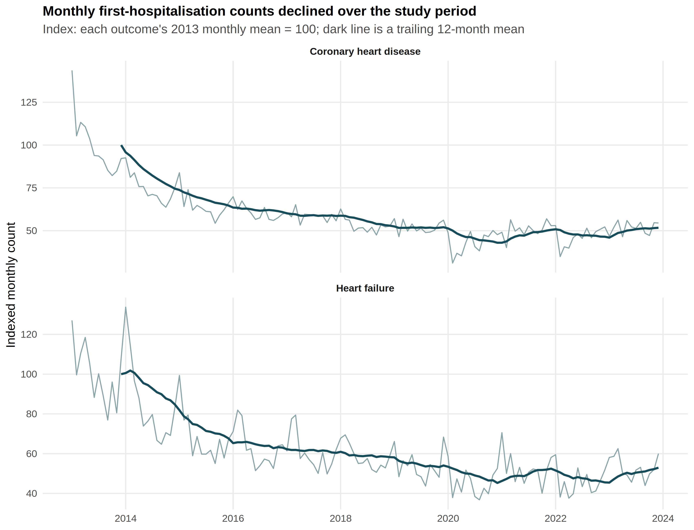
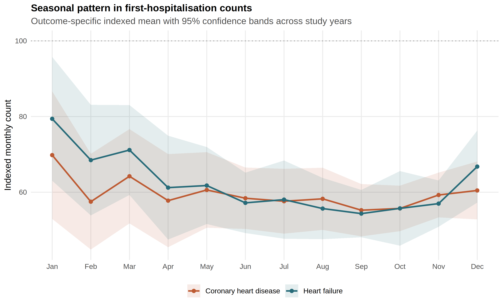
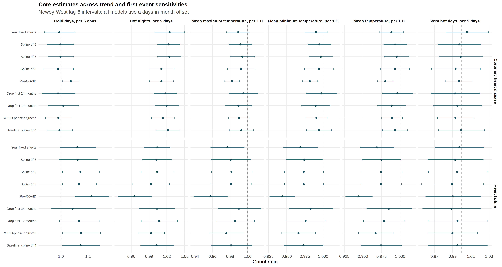

**Audience:** Professor David Bishai (supervisor), with shared scientific use by Roro, Hogan, and Bob.
**Date:** 10 August 2026
**Mode:** Supervisor-facing scientific report (internal). Gate language and collaborator roles are permitted here.
**Provenance rule:** Health estimates are `HA_APPROVED_AGGREGATE`. Calibration materials are `SYNTHETIC_CALIBRATION`. Weather reproduction checks are `REAL_PUBLIC_HKO`.
**Companion artifacts:** `outputs/release_chd_hf/`; `manuscript/chd_hf_thermal_associations_2013_2023.md`; `manuscript/chd_hf_supplement.md`; `knowledge/2026-08-10_correspondence_scientific_contract.md`; `reports/data_receipt_2026-08-07.md`.
**Not done in this document:** invent missing human decisions; freeze Gate 3; commit HA microdata; promote synthetic coefficients as findings.

---

## 1. One-page executive summary

This project asked whether monthly thermal burden in Hong Kong is associated with governed monthly counts of first cardiovascular hospitalisation among people with type 2 diabetes and/or hypertension. The delivered outcomes are first hospitalisations after a first coronary heart disease (CHD) or heart failure (HF) diagnosis record during January 2013–December 2023 (132 territory-months). Admission cause is not observed. Stroke was named in covering correspondence but was not attached. The scientifically honest estimand is therefore an ecological monthly count ratio under a cohort-restricted first-event construction, not principal-diagnosis incidence and not a daily triggering analysis.

The analysis-of-record architecture fits six exposures separately for each outcome: mean temperature, mean maximum temperature, mean minimum temperature, official hot nights, official cold days, and official very hot days. Models are negative binomial with calendar-month factors, a natural spline of time (4 df), and a days-in-month offset. Continuity reporting uses Newey–West lag-6 intervals together with Model, HC1, and Newey–West lag-3 intervals. No interval is selected because it excludes the null.

The twelve continuity estimates are complete and internally validated. The two smallest unadjusted p-values are CHD hot nights (count ratio 1.022; NW6 1.002–1.042; q = 0.192) and HF cold days (1.073; NW6 1.006–1.144; q = 0.192). For CHD hot nights, Model and HC1 intervals include the null (0.995–1.049 and 0.997–1.047). All twelve Benjamini–Hochberg q-values exceed 0.19. CHD residual autocorrelation at lag 1 is about 0.51; HF is about 0.15. Joint entry of correlated heat metrics inflates the CHD hot-night coefficient relative to the separate model. These facts support exploratory signals inside a definition- and uncertainty-aware panel. They do not support a Gate 3 confirmatory headline of “CHD-hot / HF-cold discovery.”

A constrained monthly-outcome / daily-exposure (M|D) method was calibrated on synthetic outcomes. The F1.0 pilot failed because HF-like null cells absorbed residual cold-season structure. F1.1 corrected nuisance seasonality. F1.2 recomputed gates on worst cells rather than averages. The 500-replicate decision is fail: null Type I 0.048–0.150, minimum coverage 0.840, maximum non-null relative bias 32.77, maximum moderate false-sign 0.808, stress coverage 0.842. No real daily coefficient is admitted.

What is learned: the data contract; source-locked weather morphology; a reproducible monthly panel with uncertainty discordance; and a documented refusal of uncalibrated daily recovery. What is not learned: stroke associations; cohort incidence; principal-diagnosis effects; protected primary thermal claims; or daily lag structure from monthly sums. The lead scientific recommendation is Option A (explicit no confirmatory primary; methods-focused exploratory paper); Gate 3 approval remains human-owned. Ranked decisions for humans follow in Section 10.

---

## 2. First-principles question

The first-principles question is not “which p-value is smallest.” It is:

> Given governed monthly first-hospitalisation counts without admission cause, and daily weather that can be aggregated into several non-equivalent monthly thermal burdens, what associations can be estimated honestly, and which stronger claims must be refused?

That question forces five distinctions:

1. **Outcome construction** versus disease label in ordinary language. A first hospitalisation after a first CHD diagnosis record is not an admission *for* CHD in the principal-diagnosis sense.
2. **Monthly count ratio** versus cohort incidence-rate ratio. Without the T2D/HTN risk set still eligible for a first event, a population offset remains ecological.
3. **Thermal definition** versus a single temperature number. Mean temperature, hot nights, cold days, spells, and heat-month tails select different months [@wang2019ehwe; @li2025heatwaves; @guo2017ehp].
4. **Daily mortality attributable fraction / modelled excess deaths** versus monthly morbidity associations [@liu2020jasmine; @liu2026roro].
5. **Methods feasibility** versus health finding. An M|D estimator that fails calibration does not become a daily result [@basagana2024md].

The project’s scientific product is therefore a contract-respecting panel with explicit refusals, not a press-ready binary story.

A useful corollary follows for supervision. When a monthly ecological design is forced by governance, the correct response is not to invent daily resolution in the prose. The correct response is to state the monthly estimand, stress-test thermal definitions, report residual dependence and standard-error discordance, and treat any attempt to recover daily coefficients as a gated methods question. That posture is what this report means by aggregation-aware inference.

---

## 2.1 Scientific boundaries that do not move without new data

Several boundaries are already closed by the delivered files and do not await Gate 3:

1. **No AMI / principal-diagnosis claims** from this extract. Admission cause is absent.
2. **No stroke results** until a stroke file arrives. Naming stroke in correspondence is not delivery.
3. **No cohort incidence language** without the still-at-risk denominator.
4. **No rich daily DLNM** at n = 132 months after the constrained M|D route failed calibration.
5. **No selection of SE method by null exclusion.** Continuity NW6 is displayed with the full ladder.
6. **No promotion of synthetic calibration** into health findings.

These boundaries are scientific, not administrative. Crossing them would create false findings even if the writing were elegant.

---

## 3. Concise chronology from correspondence (internal evidence)

This chronology summarises the scientific path from the nine-page Outlook thread (21 April–6 August 2026) and the 7 August data receipt. It is internal provenance, not a References list. Email addresses and private PDF quotations are omitted.

**10–12 July 2026.** Bob reported a validated Hong Kong Observatory pipeline and stated that synthetic health outcomes had tested code only. He asked for diagnosis coding, principal-diagnosis availability, episode rules, age bands, suppression, and output vetting. Professor Bishai proposed merging monthly temperature with monthly AMI and stroke admission risk and requested a descriptive Table 1 plus patient-level adjustment ambition (age, sex, medications, BMI). Roro confirmed ICD-9 coding, DAE inclusion, complete admission outcomes at patient level in that extract, no ED-to-inpatient episodes in that extract, age 65–69 / 70–74 distinguishability, and controlled HPC access. Roro asked whether additional HA work required an IRB update; no PI answer appears in the supplied thread.

**17–22 July 2026.** The project moved away from principal-diagnosis AMI claims when the general HA file was found not to contain admission causes. Near-term focus shifted toward monthly stroke aggregates. Daily weather morphology inside monthly exposures was retained; an ordinary monthly lag was not to be described as a daily DLNM. Hogan proposed source-locking a heatwave definition, counting events by month, and defining hot months by the upper tail of that count distribution.

**22–28 July 2026.** Roles clarified: Hogan on weather methods and writing mentorship; Roro on regression oversight and outcome construction; Bob on exposure pipeline, integration, and remaining Methods. Hogan shared a live manuscript and wrote the weather Methods. That live file remains collaborative manuscript authority for weather text.

**6–7 August 2026.** Roro delivered governed monthly CHD and HF aggregates for a T2D/HTN 2013–2023 cohort. Because admission cause was absent, the event was defined as first hospitalisation after the patient’s first diagnosis record for the cardiovascular condition, with assistance from Dr Jingjing Zhou on first-diagnosis records. Stroke was named but not attached. Gate 1 closed conditionally for CHD/HF; Gate 2 closed for CHD/HF territory-month first-event aggregates; Gate 3 stayed open.

**10 August 2026.** Final exploratory protocol, claim tiers, uncertainty ladder, weather source validation, and M|D calibration F1.0→F1.1→F1.2 were frozen or completed as post-outcome methods work. Release validation passed 28/28 checks. No agent Gate 3 freeze occurred.

The path is planned AMI/stroke → no admission cause → delivered CHD/HF first-event pivot. The pivot is a data-contract change, not a scientific failure of collaborators.

---

## 4. Exact data / outcome / denominator / estimand contract

| Element | Contract |
|---|---|
| Period | January 2013–December 2023; 132 territory-months |
| Cohort universe | People diagnosed with T2D and/or HTN during 2013–2023 |
| CHD event | First hospitalisation after first CHD diagnosis record |
| HF event | First hospitalisation after first HF diagnosis record |
| Admission cause | Not recorded |
| Stroke | Not delivered |
| Age/sex strata | Not delivered (capability ≠ delivery) |
| Grain | Territory × calendar month |
| Provenance label | `HA_APPROVED_AGGREGATE` |
| Analysis-of-record offset | `log(days in month)` |
| Population × days offset | Ecological sensitivity only |
| Target parameter | `exp(beta)`: monthly **count ratio** |
| Not the target | Cohort IRR; principal-diagnosis RR; AMI; daily DLNM RR; mortality AF |

Totals (`outputs/release_chd_hf/tables/table1_outcome_summary.csv`): CHD 156,156 events (mean 1,183.0/month); HF 29,681 (mean 224.9/month).

Governance: source xlsx and merged panels are gitignored. Aggregation reduces re-identification risk but does not grant external-publication authority. Written Roro/Bishai confirmation remains required before submission or public promotion (`reports/data_receipt_2026-08-07.md`).

---

## 5. Source-locked weather morphology and five reproduction checks

Daily HKO Headquarters observations create monthly means and official extreme-day counts. Official thresholds used in the continuity panel are hot night (`Tmin ≥ 28 °C`), very hot day (`Tmax ≥ 33 °C`), and cold day (`Tmin ≤ 12 °C`). Spell and atmospheric morphologies follow Wang et al. (2019) and Li et al. (2025) after source lock [@wang2019ehwe; @li2025heatwaves].

Five reproduction checks all passed (`outputs/release_chd_hf/supplement/methods_feasibility/weather_definition_source_validation.csv`):

| Check | Expected | Observed |
|---|---:|---:|
| Li events 1980–2023 | 57 | 57 |
| Wang VHD days 2006–2015 | 204 | 204 |
| Wang HN days 2006–2015 | 230 | 230 |
| Wang VHD ≥5 event-days 2006–2015 | 48 | 48 |
| Wang HN ≥5 event-days 2006–2015 | 56 | 56 |

Calendar spillover morphology (event starts, overlapping events, event-days, same-day and post-event phases) is an exposure audit, not twelve independent discovery tests. Provisional hot-month / cold-month indicators remain unlocked pending Hogan’s reference-period decision; their estimates stay supplementary.

### Key real-data figures

{width=100%}

{width=100%}

{width=100%}

{width=100%}

{width=100%}

{width=100%}

---

## 6. Real CHD/HF analysis architecture and results

### 6.1 Architecture

Amended core: separate single-exposure negative-binomial models for CHD and HF × six exposures (twelve contrasts). Controls: calendar-month factor + `ns(time, 4)`. Offset: days. Continuity SE: Newey–West lag 6, displayed with Model / HC1 / NW3 (`outputs/release_chd_hf/tables/table4_uncertainty_ladder.csv`; Figure 5). Multiplicity: Benjamini–Hochberg across the twelve NW6 p-values. Claim ledger: CVD-01…CVD-12 (`claim_ledger_v2.csv`). Release validation: 28/28 pass (`outputs/reports/cvd_real_release_validation.md`).

### 6.2 Complete nulls and core estimates

All twelve continuity estimates (`table2_core_models.csv`):

| ID | Outcome | Contrast | RR (NW6 95% CI) | p | q |
|---|---|---|---|---:|---:|
| CVD-01 | CHD | Mean temp /1 °C | 0.993 (0.976–1.010) | 0.424 | 0.726 |
| CVD-02 | CHD | Mean Tmax /1 °C | 0.993 (0.979–1.007) | 0.321 | 0.642 |
| CVD-03 | CHD | Mean Tmin /1 °C | 0.994 (0.977–1.012) | 0.509 | 0.764 |
| CVD-04 | CHD | Hot nights /5 | 1.022 (1.002–1.042) | 0.032 | 0.192 |
| CVD-05 | CHD | Cold days /5 | 0.995 (0.949–1.043) | 0.823 | 0.900 |
| CVD-06 | CHD | Very hot days /5 | 0.999 (0.974–1.025) | 0.962 | 0.962 |
| CVD-07 | HF | Mean temp /1 °C | 0.974 (0.947–1.002) | 0.069 | 0.207 |
| CVD-08 | HF | Mean Tmax /1 °C | 0.981 (0.958–1.005) | 0.113 | 0.272 |
| CVD-09 | HF | Mean Tmin /1 °C | 0.973 (0.947–1.000) | 0.050 | 0.202 |
| CVD-10 | HF | Hot nights /5 | 1.003 (0.976–1.031) | 0.825 | 0.900 |
| CVD-11 | HF | Cold days /5 | 1.073 (1.006–1.144) | 0.031 | 0.192 |
| CVD-12 | HF | Very hot days /5 | 0.995 (0.963–1.028) | 0.764 | 0.900 |

**Complete nulls / near-nulls under continuity NW6:** CHD mean temperatures and cold/very-hot days; HF hot nights and very hot days; HF mean temperatures near null with intervals that touch or include 1 under NW6. **Exploratory unadjusted signals:** CVD-04 and CVD-11. **Multiplicity:** all q > 0.19.

Figures: indexed series (Figure 1), seasonality (Figure 2), core forest (Figure 3) under `outputs/release_chd_hf/figures/`.

### 6.3 Standard-error ladder (explicit key contrasts)

CHD hot nights, RR = 1.022:

| SE method | 95% CI |
|---|---|
| Model | 0.995–1.049 |
| HC1 | 0.997–1.047 |
| NW3 | 1.000–1.044 |
| NW6 | 1.002–1.042 |

HF cold days, RR = 1.073:

| SE method | 95% CI |
|---|---|
| Model | 1.023–1.125 |
| HC1 | 1.011–1.138 |
| NW3 | 1.007–1.143 |
| NW6 | 1.006–1.144 |

NW6 is continuity analysis of record with the full ladder shown. It is not designated primary because an interval excludes the null [@lazarus2018har]. For CHD hot nights, Model and HC1 include the null; NW6 does not. That discordance is a result.

### 6.4 Multiplicity and residual dependence

Benjamini–Hochberg q-values across the twelve amended-core NW6 contrasts are all greater than 0.19. The two unadjusted associations below conventional 0.05 therefore remain exploratory panel results.

Pearson residual ACF1 ≈ 0.51 for CHD core models (range 0.508–0.534) and ≈ 0.15 for HF (range 0.131–0.179). Ljung–Box tests reject white noise for CHD, not for HF. Negative-binomial INGARCH(1,1) fits without an offset reduce residual autocorrelation and retain positive CHD hot-night and HF cold-day associations; these unoffset diagnostics are not directly comparable with days-offset continuity estimates. Serial dependence is part of the inferential problem.

### 6.5 Joint models

After month/trend residualisation, VIF = 4.66 for joint mean Tmax/Tmin and ≈ 1.96 for hot nights / very hot days. Joint extreme-day modelling raises the CHD hot-night ratio from 1.022 to 1.045 (1.015–1.075). HF cold days remain about 1.073. Joint models are collinearity diagnostics, not preferred estimates.

### 6.6 Trend, depletion, lag, influence

Across trend/depletion scenarios (`table3_robustness_summary.csv`; Figure 4), CHD hot nights range ≈ 1.011–1.025; HF cold days ≈ 1.043–1.113. Pre-2020 HF cold days: 1.113 (1.053–1.176). Lag-1/2 attenuate CHD hot nights toward the null; HF cold remains elevated at lag 1 (1.073) and weaker at lag 2 (1.053). Influence exclusions (CHD 2020-02; HF 2022-02 for cold days) leave directions unchanged.

### 6.7 Specification discipline and what was not searched

The final exploratory protocol freezes a finite model universe after outcomes were visible (`analysis_plan/final_reanalysis_protocol_2026-08-10.md`). That status matters. The panel is post-outcome exploratory, not a confirmatory preregistration. Several rules follow:

- The twelve amended-core contrasts form one multiplicity family.
- Spillover morphology variants are an exposure audit family; they cannot rescue a core claim.
- Warm-season heat and cold-season cold cut-points are not searched after fitting.
- Cross-outcome hot-versus-cold contrast Δ requires a stacked model; separate coefficients do not establish Δ ≠ 0. That stacked contrast was part of the frozen ensemble design and is blocked in this checkout by missing governed panel runtime, so it is not reported as completed.
- Predictive log-score gains, if later obtained, would not be causal evidence.

SAP Amendment A1 already corrected an earlier tendency to treat joint P02/P04 as headline candidates and to interpret population × days as a true risk-set offset (`reports/gate3_decision_packet_2026-08-07.md`). The present report inherits those corrections.

### 6.8 Reading the exploratory CHD hot-night / HF cold-day pattern without over-claiming

A qualitative panel pattern is visible: CHD first-hospitalisation counts track official hot-night burden more closely than mean temperature or cold days; HF counts track cold-day burden more closely than hot nights. That pattern is scientifically discussable as exploratory. It is consistent with historical Hong Kong emphasis on cold for cardiac admissions and with contemporary concern about nighttime heat [@goggins2013; @guo2024hotnights]. It is also consistent with definition sensitivity: continuous monthly means are near null for CHD while an official extreme-night count is not.

Over-claiming would look like this:

- calling the pattern confirmatory despite q = 0.192;
- ignoring that CHD hot-night Model/HC1 intervals include the null;
- treating joint-model 1.045 as the preferred CHD estimate;
- translating monthly count ratios into daily nocturnal physiology;
- importing Jasmine’s mortality AFs or Roro’s excess deaths as if they were these morbidity coefficients.

Under-claiming would look like this:

- hiding CVD-04 and CVD-11;
- reporting only multiplicity-adjusted silence without the complete panel;
- omitting residual dependence and SE discordance;
- pretending the M|D exercise never happened.

The durable middle is the panel as written: complete estimates, explicit uncertainty, explicit refusals.

### 6.9 Blocked extensions

Final ensemble, prediction specification, and real M|D were not run on a governed analysis panel in this checkout (`analysis_availability.csv`). Those rows are availability facts, not completed analyses.

---

## 7. M|D rationale, F1.0 failure, F1.1 correction, F1.2 worst-cell failure

Monthly health sums erase day-of-month timing. Basagaña and Ballester show that aggregated-outcome likelihoods can, under conditions, recover daily temperature–mortality relations from temporally aggregated outcomes, with monthly recovery more variance-prone than weekly [@basagana2024md; @basagana2026md]. The project therefore tested a constrained M|D estimator as methods feasibility, not as a default DLNM.

**F1.0 (100-rep pilot).** Daily nuisance seasonality used one sine/cosine pair. CHD-like nulls looked acceptable. HF-like null Type I rose to 0.62–0.75 with coverage 0.25–0.38. Residual cold-season structure was absorbed by the cold exposure. This was a design failure, not a real HF finding (`md_pilot_f1_0_failure_note.md`).

**F1.1.** Nuisance seasonality was amended to calendar-month indicators, matching the analysis of record, inside the frozen 20-parameter cap. The failed pilot was retained for audit. No real coefficient was inspected to choose the amendment.

**F1.2 (500-rep worst-cell gates).** Averaging across cells can hide a failed HF-like cell behind a calibrated CHD-like cell. Gates were recomputed on binding worst cells without relaxing thresholds or fitting new real models. Decision: `FAIL_METHODS_FEASIBILITY_ONLY`. Null Type I 0.048–0.150; min coverage 0.840; max non-null relative bias 32.77; max moderate false-sign 0.808; stress coverage 0.842. Convergence/Hessian/divergence passed; Type I, coverage, bias, false-sign, and stress coverage did not.

**Admission rule.** Because gates failed, no real daily-exposure coefficient enters Results. The monthly panel remains analysis of record.

### 7.1 Why the failure is scientifically useful

A failed calibration is not wasted work. It answers a concrete methods question that supervisors and reviewers will ask: given only monthly sums, can a constrained daily-exposure model be trusted here? Under the frozen gates and this synthetic design, the answer is no. That refusal protects the manuscript from a common failure mode in environmental epidemiology—borrowing daily language for monthly data.

The failure also clarifies next designs. If daily or weekly governed outcomes become available, a conventional time-series model is the honest route. If only monthly sums remain available, the analysis should stay monthly and invest in definition robustness, residual dependence, and denominator improvement rather than in uncalibrated daily recovery.

### 7.2 Comparator noncomparability (F1.2)

F1.2 also records that comparator models whose coefficients target a different monthly quantity are not scored against the daily M|D β. Their convergence and predictive metrics remain reportable, but they cannot be used to invent a pass for the daily method. This prevents a second subtle misuse: treating a well-behaved monthly negative-binomial comparator as evidence that the daily coefficient was recovered.

---

## 8. Jasmine daily mortality AF → Roro modelled excess deaths → current monthly morbidity map

Three claim classes must stay distinct (`literature/final_methods_evidence_map.md`):

1. **Jingwen Liu et al. (2020)** — daily Hong Kong mortality, 2006–2016; DLNM + quasi-Poisson; cold AF 4.72% vs heat 0.16%; moderate AF 4.25% vs extreme 0.63% [@liu2020jasmine]. These are mortality attributable fractions.
2. **Zhenyuan Liu et al. (2026, medRxiv)** — model-based excess deaths 2014–2023 under four heatwave scenarios using transported local RRs; range 1,455–3,238 across definitions [@liu2026roro]. These are modelled excess deaths, not new daily regressions and not hospitalisation coefficients. Public cite = medRxiv v1; private revised PDF is internal audit only.
3. **This project** — monthly CHD/HF first-hospitalisation count ratios under T2D/HTN first-event construction. Continuity exploratory signals exist; multiplicity-protected primary claims do not.

The family is cumulative in literature motivation: daily mortality AF → multi-definition modelled heat deaths → monthly morbidity associations. It is not a licence to paste AF or excess-death numbers into Table 2.

### 8.1 How each class should appear in team prose

| Class | Where it belongs | Sentence template |
|---|---|---|
| Daily mortality AF | Introduction / evidence spine | “Jingwen Liu et al. (2020) reported cold AF 4.72% versus heat 0.16% for Hong Kong mortality.” |
| Modelled excess deaths | Companion mortality baseline | “Zhenyuan Liu et al. (2026) estimated 1,455–3,238 model-based excess deaths across four heatwave definitions.” |
| Monthly morbidity count ratios | Results tables | “Under days-in-month offset, the continuity count ratio for HF cold days was 1.073 (NW6 1.006–1.144; q = 0.192).” |
| M\|D validation | Methods / supplement | “Synthetic calibration failed F1.2 worst-cell gates; no real daily coefficient was admitted.” |

If a draft sentence mixes two rows of this table, rewrite it.

### 8.2 Local morbidity precedents that still do not rewrite the estimand

Goggins et al. (2012, 2013) and Chan et al. (2013) provide historical daily Hong Kong morbidity baselines for stroke, AMI, and broad admissions [@goggins2012stroke; @goggins2013; @chan2013bullwho]. Yang et al. (2025) support a pre-specified influenza sensitivity for cold models in longer weekly stroke series [@yang2025coldflu]. Guo et al. (2024, 2025) motivate hot-night intensity and staged pollution adjustment [@guo2024hotnights; @guo2025temppollution]. None of these studies converts the present CHD/HF first-event monthly aggregates into principal-diagnosis or daily-trigger findings. They motivate symmetry, covariates, and caution.

---

## 9. What is scientifically learned versus not learned

### Learned (established / supported)

- Exact outcome and denominator contract for the delivered files.
- Source-locked weather morphology with five passing reproduction checks.
- A complete twelve-contrast monthly panel with claim-ledger identity and release validation.
- Uncertainty discordance: CHD hot-night intervals cross the null under Model/HC1 but not under continuity NW6.
- Multiplicity: all core q > 0.19.
- Residual dependence: CHD ACF1 ≈ 0.51; HF ≈ 0.15.
- Joint-model inflation of CHD hot nights as a collinearity warning.
- Robustness ranges for trend, depletion, lag, and influence.
- Documented M|D methods failure under F1.2 worst-cell gates.

### Not learned (future / blocked / hypothesis-only)

- Stroke associations.
- Principal-diagnosis CHD/HF or AMI effects.
- True cohort incidence with the still-at-risk denominator.
- Age, sex, medication, or subtype modification.
- Locked hot-month / cold-month primary effects.
- Daily lag-specific triggering from monthly sums.
- A Gate 3 confirmatory headline.
- Causal pathway stories (nocturnal recovery impairment; cold-triggered decompensation) beyond hypothesis language.
- External publication permission.

### 9.1 Claim-tier map for this report

Using `analysis_plan/final_claim_tiers.yml`:

| Tier | Examples in this report | Manuscript handling |
|---|---|---|
| Established | 132 months; first-event construction; no admission cause; stroke absent; Gate 3 open; weather checks pass | Allowed |
| Supported | All twelve continuity estimates; VIF; residual ACF; robustness ranges; SE ladder | Allowed with uncertainty and model IDs |
| Exploratory | CHD hot-night and HF cold-day signals; joint-model inflation | Allowed with exploratory qualifier and multiplicity |
| Hypothesis | Nocturnal recovery impairment; cold-triggered HF decompensation; depletion as care-pattern change | Discussion only |
| Future | Stroke; cohort incidence; age/sex/medication; principal-diagnosis; daily DLNM | Limitations / next-data only |

Forbidden promotions remain binding: calibration ↛ real finding; exploratory ↛ primary without Gate 3; mortality AF ↛ monthly morbidity; excess deaths ↛ hospitalisation burden; population offset ↛ cohort incidence.

---

## 10. Ranked decisions for humans

### For Professor Bishai

1. Decide Gate 3 posture: freeze no confirmatory primary; or freeze a carefully worded exploratory panel summary; or request additional governed data before any headline.
2. Decide whether IRB/protocol amendment is required for the HA work (question raised; unanswered in supplied thread).
3. Confirm external dissemination permission for disclosure-minimised aggregates.
4. Set authorship expectations with Roro and Hogan (order; corresponding author; co-first suggestion).

### For Roro

1. Deliver stroke file or confirm permanent absence for this manuscript cycle.
2. Confirm ICD lists and `*_inpatient` semantics.
3. Advise whether the T2D/HTN cohort still at risk of a first event can be obtained.
4. Confirm health-data Methods text and publication authority for aggregates.
5. Resolve co-first / author-order discussion in writing.

### For Hogan

1. Lock weather reference period and HM/CM starters (or explicitly keep them supplementary).
2. Review whether live weather Methods enter the journal manuscript under his text.
3. Advise on writing register for the journal draft (already applied here in sparse academic English).

### For Bob

1. Keep NW6 as continuity analysis of record with full SE ladder; do not p-hunt intervals.
2. Do not promote CVD-04/CVD-11 to primary without Gate 3.
3. Keep M|D in methods-feasibility quarantine.
4. Sync repository prose with Hogan’s live manuscript without overwriting weather Methods.
5. Maintain provenance firewall and claim-ledger comments in manuscript drafts.

### 10.1 Lead scientific recommendation and Gate 3 menu

**Lead recommendation (scientific, not a freeze):** Option A — explicit no confirmatory primary; methods-focused exploratory paper. Report CVD-01 to CVD-12 with q-values and the full SE ladder; refuse a single headline differential thermal claim. This matches current multiplicity (all q > 0.19), CHD hot-night SE sensitivity, and the failed M|D calibration. Team approval of Gate 3 remains human-owned.

Alternatives:

**Option B — Exploratory panel summary without discovery framing.** Allow a qualitative sentence that CHD tracks hot nights more than means/cold and HF tracks cold days more than hot nights, while stating all q > 0.19 and Model/HC1 discordance for CHD hot nights. Still not a confirmatory primary.

**Option C — Defer headline until next data.** Hold external manuscript submission until stroke and/or risk-set denominators arrive. Internal report and methods quarantine remain usable now.

The freeze itself is not executed here.

---

## 11. Technically credible next-data programme

A credible next programme is incremental and governance-first:

1. **Stroke delivery** under the same first-event contract, or an explicit written decision that stroke is out of scope for this paper.
2. **Dictionary lock:** ICD lists; inpatient semantics; suppression rules; any ED inclusion.
3. **Risk-set denominator:** monthly counts of T2D/HTN cohort members still at risk of a first CHD or HF hospitalisation, enabling incidence-rate language.
4. **Optional strata:** age bands (including 65–69 / 70–74 if available) and sex as predeclared modifiers, not fishing.
5. **Weather lock:** Hogan-approved HM/CM reference rules before those indicators leave the supplement.
6. **Only then** re-open daily designs if daily or weekly governed outcomes exist; do not retry rich DLNM at n = 132 months after M|D failure.
7. **Prediction / ensemble** only after the governed analysis panel is present in the runtime environment and Gate 3 posture is set.

This sequence improves readiness without inventing missing files.

### 11.1 Minimum viable “next paper” versus “next methods note”

If the team wants a journal manuscript from current files only, the viable thesis is aggregation-aware inference and thermal-definition uncertainty, as in the rewritten manuscript. That paper can be scientifically complete under the recommended Option A posture, or under Option B if the team prefers a cautious qualitative summary.

If the team wants a stronger morbidity claim, the binding constraint is data, not prose. Stroke delivery, risk-set denominators, and dictionary confirmation change the estimand. Writing cannot substitute for them.

If the team wants daily lag claims, the binding constraint is outcome grain. Monthly sums plus failed M|D calibration are not a temporary inconvenience; they are a refusal. Weekly or daily governed outcomes would reopen that door.

### 11.2 Reproducibility obligations that should travel with any next delivery

Any new governed file should arrive with:

- SHA-256 and row inventory in a data receipt;
- explicit event-construction text;
- provenance label on every analysis row;
- an updated claim ledger rather than orphan coefficients;
- release validation that recomputes multiplicity and checks table-to-ledger identity.

The present CHD/HF release already implements that pattern (`cvd_real_release_validation.md`, 28/28). Future deliveries should not regress to unlabelled CSVs.

---

## 12. Conclusion

The delivered science is a governed monthly CHD/HF first-hospitalisation panel under thermal-definition uncertainty and aggregation-aware inference. Continuity estimates show exploratory CHD hot-night and HF cold-day associations with q = 0.192, material CHD residual dependence, and SE discordance that forbids selecting NW6 because it excludes the null. Constrained daily-exposure recovery failed calibration and is refused. Daily mortality attributable fractions and modelled excess deaths remain complementary literature baselines, not substitutes for these morbidity count ratios. Gate 3, authorship, dictionary confirmation, stroke delivery, weather lock, and dissemination remain human decisions. The correct next step is to decide those items and, where needed, request the next governed data layer—not to invent a stronger claim from the present release.

### Closing inventory for the supervision meeting

Bring to the meeting:

1. This integrated report and the journal manuscript draft.
2. Table 2 and Table 4 from `outputs/release_chd_hf/tables/`.
3. Figure 3 (core forest) and Figure 5 (SE ladder).
4. The F1.2 decision report and the five weather reproduction checks.
5. The open-decision list in Section 10, with Option A recommended and B/C retained as alternatives.

Do not bring synthetic calibration coefficients as if they were CHD/HF effects. Do not bring a frozen headline that the team has not chosen.

The meeting’s success criterion is a written decision on Gate 3 posture and on the next governed-data request, not a longer coefficient list.

---

## Internal provenance (not bibliographic references)

`knowledge/2026-08-10_correspondence_scientific_contract.md`; `reports/data_receipt_2026-08-07.md`; `reports/gate2_qc_close_2026-08-07.md`; `analysis_plan/final_reanalysis_protocol_2026-08-10.md`; `analysis_plan/final_claim_tiers.yml`; `outputs/reports/cvd_real_release_validation.md`; `outputs/calibration_md/md_calibration_f1_2_decision_report.md`.

Bibliographic citations are rendered by Pandoc citeproc from `literature/references.bib`.

---

## Appendix A — Artifact map (short)

| Need | Path |
|---|---|
| Core tables | `outputs/release_chd_hf/tables/table1_*.csv` … `table4_*.csv` |
| Claims | `…/tables/claim_ledger_v2.csv` |
| Figures 1–5 | `…/figures/figure{1–5}_*.png` |
| Supplement diagnostics | `…/supplement/` |
| Methods feasibility | `…/supplement/methods_feasibility/` |
| Journal draft | `manuscript/chd_hf_thermal_associations_2013_2023.md` |
| Supplement draft | `manuscript/chd_hf_supplement.md` |
| Authorship status | `manuscript/authorship_and_governance_decisions.md` |

See also [`README.md`](README.md) in this folder for compile notes.

## Appendix B — Deliberately excluded claims

The following claims were available as temptations and were excluded on purpose:

1. A confirmatory “CHD hot / HF cold” primary discovery.
2. Any real M|D daily thermal coefficient.
3. Stroke results.
4. Admissions *for* CHD/HF, AMI, principal diagnosis, or incidence-rate language.
5. Mortality attributable fractions or modelled excess deaths presented as these morbidity effects.
6. NW6 designated primary because it excludes the null for CHD hot nights.
7. Final author order or co-first status.
8. Gate 3 freeze by agent.
9. Ensemble or prediction results marked completed despite availability blockers.
10. Private email quotations or raw addresses.

These exclusions are scientific refusals, not omissions of unfinished prose. The integrated report is complete when humans can decide Gate 3 and the next data request from these artifacts alone.

## Appendix C — Cloud / checkout availability (internal)

The public or cloud checkout used for drafting may lack governed analysis panels. In that setting:

- disclosure-minimised release tables under `outputs/release_chd_hf/` remain the analysis-of-record artifact set;
- ensemble, prediction, and real M|D scripts record blockers in `outputs/release_chd_hf/tables/analysis_availability.csv`;
- a governed full rerun requires local files: `PATHWAY_MODE=real OUTCOMES=chd,hf Rscript scripts/run_cvd_full_analysis.R`.

These are operations facts for supervisors. They are not journal Results.

