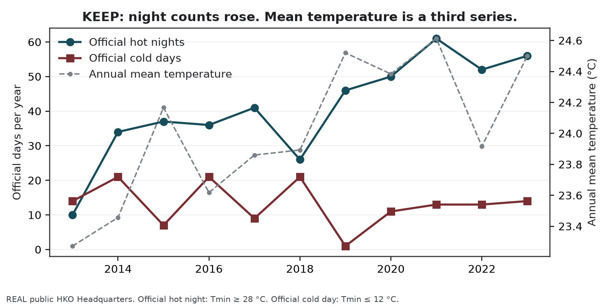
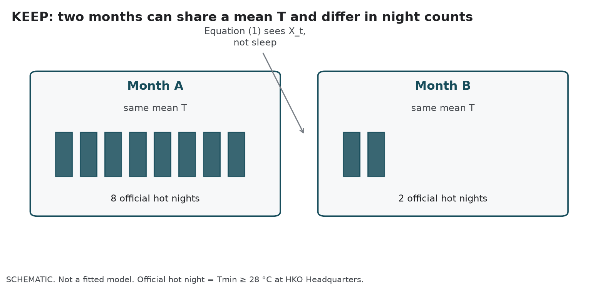
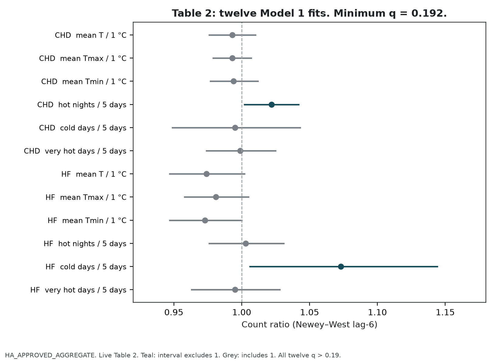
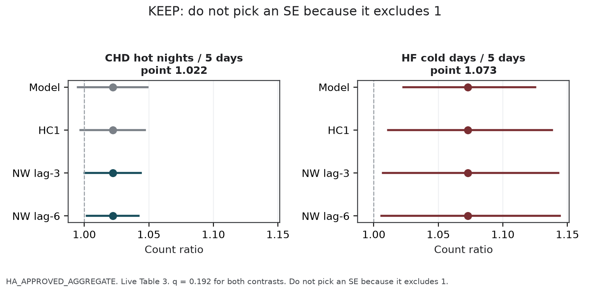
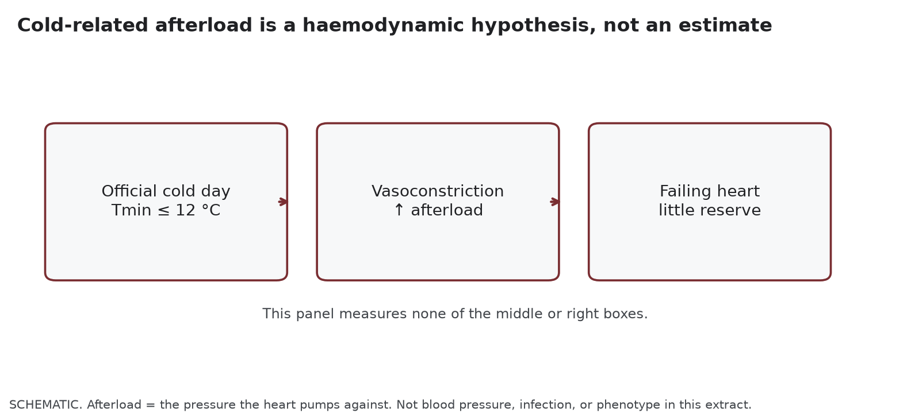
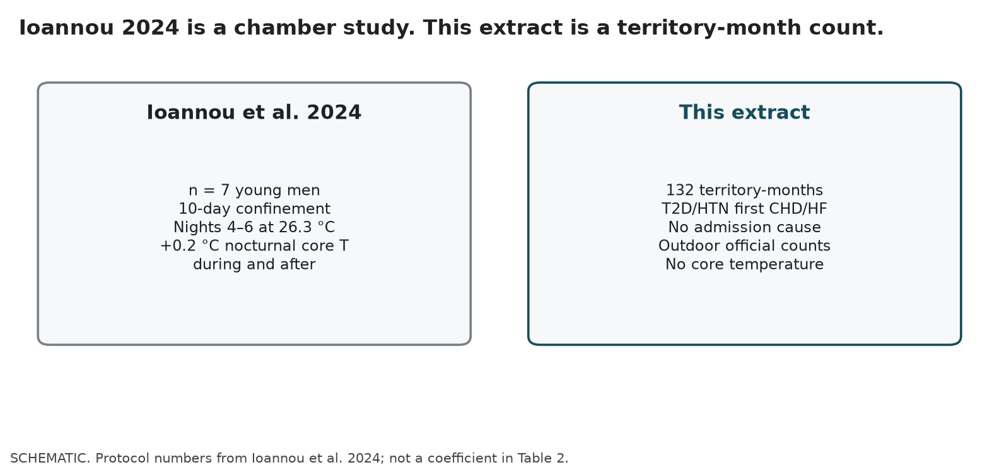
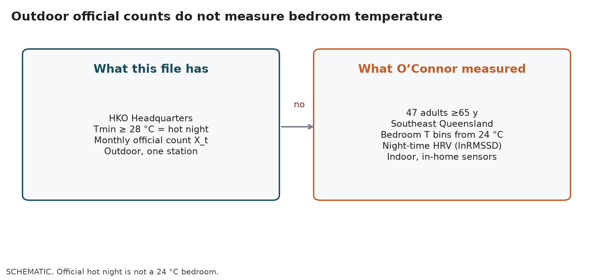
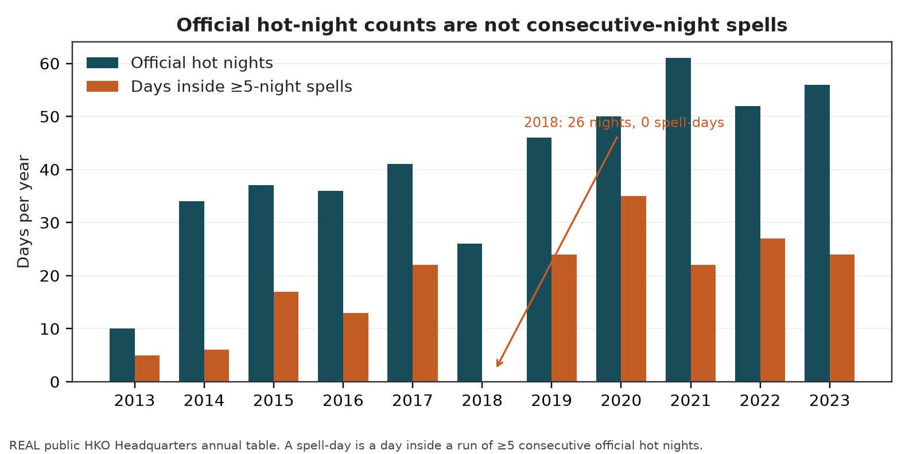

<strong>BOB REVIEW ONLY.</strong> Do not send this PDF to Hogan. He asked for bullets, then for a DOI under each point. The Hogan-facing paste remains <code>MECHANISM_BULLETS.md</code>. Table 2 and his HKO paragraph are unchanged. The live manuscript is not cut. Gate 3 remains open.

# What we are discussing

Nine September 2026, rewritten so the discussion is visible. Skim the cards. Read the long text only when you want the evidence. Count ratios are copied from the live identification article. No new Hospital Authority model is fitted here.

## Conversation map

How we got here, in order. This PDF is the last row, not a new ask of Hogan.

<table class="scoreboard">
<thead>
<tr><th>When</th><th>Who</th><th>What happened</th></tr>
</thead>
<tbody>
<tr><td>4 Sep 2026</td><td>Hogan</td><td>Mechanisms beforehand, as <strong>bullets</strong>, not a document.</td></tr>
<tr><td>8 Sep 2026</td><td>Hogan</td><td>Put the <strong>DOI under each point</strong>.</td></tr>
<tr><td>9 Sep 2026</td><td>Bob</td><td>Asked for a longer review PDF for himself (500–1000 words per point, with graphs).</td></tr>
<tr><td>This rewrite</td><td>Bob</td><td>Make the discussion readable. Keep, drop, or refuse must be visible at a glance.</td></tr>
<tr><td>Live manuscript</td><td>—</td><td><strong>Not cut</strong> until Hogan has seen the bullets.</td></tr>
<tr><td>This PDF</td><td>—</td><td><strong>Do not send this PDF to Hogan.</strong></td></tr>
</tbody>
</table>

The seven points, labelled. Hogan sees only the short list.

<table class="scoreboard">
<thead>
<tr><th>#</th><th>Point</th><th>Label</th><th>On the table</th></tr>
</thead>
<tbody>
<tr><td>1</td><td>Overnight recovery after hot nights</td><td class="pill-keep">KEEP</td><td>Keep the hypothesis. Do not make it a finding.</td></tr>
<tr><td>2</td><td>Cold-related afterload on a failing heart</td><td class="pill-keep">KEEP</td><td>Keep the hedge. Do not import Goggins 2.63.</td></tr>
<tr><td>3</td><td>Confinement study of seven men</td><td class="pill-drop">DROP</td><td>Drop after Hogan has seen the bullets. Live file still names it.</td></tr>
<tr><td>4</td><td>Bedroom temperature and HRV</td><td class="pill-drop">DROP</td><td>Drop after Hogan has seen the bullets. Reads as indoor measurement.</td></tr>
<tr><td>5</td><td>Indoor temperature from outdoor counts</td><td class="pill-refuse">REFUSE</td><td>Do not invert Headquarters counts into bedrooms.</td></tr>
<tr><td>6</td><td>Five extra official days as duration</td><td class="pill-refuse">REFUSE</td><td>Reporting scale, not a consecutive-night trigger. 2018 is the exhibit.</td></tr>
<tr><td>7</td><td>Evaluating Hong Kong’s warnings</td><td class="pill-refuse">REFUSE</td><td>Map instruments. Do not score VHWW. Do not count admissions averted.</td></tr>
</tbody>
</table>

<strong>How to read the rest.</strong> Each point opens with a discussion card: what Hogan asked, what the live file currently says, what is on the table, and keep / drop / refuse. Graphs state that same discussion in plain English. The long text is evidence, not a second set of decisions.

**Rails, one screen.** Ecological monthly Hong Kong first-hospitalisation counts. CHD 156,156 events; HF 29,681 events. People with T2D and/or HTN. January 2013–December 2023. 132 months. Negative-binomial count ratio. Calendar-month factors, `ns(time, 4)`, days-in-month offset. Official days use `I(count/5)` as a reporting scale, not consecutive duration. All twelve Model 1 *q* > 0.19 (minimum 0.192). Gate 3 is open. Hogan’s HKO paragraph is verbatim.

## Point 1. KEEP — Interrupted overnight recovery after hot nights

KEEP

<dl>
<dt>Hogan asked</dt>
<dd>Mechanisms as bullets, then a DOI under each point. Overnight recovery is on the keep list he will see, with Chevance and Ashe.</dd>
<dt>Live file</dt>
<dd>“Interrupted overnight recovery is one hypothesis for why a hot-night count could differ from monthly mean temperature. The present monthly design cannot test that hypothesis.” Chevance, Ioannou, O’Connor, and Ashe currently sit in the same paragraph.</dd>
<dt>On the table</dt>
<dd>Keep this hypothesis in the draft. Do not promote it to a finding. Do not add a sleep pathway diagram. Do not cut the live file until Hogan has seen the bullets.</dd>
<dt>Decision</dt>
<dd><strong>KEEP</strong> the labelled hypothesis. Drop the n=7 and bedroom exhibits (points 3–4), not this sentence.</dd>
</dl>

### What the residual is

This is the keep-mechanism for the CHD residual. It is a hypothesis about why a monthly official hot-night *count* can differ from monthly mean temperature. It is not a sleep coefficient, a mediator test, or a finding of Model 1.

Under Newey–West lag-6 reporting, the CHD count ratio is 1.022 (1.002–1.042) per five official hot nights, *q* = 0.192. The three continuous CHD temperature encodings sit near the null (0.993, 0.993, 0.994). CHD very hot days are 0.999 (0.974–1.025). The residual is therefore specific to the official night *count*, not to “heat” as a monthly average.

All twelve Model 1 *q*-values exceed 0.19. The CHD hot-night interval additionally depends on the standard-error construction: model-based and HC1 intervals include 1. The pre-2020 window is 1.011 (0.991–1.032) and includes 1. Those facts stay in the Results. Overnight recovery does not repair them.

### Why a night count is a different question from a mean

Sleep onset in humans is coupled to a nighttime fall in core temperature. If that fall is interrupted, sleep is shorter and more fragmented. Overnight cardiovascular recovery is then a plausible casualty. A month that contains many official hot nights (Tmin ≥ 28 °C at the Hong Kong Observatory Headquarters) can therefore differ from a month that is merely warm on average. That can be true even if the two months have similar mean temperature.

Equation (1) sees only the monthly official count *X_t*. It does not see sleep. It does not see core temperature. It does not see indoor temperature. The hypothesis is about why those two monthly questions can disagree. It is not a claim that we measured the disagreement’s cause.

### Sleep papers that support the hypothesis, and papers that bound it

Chevance and colleagues (2024) collected the sleep evidence in a systematic review of ambient heat and sleep. Higher outdoor or indoor temperature is associated with shorter sleep and poorer sleep quality. The review is about sleep, not first CHD hospitalisation in this Hong Kong monthly official-count model. It earns its place as the reason a night *count* is a different question from a monthly mean. It does not identify the 1.022.

Ashe and colleagues (2025) are the limit on that hypothesis, not a second keep-mechanism. Their scoping review found three eligible studies. Blood pressure did not move in one direction. No study demonstrated that sleep mediates a heat–hospitalisation path. The live Discussion already uses this paper as a refusal: the panel cannot treat sleep as a measured mediator. Keep Chevance for the sleep association. Keep Ashe so the overnight-recovery sentence cannot be misread as a dipping theorem.

### The Hong Kong neighbour is Guo, not Chevance

Guo, Chan, Qiu, Wong and Ho (2024) used daily unplanned emergency hospitalisations in Hong Kong during the hot seasons of 2000–2019. The official hot-night *flag* (minimum temperature ≥ 28 °C) showed no overall association with non-cancer, non-external hospitalisation over lags 0–4 days after adjustment for multi-day mean temperature (excess relative risk −0.2%, −1.2% to 0.7%). An hourly nighttime excess-heat metric for 20:00–07:59 was associated, including 3.1% (1.5–4.8%) at its extreme value and 3.4% (0.2–6.8%) for circulatory admissions.

Those percentages are Guo’s daily estimand. They are not this paper’s monthly count ratio, and not first CHD after a first diagnosis. They do show, in this city, that an official night encoding and a nighttime intensity encoding can disagree. Monthly official *counts* are coarser than either daily encoding. The contrast between 1.022 and 0.993 is a contrast between monthly questions, not a replication of Guo’s hourly result. Do not import Guo’s 3.1% as a magnitude.

### What this panel cannot do

It cannot see sleep, indoor temperature, or overnight recovery. It only counts nights. First-event totals fall by about half while official hot nights rise from 10 in 2013 to 61 in 2021. The same 4-df spline absorbs both. That is why the CHD residual is trend-sensitive at 3-df (1.011, 0.990–1.032, includes 1), and why overnight recovery stays a labelled hypothesis rather than a confirmation of Table 2.

Keep the mechanism in the draft, in the live wording. Do not add a sleep pathway diagram. Do not freeze a confirmatory night claim from this review. Gate 3 is open.

## Point 2. KEEP — Cold-related afterload on a failing heart

KEEP

<dl>
<dt>Hogan asked</dt>
<dd>The same bullet list. Afterload is the second keep item he will see, with Ikäheimo and Li. He did not ask for a haemodynamic tour.</dd>
<dt>Live file</dt>
<dd>“Cold exposure can raise afterload; a failing heart has little reserve against that load.” Goggins and Chan are named as the local epidemiological neighbour, not a magnitude to import.</dd>
<dt>On the table</dt>
<dd>Keep the hedge. Do not name a ventricular phenotype. Do not import 2.63 into Table 2. Do not treat concordance across standard-error methods as a freeze.</dd>
<dt>Decision</dt>
<dd><strong>KEEP</strong> the labelled hypothesis. This is the more coherent residual. It is still not a finding.</dd>
</dl>

### What the residual is

This is the keep-mechanism for the HF residual. It is haemodynamic rather than nocturnal. It is a hypothesis about why official cold days can be a different monthly question from monthly mean temperature for a first heart-failure hospitalisation. It is not a blood-pressure coefficient. It is not an afterload measurement. It is not an imported daily relative risk.

Under Newey–West lag-6 reporting, the HF count ratio is 1.073 (1.006–1.144) per five official cold days, *q* = 0.192. All four uncertainty constructions exclude 1. The pre-2020 estimate is stronger: 1.113 (1.053–1.176). Official cold days fall almost entirely in December–February (141 of 145). After calendar-month indicators, the remaining contrast is between winters, not summer versus winter.

HF hot nights are 1.003 (0.976–1.031). HF very hot days are 0.995 (0.963–1.028). A heat-only reading of the paper would miss the more coherent residual. That sentence is already in the live Discussion. Afterload is the reason it is scientifically available as interpretation. It is not a new estimate.

### What afterload means here

Afterload is the pressure the heart pumps against. Cold exposure can raise sympathetic outflow, peripheral resistance, and therefore afterload. A heart that is already in failure has little reserve against that load. Use “failing heart.” Do not name a ventricular phenotype. This cohort has no recorded HF subtype.

Ikäheimo (2018) reviews cardiovascular disease, cold exposure, and exercise in those terms: sympathetic vasoconstriction, raised peripheral resistance, increased cardiac workload. The review’s own language is that a heart-failure patient has little physiological reserve, and that a failing heart may not be able to compensate. Li, Wu, Xu and colleagues (2026) synthesise cold as a sympathomimetic stimulus with afterload augmentation and decompensation risk in cardiovascular disease, including heart failure.

Neither paper is this extract. Neither measures first hospitalisation after a first HF diagnosis without recorded admission cause. Neither supplies a monthly count ratio per five official cold days. They earn their place as the physiological reason the HF–cold residual is more coherent, across standard-error constructions and in the pre-2020 window, than the CHD–hot-night residual.

### Goggins is a neighbour, not a magnitude

Goggins and Chan (2017) remain the local epidemiological neighbour. Their daily public-hospital heart-failure admissions during 2002–2011 had a cumulative relative risk of 2.63 (2.43–2.84) comparing 11 °C with 25 °C over lags to 23 days. That is a daily, cause-coded, earlier-decade estimand. It is not 1.073 per five official cold days in a first-event series without admission cause. The live Discussion already states the comparison is between questions, not between magnitudes. This review does not move 2.63 into Table 2. Do not import it in the room either.

### Identification is weather-side, and already drawn

Remaining variation after calendar-month indicators is between-year winter. January 2021 had 11 official cold days. January 2019 had one. The model is not discovering that winter is colder than July. It is using differences among Januarys, Februarys, and Decembers. Infection, indoor heating, and care-seeking are not separated on a monthly grain. Influenza is missing for January–October 2013 and was not entered in Model 1. Those are reasons the afterload sentence stays a hedge.

The 8-df time-trend spline opens the HF cold-day interval onto 1 (1.062, 0.994–1.135). The 6-df spline does not (1.072, 1.005–1.143). That is a property of the nuisance smooth, not a myocardial duration. Physiology does not put a cliff at day 6. Afterload does not rescue the 8-df opening. It does not convert *q* = 0.192 into multiplicity protection. Gate 3 is open.

Keep the mechanism in the draft, in the live wording: cold exposure can raise afterload; a failing heart has little reserve; the present counts do not measure afterload, blood pressure, or infection. Do not add a haemodynamic tour to the manuscript. Do not treat concordance across standard-error methods as a freeze.

## Point 3. DROP — A confinement study of seven men

DROP

<dl>
<dt>Hogan asked</dt>
<dd>Look at the paper. Tell him beforehand, as bullets, with the DOI. He did not ask to vote it onto Table 2.</dd>
<dt>Live file</dt>
<dd>“A confinement study of seven men reported higher nocturnal core temperature after hot nights.” It currently sits in the same adjacency as Chevance.</dd>
<dt>On the table</dt>
<dd>Drop or collapse this adjacency after Hogan has seen the bullets. Do not cut the live file first. Do not walk the seven-man protocol in the room as if it were a Hong Kong result.</dd>
<dt>Decision</dt>
<dd><strong>DROP</strong> (candidate). Keep Chevance and the overnight-recovery sentence. What goes is the n=7 exhibit.</dd>
</dl>

### What the paper actually did

This is a drop-candidate, not a keep-mechanism. Ioannou, Tsoutsoubi, Mantzios and colleagues (2024) confined seven young healthy men for ten days. Nights 1–3 and 7–10 were 22.3 °C. Nights 4–6 were 26.3 °C. Mean nocturnal core temperature was 0.2 °C higher during *and after* the three hot nights than before them, more so in the first two hours of sleep (+0.3 °C). Total sleep time fell by about 14 minutes per 0.1 °C rise in overnight core temperature. The protocol also used hot days (35.4 °C) during the heatwave block.

The fact that matters for a non-recovery hypothesis is the *after* period. Nights 7–10 at 22.3 °C still showed elevated nocturnal core temperature. That is laboratory support for failed overnight recovery across consecutive hot nights in young men in a chamber. It is a reason consecutive-night designs exist in physiology. It is not a reason this monthly file has identified that design.

### Why it is the wrong object beside 1.022

None of those design facts is this project. The participants are not people with type 2 diabetes or hypertension. They are not in Hong Kong. The outcome is not first CHD hospitalisation. The exposure is not an official monthly count of Tmin ≥ 28 °C at Headquarters. Core temperature is measured. Sleep is measured. The sample is seven. Consecutive nights are the experimental unit.

Equation (1) has 132 months, no core temperature, no sleep, and a monthly sum that cannot distinguish consecutive nights from nights scattered through the month. Leaving the seven-man study in the live adjacency invites a reader to treat chamber core temperature as if it travelled to this extract. It also reads as an indoor, personal-environment claim. Hogan’s 24 August comment already asked not to raise unmeasured housing and behaviour. The live body already omits the words housing and medication. A chamber study of nocturnal core temperature can still violate that comment by implication.

### What the drop does not delete

The drop does not delete Chevance. It does not delete the overnight-recovery hypothesis. Those stay (point 1). What goes is the specific n=7 adjacency that the live file currently uses as a second exhibit after Chevance.

If a consecutive-night physiology is ever tested in this programme, it needs a daily, cause-recorded series. The clean-room monthly-outcome/daily-exposure recovery already failed its 500-replicate calibration (null Type I error up to 0.150; minimum coverage 0.840; maximum non-null relative bias 32.8; maximum moderate false-sign rate 0.808). No real daily coefficient is reported. Ioannou does not replace that refusal. A chamber study of seven men cannot repair a failed calibration of 132 monthly counts.

Hogan asked to look at the paper. The sendable list already carries the DOI. This review is the longer account of why it is listed as “thinking of dropping, not adding.” Do not cut the live file until he has seen the bullets. Do not ask him to vote. The rule was: tell him beforehand.

## Point 4. DROP — Bedroom temperature and heart-rate variability

DROP

<dl>
<dt>Hogan asked</dt>
<dd>The same beforehand list. The bedroom paper is on the “thinking of dropping, not adding” bullets, with its DOI.</dd>
<dt>Live file</dt>
<dd>“Bedroom temperatures above 24 °C were associated with lower heart-rate variability in older adults.” That sentence is true of the cited study. It is not a measurement in this series.</dd>
<dt>On the table</dt>
<dd>Drop or collapse the bedroom-HRV adjacency after Hogan has seen the bullets. Keep the sentence that those studies do not measure first CHD hospitalisation in Hong Kong and do not measure indoor temperature in this series.</dd>
<dt>Decision</dt>
<dd><strong>DROP</strong> (candidate). It reads as if the monthly file had indoor bedrooms. It does not.</dd>
</dl>

### What the paper actually measured

This is the second drop-candidate. O’Connor, Bach, Forbes and colleagues (2025) monitored 47 community-dwelling adults aged 65 years or older in southeast Queensland across one summer (December 2024–March 2025). Wearables recorded heart rate and heart-rate variability at night. In-home sensors recorded bedroom temperature.

Relative to nights below 24 °C, bedroom temperatures of 24–26 °C, 26–28 °C, and 28–32 °C had odds ratios 1.4 (1.2–1.6), 2.0 (1.8–2.3), and 2.9 (2.5–3.4) for a clinically relevant drop in lnRMSSD. Heart rate rose. Frequency-domain indices shifted toward sympathetic dominance. Across 14,179 valid nighttime hours, median bedroom temperature was 25.9 °C. The paper is observational, Australian, and about autonomic strain in older adults’ bedrooms. It is open access. It is not first CHD hospitalisation in Hong Kong. It is not Tmin ≥ 28 °C at Headquarters.

### Outdoor official counts are not bedrooms

Hong Kong’s official hot night is an outdoor threshold at one station. O’Connor’s 24 °C is an indoor bedroom bin. Equating them would convert an official monthly count into a bedroom temperature. The live file does not measure indoor temperature.

Hogan’s weather paragraph averages daily Headquarters observations to calendar months. That paragraph is verbatim and is not being rewritten. It cannot be asked to yield Queensland bedroom temperatures. It cannot be asked to yield Hong Kong bedroom temperatures.

The paper is useful as a reason indoor night temperature is a *hypothesis* for a different design. It is the wrong exhibit beside a monthly outdoor count. Left in the live adjacency, it invites the reader to treat 1.022 as if it were an indoor autonomic finding. That is the same class of overclaim as treating Ioannou’s chamber as this cohort. It also raises, by implication, an unmeasured indoor environment after Hogan asked not to raise unmeasured housing and behaviour.

### Ashe still bounds the story

Ashe et al. (2025) again bound the story. Three studies. Mixed blood pressure. No demonstration of sleep as a mediator of hospitalisation. O’Connor is one observational HRV study in older adults. It does not close a pathway from official hot nights to first CHD hospitalisation. It also does not measure hospitalisation at all.

Drop or collapse the bedroom-HRV adjacency after Hogan has seen the bullets. Do not add a 24 °C indoor guideline to the manuscript. Do not evaluate WHO daytime indoor guidance from this file. Do not treat outdoor official counts as a proxy that has been calibrated to bedrooms. Point 5 is the matching refusal: we are not proposing indoor temperature from outdoor counts.

## Point 5. REFUSE — Not proposing indoor temperature from outdoor counts

REFUSE

<dl>
<dt>Hogan asked</dt>
<dd>Not a paper. The sendable list groups this with two other refusals so he does not look for a missing DOI.</dd>
<dt>Live file</dt>
<dd>Exposures are outdoor, station-based, daily indicators summed to months. Limitations already say all exposures were measured at a single Observatory station and applied territory-wide. The HKO paragraph is verbatim.</dd>
<dt>On the table</dt>
<dd>Do not invert Headquarters monthly counts into indoor temperature, air-conditioning use, or shelter occupancy. Do not rewrite the HKO paragraph. Do not add a modelled indoor series.</dd>
<dt>Decision</dt>
<dd><strong>REFUSE</strong>. The honest contribution is the negative sentence.</dd>
</dl>

### What the weather file actually is

This is a refusal, not a paper. The contribution to the project is negative and specific. The analysis will not invert Headquarters monthly counts into indoor temperature, air-conditioning use, or shelter occupancy.

The weather co-investigator’s live paragraph states that meteorological data was obtained from the HKO, and that monthly variables were derived by taking the average of daily data in each calendar month. Official hot nights are days with Tmin ≥ 28 °C. Official very hot days are Tmax ≥ 33 °C. Official cold days are Tmin ≤ 12 °C. Those are outdoor, station-based, daily indicators summed to months. They are the exposures in Model 1. They are not bedroom temperatures. They are not ward temperatures. They are not personal heat indices. Do not overwrite that paragraph.

### Why indoor temperature is scientifically tempting, and still refused

O’Connor et al. (2025) and Chevance et al. (2024) are the papers that make indoor temperature scientifically tempting. Chevance includes indoor as well as outdoor temperature among the heat exposures associated with degraded sleep. O’Connor measures bedrooms. Guo et al. (2024) show that an hourly nighttime excess metric, which is still outdoor but finer than the official flag, associates with hospitalisation when the official flag does not.

None of those results licenses a two-step: take the monthly official count, declare it indoor, and interpret 1.022 as a bedroom effect. There is no transfer function in this repository from Headquarters Tmin to a Hong Kong bedroom. Housing quality, cooling, and behaviour are unmeasured. Hogan already asked that they not be raised as if they were in the file.

### Policy mapping is not indoor recovery

WHO 2026 heat–health action-plan element 6 is reducing heat exposure at household, building, and urban scales. Hong Kong already issues indoor ventilation and air-conditioning advice and operates temporary heat shelters. The monthly panel cannot inform whether those instruments reduce indoor night temperature in the diabetes and hypertension group. It cannot count shelter nights. It cannot report air-conditioning prevalence. Mapping element 6 onto existing advice is already in the companion HHAP note. This refusal is the matching methods sentence: indoor temperature is not recovered from outdoor counts.

The same refusal applies to cold. Indoor heating in January is unmeasured. Afterload remains a hypothesis partly because indoor conditions are unknown. That is a reason to keep the hedge (point 2). It is not a reason to invent an indoor-cold exposure. Official cold days are Tmin ≤ 12 °C outdoors. They are not a measured indoor heating deficit.

### A modelled indoor series would still be outdoor weather

A modelled indoor series built from outdoor percentiles would still be outdoor weather under another name. It would not become O’Connor’s in-home sensor. It would not become a Hong Kong bedroom. The live limitations already state that all exposures were measured at a single Observatory station and applied territory-wide. That sentence is the indoor-environment bound. It does not need a new covariate.

If a later design measures indoor night temperature, or personal exposure, that will be a different paper. It will need a different DUA, a different estimand, and a different Hogan weather lock. Until then, the honest contribution is the refusal. Do not add a modelled indoor series. Do not treat the 24 °C bedroom bin as a Hong Kong threshold. Do not rewrite the HKO paragraph to imply multi-station indoor averaging. That paragraph stays as it is.

## Point 6. REFUSE — Five extra official days is a reporting scale, not consecutive duration

REFUSE

<dl>
<dt>Hogan asked</dt>
<dd>The bullets already say not to treat five extra official days as consecutive duration. The 2018 exhibit is in that clause: 26 official hot nights, zero days in five-night spells.</dd>
<dt>Live file</dt>
<dd>Methods: “Five days is a convenient scale, not a new weather threshold and not a consecutive-duration rule.” Discussion: a monthly official-day total does not distinguish consecutive days from days scattered through the month. Figure 3’s caption already refuses duration.</dd>
<dt>On the table</dt>
<dd>Do not adopt a five-night warning from this file. Do not describe Figure 3 as a 5/6/8-day heatwave forest. Do not treat 2018’s 26 nights as proof of a spell effect.</dd>
<dt>Decision</dt>
<dd><strong>REFUSE</strong>. This looks like physiology. It is identification. <code>I(count/5)</code> is a reporting scale.</dd>
</dl>

### What the five is

This is the identification point that looks like physiology and is not. Model 1 divides the monthly official count by five, `I(count/5)`, so that *e^β* is the count ratio per five additional such days in the month. Five is a convenient scale, like reporting a 1 °C contrast rather than a 0.1 °C contrast. It is not a new weather threshold. It is not a consecutive-duration rule. The live Methods already say this. The live Discussion already says a monthly official-day total does not distinguish consecutive days from days scattered through the month.

### 2018 makes the distinction empirical

The exhibit that makes the distinction empirical is 2018. In that year Hong Kong recorded 26 official hot nights and zero days inside a run of five or more consecutive official hot nights. A year can be heavy in official hot nights without containing a five-night spell.

Across 2013–2023 the same annual table records 449 official hot nights, of which 195 (43.4%) sat inside ≥5-night spells. The other 56.6% did not. Very hot days show a similar split (421 days; 183, 43.5%, inside ≥5-day spells). 2018 is the opposite pattern for very hot days: 36 very hot days and 26 days inside ≥5-day spells. The official-count exposure and the spell-day exposure are not interchangeable. They do not move together year by year. Do not treat 2018’s 26 nights as proof of a spell effect. That year had zero five-night spell-days.

### Consecutive-night literature is a different design

Wang and colleagues’ ≥5 consecutive very-hot-days or hot-nights convention, and Ho and colleagues’ consecutive-night mortality contrast, are local *mortality* designs. They are a reason to test consecutive nights if a daily cause-recorded series is obtained. They are not a reason to read `I(count/5)` as that test. The Dutch meteorological heatwave (≥5 summer days) is a third literature. None of those objects is Table 2.

### Spline degrees of freedom are a fourth object fused with “5, 6, 8”

Model 1 is a 4-df time-trend spline. Sensitivities are 3, 6, and 8 df, or year indicators. Those numbers describe how flexible the long-term time smooth is. They do not describe a 3-day, 6-day, or 8-day heatwave. Among specifications more flexible than Model 1, only the 6-df spline keeps both headline intervals away from 1. The 8-df spline opens HF cold days onto 1. Physiology supports nights and non-recovery. It does not put a cliff at day 6. The 6-df spline is a named robustness check. It does not replace Table 2. Do not describe Figure 3 as a 5/6/8-day heatwave forest.

### The failed daily recovery is the matching methods limit

Monthly sums do not automatically yield daily trigger estimates in this implementation. The clean-room monthly-outcome/daily-exposure recovery failed its 500-replicate calibration. That refusal is specific to this series, this method, and this calibration standard. It is not evidence that recovery of daily effects from aggregated outcomes fails in general. It is evidence that this paper will not report a consecutive-night coefficient from 132 monthly counts. No real daily coefficient is admitted.

Not proposing consecutive duration therefore contributes in three places: the Methods sentence on the reporting scale; the Discussion sentence that a monthly total cannot identify consecutive days; and the 2018 exhibit, which is weather, already in Hogan’s domain, and needs no new health model. Do not adopt a five-night warning from this file.

## Point 7. REFUSE — Not evaluating Hong Kong’s heat or cold warnings

REFUSE

<dl>
<dt>Hogan asked</dt>
<dd>The bullets already refuse evaluating Hong Kong’s heat or cold warnings, in one clause, with the other refusals. He did not ask for a second HHAP document.</dd>
<dt>Live file</dt>
<dd>“Hong Kong issues official heat and cold warnings. These estimates do not evaluate those warnings.” The mapping paragraph is already in the live Discussion. Physiology and HHAP mapping are interpretation, not identified effects.</dd>
<dt>On the table</dt>
<dd>Keep the mapping paragraph. Keep the sentence that the estimates do not evaluate warnings. Do not add a score for VHWW. Do not report admissions averted. Do not send Hogan a second HHAP document.</dd>
<dt>Decision</dt>
<dd><strong>REFUSE</strong> the evaluation. The paper’s contribution is identification of what monthly first-event counts can and cannot settle.</dd>
</dl>

### What this refusal protects

This is the second policy refusal. Hong Kong issues official heat and cold warnings. The estimates do not evaluate those warnings. They do not set a five-day trigger. They do not count admissions averted. They do not say whether existing instruments work. The live Discussion already states this. The contribution of a longer note is to show *why* the monthly file cannot do the evaluation, and what it can do instead: a map.

### Instruments exist. An evaluated HHAP does not follow from this file

The World Health Organization Regional Office for Europe’s 2026 heat–health action-plan guidance lists eight core elements: governance; a heat–health warning system; populations at increased risk; communication; health-system resilience; reducing heat exposure; heat–health surveillance; and monitoring, evaluation and learning. Hong Kong is not a European member state. It already operates products that sit near several of those elements: the Very Hot Weather Warning; a Hot Weather Special Advisory; a Prolonged Heat Special Alert that names hot nights beside very hot days; an Extremely Hot Weather product around 35 °C; Centre for Health Protection advice that names people with heart disease or high blood pressure; temporary heat and cold shelters; and a separate Cold Weather Warning. Those are instruments. They are not, on the 2026 definition, the eight documented HHAP output files. The monthly panel cannot supply the missing outputs. Do not evaluate VHWW from this extract.

### What the panel can inform is limited and already used

The CHD residual sits with official hot-night *counts*, not very-hot-day counts (0.999). The Prolonged Heat product already names nights. Department of Health materials already name heart disease and hypertension. This cohort is inside that named group, not a new named group. A heat-only HHAP reading would omit the more coherent residual, which is HF with official cold days. WHO heat guidance does not replace the Cold Weather Warning.

### What the panel cannot inform is the evaluation itself

There is no warning-day treatment indicator in Model 1. There is no daily, cause-recorded outcome. Admission cause is absent, so an event is a first hospitalisation after a first diagnosis, not a cardiac-caused admission on a warning day. Monthly first-event counts are not operational surveillance for activation (element 7). They are not a monitoring-evaluation-learning framework (element 8). Law and colleagues’ daily study of mortality and emergency calls during extremely hot weather is a neighbouring estimand and is not this file.

The CHD serial-correlation problem (lag-1 Pearson autocorrelation 0.508 in the hot-night model) and the open multiplicity problem (minimum *q* = 0.192) are further reasons not to promote 1.022 into a statement that a warning should be tightened or relaxed. The HF residual is more coherent and still *q*-unprotected. Gate 3 is open. Evaluation, if it is ever done, needs a predeclared contrast, warning-day exposure, and cause-recorded daily outcomes. Those data are not this extract.

Not proposing an evaluation therefore protects the paper’s actual contribution: identification of what monthly first-event counts can and cannot settle, with both heat and cold in one design. Keep the mapping paragraph in the live file. Keep the sentence that the estimates do not evaluate warnings. Do not send Hogan a second HHAP document. The bullets already say the refusal in one clause.

## What this packet does not do

It does not replace the sendable bullets. It does not rewrite Hogan’s HKO paragraph. It does not cut the live Discussion. It does not freeze a confirmatory claim. It does not fit Models 2 or 3. It does not invent a stroke series. Physiology remains interpretation. Gate 3 remains open. The next human step, if Monday’s meeting happens, is still the short list with DOIs, not this PDF.
